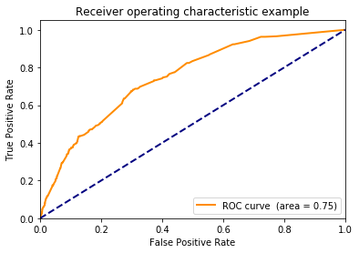

Compare to [R solution](https://github.com/WinVector/PDSwR2/blob/master/KDD2009/KDD2009vtreat.md).


```python
!pip install /Users/johnmount/Documents/work/pyvtreat/dist/vtreat-0.1.tar.gz
#!pip install https://github.com/WinVector/pyvtreat/raw/master/dist/vtreat-0.1.tar.gz
```

    Processing /Users/johnmount/Documents/work/pyvtreat/dist/vtreat-0.1.tar.gz
    Requirement already satisfied: numpy in /Users/johnmount/anaconda3/envs/aiAcademy/lib/python3.7/site-packages (from vtreat==0.1) (1.16.4)
    Requirement already satisfied: pandas in /Users/johnmount/anaconda3/envs/aiAcademy/lib/python3.7/site-packages (from vtreat==0.1) (0.24.2)
    Requirement already satisfied: statistics in /Users/johnmount/anaconda3/envs/aiAcademy/lib/python3.7/site-packages (from vtreat==0.1) (1.0.3.5)
    Requirement already satisfied: scipy in /Users/johnmount/anaconda3/envs/aiAcademy/lib/python3.7/site-packages (from vtreat==0.1) (1.2.1)
    Requirement already satisfied: python-dateutil>=2.5.0 in /Users/johnmount/anaconda3/envs/aiAcademy/lib/python3.7/site-packages (from pandas->vtreat==0.1) (2.8.0)
    Requirement already satisfied: pytz>=2011k in /Users/johnmount/anaconda3/envs/aiAcademy/lib/python3.7/site-packages (from pandas->vtreat==0.1) (2019.1)
    Requirement already satisfied: docutils>=0.3 in /Users/johnmount/anaconda3/envs/aiAcademy/lib/python3.7/site-packages (from statistics->vtreat==0.1) (0.14)
    Requirement already satisfied: six>=1.5 in /Users/johnmount/anaconda3/envs/aiAcademy/lib/python3.7/site-packages (from python-dateutil>=2.5.0->pandas->vtreat==0.1) (1.12.0)
    Building wheels for collected packages: vtreat
      Building wheel for vtreat (setup.py) ... [?25ldone
    [?25h  Stored in directory: /Users/johnmount/Library/Caches/pip/wheels/28/d1/8a/f8f4ee7c515a6c18d95d64f4d49327fe498b9e6e23d04c7159
    Successfully built vtreat
    Installing collected packages: vtreat
      Found existing installation: vtreat 0.1
        Uninstalling vtreat-0.1:
          Successfully uninstalled vtreat-0.1
    Successfully installed vtreat-0.1


First read in data


```python
import pandas

dir = "../../PracticalDataScienceWithR2nd/PDSwR2/KDD2009/"
d = pandas.read_csv(dir + 'orange_small_train.data.gz', sep='\t', header=0)
vars = [c for c in d.columns]
d.shape
```


    (50000, 230)


```python
churn = pandas.read_csv(dir + 'orange_small_train_churn.labels.txt', header=None)
churn.columns = ["churn"]
churn.shape
```


    (50000, 1)


```python
churn["churn"].value_counts()
```


    -1    46328
     1     3672
    Name: churn, dtype: int64


arrange test/train split


```python
import numpy.random

n = d.shape[0]
is_train = numpy.random.uniform(size=n)<=0.9
is_test = numpy.logical_not(is_train)
```


```python
d_train = d.loc[is_train, :].copy()
churn_train = numpy.asarray(churn.loc[is_train, :]["churn"]==1)
d_test = d.loc[is_test, :].copy()
churn_test = numpy.asarray(churn.loc[is_test, :]["churn"]==1)
```

Treat variables


```python
import vtreat
```


```python

```


```python

```


```python
plan = vtreat.binomial_outcome_treatment(outcomename="y", outcometarget=True)
```


```python
cross_frame = plan.fit_transform(d_train, churn_train)
```

    before transform
    before patch
    Var191_impact_code


    /Users/johnmount/anaconda3/envs/aiAcademy/lib/python3.7/site-packages/pandas/core/indexing.py:1017: FutureWarning: 
    Passing list-likes to .loc or [] with any missing label will raise
    KeyError in the future, you can use .reindex() as an alternative.
    
    See the documentation here:
    https://pandas.pydata.org/pandas-docs/stable/indexing.html#deprecate-loc-reindex-listlike
      return getattr(section, self.name)[new_key]
    /Users/johnmount/anaconda3/envs/aiAcademy/lib/python3.7/site-packages/pandas/core/indexing.py:1494: FutureWarning: 
    Passing list-likes to .loc or [] with any missing label will raise
    KeyError in the future, you can use .reindex() as an alternative.
    
    See the documentation here:
    https://pandas.pydata.org/pandas-docs/stable/indexing.html#deprecate-loc-reindex-listlike
      return self._getitem_tuple(key)


    Var192_impact_code
    Var193_impact_code
    Var194_impact_code
    Var195_impact_code
    Var196_impact_code
    Var197_impact_code
    Var198_impact_code
    Var199_impact_code
    Var200_impact_code
    Var201_impact_code
    Var202_impact_code
    Var203_impact_code
    Var204_impact_code
    Var205_impact_code
    Var206_impact_code
    Var207_impact_code
    Var208_impact_code
    Var210_impact_code
    Var211_impact_code
    Var212_impact_code
    Var213_impact_code
    Var214_impact_code
    Var215_impact_code
    Var216_impact_code
    Var217_impact_code
    Var218_impact_code
    Var219_impact_code
    Var220_impact_code
    Var221_impact_code
    Var222_impact_code
    Var223_impact_code
    Var224_impact_code
    Var225_impact_code
    Var226_impact_code
    Var227_impact_code
    Var228_impact_code
    Var229_impact_code
    before sf
    before return


```python
plan.score_frame_
```


<div>
<style scoped>
    .dataframe tbody tr th:only-of-type {
        vertical-align: middle;
    }

    .dataframe tbody tr th {
        vertical-align: top;
    }

    .dataframe thead th {
        text-align: right;
    }
</style>
<table border="1" class="dataframe">
  <thead>
    <tr style="text-align: right;">
      <th></th>
      <th>variable</th>
      <th>PearsonR</th>
      <th>significance</th>
    </tr>
  </thead>
  <tbody>
    <tr>
      <th>0</th>
      <td>Var1_is_bad</td>
      <td>0.002357</td>
      <td>6.175670e-01</td>
    </tr>
    <tr>
      <th>1</th>
      <td>Var2_is_bad</td>
      <td>0.017252</td>
      <td>2.570297e-04</td>
    </tr>
    <tr>
      <th>2</th>
      <td>Var3_is_bad</td>
      <td>0.017219</td>
      <td>2.640720e-04</td>
    </tr>
    <tr>
      <th>3</th>
      <td>Var4_is_bad</td>
      <td>0.018033</td>
      <td>1.330588e-04</td>
    </tr>
    <tr>
      <th>4</th>
      <td>Var5_is_bad</td>
      <td>0.017669</td>
      <td>1.814568e-04</td>
    </tr>
    <tr>
      <th>5</th>
      <td>Var6_is_bad</td>
      <td>-0.029972</td>
      <td>2.137347e-10</td>
    </tr>
    <tr>
      <th>6</th>
      <td>Var7_is_bad</td>
      <td>-0.026341</td>
      <td>2.383238e-08</td>
    </tr>
    <tr>
      <th>7</th>
      <td>Var9_is_bad</td>
      <td>0.002357</td>
      <td>6.175670e-01</td>
    </tr>
    <tr>
      <th>8</th>
      <td>Var10_is_bad</td>
      <td>0.017669</td>
      <td>1.814568e-04</td>
    </tr>
    <tr>
      <th>9</th>
      <td>Var11_is_bad</td>
      <td>0.017219</td>
      <td>2.640720e-04</td>
    </tr>
    <tr>
      <th>10</th>
      <td>Var12_is_bad</td>
      <td>0.001097</td>
      <td>8.162131e-01</td>
    </tr>
    <tr>
      <th>11</th>
      <td>Var13_is_bad</td>
      <td>-0.026341</td>
      <td>2.383238e-08</td>
    </tr>
    <tr>
      <th>12</th>
      <td>Var14_is_bad</td>
      <td>0.017219</td>
      <td>2.640720e-04</td>
    </tr>
    <tr>
      <th>13</th>
      <td>Var16_is_bad</td>
      <td>0.017669</td>
      <td>1.814568e-04</td>
    </tr>
    <tr>
      <th>14</th>
      <td>Var17_is_bad</td>
      <td>0.018033</td>
      <td>1.330588e-04</td>
    </tr>
    <tr>
      <th>15</th>
      <td>Var18_is_bad</td>
      <td>0.018033</td>
      <td>1.330588e-04</td>
    </tr>
    <tr>
      <th>16</th>
      <td>Var19_is_bad</td>
      <td>0.018033</td>
      <td>1.330588e-04</td>
    </tr>
    <tr>
      <th>17</th>
      <td>Var21_is_bad</td>
      <td>-0.029972</td>
      <td>2.137347e-10</td>
    </tr>
    <tr>
      <th>18</th>
      <td>Var22_is_bad</td>
      <td>-0.030343</td>
      <td>1.277618e-10</td>
    </tr>
    <tr>
      <th>19</th>
      <td>Var23_is_bad</td>
      <td>0.017669</td>
      <td>1.814568e-04</td>
    </tr>
    <tr>
      <th>20</th>
      <td>Var24_is_bad</td>
      <td>-0.008051</td>
      <td>8.808399e-02</td>
    </tr>
    <tr>
      <th>21</th>
      <td>Var25_is_bad</td>
      <td>-0.030343</td>
      <td>1.277618e-10</td>
    </tr>
    <tr>
      <th>22</th>
      <td>Var26_is_bad</td>
      <td>0.017669</td>
      <td>1.814568e-04</td>
    </tr>
    <tr>
      <th>23</th>
      <td>Var27_is_bad</td>
      <td>0.017669</td>
      <td>1.814568e-04</td>
    </tr>
    <tr>
      <th>24</th>
      <td>Var28_is_bad</td>
      <td>-0.030378</td>
      <td>1.215698e-10</td>
    </tr>
    <tr>
      <th>25</th>
      <td>Var29_is_bad</td>
      <td>0.002357</td>
      <td>6.175670e-01</td>
    </tr>
    <tr>
      <th>26</th>
      <td>Var30_is_bad</td>
      <td>0.002357</td>
      <td>6.175670e-01</td>
    </tr>
    <tr>
      <th>27</th>
      <td>Var33_is_bad</td>
      <td>0.014810</td>
      <td>1.702731e-03</td>
    </tr>
    <tr>
      <th>28</th>
      <td>Var34_is_bad</td>
      <td>0.017252</td>
      <td>2.570297e-04</td>
    </tr>
    <tr>
      <th>29</th>
      <td>Var35_is_bad</td>
      <td>-0.030343</td>
      <td>1.277618e-10</td>
    </tr>
    <tr>
      <th>...</th>
      <td>...</td>
      <td>...</td>
      <td>...</td>
    </tr>
    <tr>
      <th>489</th>
      <td>Var224_lev__NA_</td>
      <td>0.006852</td>
      <td>1.465746e-01</td>
    </tr>
    <tr>
      <th>490</th>
      <td>Var225_impact_code</td>
      <td>0.005664</td>
      <td>2.301263e-01</td>
    </tr>
    <tr>
      <th>491</th>
      <td>Var225_prevalence_code</td>
      <td>0.054885</td>
      <td>2.688106e-31</td>
    </tr>
    <tr>
      <th>492</th>
      <td>Var225_lev__NA_</td>
      <td>0.056180</td>
      <td>1.031657e-32</td>
    </tr>
    <tr>
      <th>493</th>
      <td>Var225_lev_ELof</td>
      <td>-0.044022</td>
      <td>1.049765e-20</td>
    </tr>
    <tr>
      <th>494</th>
      <td>Var225_lev_kG3k</td>
      <td>-0.016339</td>
      <td>5.365645e-04</td>
    </tr>
    <tr>
      <th>495</th>
      <td>Var226_impact_code</td>
      <td>0.010570</td>
      <td>2.513247e-02</td>
    </tr>
    <tr>
      <th>496</th>
      <td>Var226_prevalence_code</td>
      <td>0.021698</td>
      <td>4.277923e-06</td>
    </tr>
    <tr>
      <th>497</th>
      <td>Var226_lev_FSa2</td>
      <td>0.030909</td>
      <td>5.758415e-11</td>
    </tr>
    <tr>
      <th>498</th>
      <td>Var226_lev_Qu4f</td>
      <td>-0.009137</td>
      <td>5.290042e-02</td>
    </tr>
    <tr>
      <th>499</th>
      <td>Var226_lev_WqMG</td>
      <td>-0.001631</td>
      <td>7.297060e-01</td>
    </tr>
    <tr>
      <th>500</th>
      <td>Var226_lev_szEZ</td>
      <td>-0.017060</td>
      <td>3.009067e-04</td>
    </tr>
    <tr>
      <th>501</th>
      <td>Var226_lev_7P5s</td>
      <td>-0.020425</td>
      <td>1.507270e-05</td>
    </tr>
    <tr>
      <th>502</th>
      <td>Var226_lev_fKCe</td>
      <td>0.000675</td>
      <td>8.862188e-01</td>
    </tr>
    <tr>
      <th>503</th>
      <td>Var226_lev_Aoh3</td>
      <td>-0.004496</td>
      <td>3.408023e-01</td>
    </tr>
    <tr>
      <th>504</th>
      <td>Var227_impact_code</td>
      <td>0.002578</td>
      <td>5.849870e-01</td>
    </tr>
    <tr>
      <th>505</th>
      <td>Var227_prevalence_code</td>
      <td>0.046686</td>
      <td>4.328188e-23</td>
    </tr>
    <tr>
      <th>506</th>
      <td>Var227_lev_RAYp</td>
      <td>0.048053</td>
      <td>2.281345e-24</td>
    </tr>
    <tr>
      <th>507</th>
      <td>Var227_lev_ZI9m</td>
      <td>-0.045519</td>
      <td>4.983934e-22</td>
    </tr>
    <tr>
      <th>508</th>
      <td>Var227_lev_6fzt</td>
      <td>-0.003207</td>
      <td>4.968716e-01</td>
    </tr>
    <tr>
      <th>509</th>
      <td>Var228_impact_code</td>
      <td>-0.002533</td>
      <td>5.915760e-01</td>
    </tr>
    <tr>
      <th>510</th>
      <td>Var228_prevalence_code</td>
      <td>0.063572</td>
      <td>2.000005e-41</td>
    </tr>
    <tr>
      <th>511</th>
      <td>Var228_lev_F2FyR07IdsN7I</td>
      <td>0.064169</td>
      <td>3.556149e-42</td>
    </tr>
    <tr>
      <th>512</th>
      <td>Var228_lev_55YFVY9</td>
      <td>-0.028635</td>
      <td>1.296397e-09</td>
    </tr>
    <tr>
      <th>513</th>
      <td>Var228_lev_ib5G6X1eUxUn6</td>
      <td>-0.032737</td>
      <td>3.992644e-12</td>
    </tr>
    <tr>
      <th>514</th>
      <td>Var229_impact_code</td>
      <td>-0.009246</td>
      <td>5.013530e-02</td>
    </tr>
    <tr>
      <th>515</th>
      <td>Var229_prevalence_code</td>
      <td>0.062159</td>
      <td>1.119970e-39</td>
    </tr>
    <tr>
      <th>516</th>
      <td>Var229_lev__NA_</td>
      <td>0.062266</td>
      <td>8.296125e-40</td>
    </tr>
    <tr>
      <th>517</th>
      <td>Var229_lev_am7c</td>
      <td>-0.038745</td>
      <td>2.184880e-16</td>
    </tr>
    <tr>
      <th>518</th>
      <td>Var229_lev_mj86</td>
      <td>-0.036010</td>
      <td>2.322464e-14</td>
    </tr>
  </tbody>
</table>
<p>519 rows × 3 columns</p>
</div>


```python
cross_frame.head()
```


<div>
<style scoped>
    .dataframe tbody tr th:only-of-type {
        vertical-align: middle;
    }

    .dataframe tbody tr th {
        vertical-align: top;
    }

    .dataframe thead th {
        text-align: right;
    }
</style>
<table border="1" class="dataframe">
  <thead>
    <tr style="text-align: right;">
      <th></th>
      <th>Var1_is_bad</th>
      <th>Var2_is_bad</th>
      <th>Var3_is_bad</th>
      <th>Var4_is_bad</th>
      <th>Var5_is_bad</th>
      <th>Var6_is_bad</th>
      <th>Var7_is_bad</th>
      <th>Var9_is_bad</th>
      <th>Var10_is_bad</th>
      <th>Var11_is_bad</th>
      <th>...</th>
      <th>Var228_impact_code</th>
      <th>Var228_prevalence_code</th>
      <th>Var228_lev_F2FyR07IdsN7I</th>
      <th>Var228_lev_55YFVY9</th>
      <th>Var228_lev_ib5G6X1eUxUn6</th>
      <th>Var229_impact_code</th>
      <th>Var229_prevalence_code</th>
      <th>Var229_lev__NA_</th>
      <th>Var229_lev_am7c</th>
      <th>Var229_lev_mj86</th>
    </tr>
  </thead>
  <tbody>
    <tr>
      <th>0</th>
      <td>1.0</td>
      <td>1.0</td>
      <td>1.0</td>
      <td>1.0</td>
      <td>1.0</td>
      <td>0.0</td>
      <td>0.0</td>
      <td>1.0</td>
      <td>1.0</td>
      <td>1.0</td>
      <td>...</td>
      <td>0.002340</td>
      <td>0.653990</td>
      <td>1</td>
      <td>0</td>
      <td>0</td>
      <td>0.000520</td>
      <td>0.568752</td>
      <td>1</td>
      <td>0</td>
      <td>0</td>
    </tr>
    <tr>
      <th>1</th>
      <td>1.0</td>
      <td>1.0</td>
      <td>1.0</td>
      <td>1.0</td>
      <td>1.0</td>
      <td>0.0</td>
      <td>0.0</td>
      <td>1.0</td>
      <td>1.0</td>
      <td>1.0</td>
      <td>...</td>
      <td>0.002340</td>
      <td>0.653990</td>
      <td>1</td>
      <td>0</td>
      <td>0</td>
      <td>0.000520</td>
      <td>0.568752</td>
      <td>1</td>
      <td>0</td>
      <td>0</td>
    </tr>
    <tr>
      <th>2</th>
      <td>1.0</td>
      <td>1.0</td>
      <td>1.0</td>
      <td>1.0</td>
      <td>1.0</td>
      <td>0.0</td>
      <td>0.0</td>
      <td>1.0</td>
      <td>1.0</td>
      <td>1.0</td>
      <td>...</td>
      <td>-0.007704</td>
      <td>0.053491</td>
      <td>0</td>
      <td>0</td>
      <td>1</td>
      <td>-0.001497</td>
      <td>0.233436</td>
      <td>0</td>
      <td>1</td>
      <td>0</td>
    </tr>
    <tr>
      <th>3</th>
      <td>1.0</td>
      <td>1.0</td>
      <td>1.0</td>
      <td>1.0</td>
      <td>1.0</td>
      <td>1.0</td>
      <td>0.0</td>
      <td>1.0</td>
      <td>1.0</td>
      <td>1.0</td>
      <td>...</td>
      <td>0.002530</td>
      <td>0.653990</td>
      <td>1</td>
      <td>0</td>
      <td>0</td>
      <td>0.000138</td>
      <td>0.568752</td>
      <td>1</td>
      <td>0</td>
      <td>0</td>
    </tr>
    <tr>
      <th>4</th>
      <td>1.0</td>
      <td>1.0</td>
      <td>1.0</td>
      <td>1.0</td>
      <td>1.0</td>
      <td>0.0</td>
      <td>0.0</td>
      <td>1.0</td>
      <td>1.0</td>
      <td>1.0</td>
      <td>...</td>
      <td>0.000970</td>
      <td>0.653990</td>
      <td>1</td>
      <td>0</td>
      <td>0</td>
      <td>0.000957</td>
      <td>0.196320</td>
      <td>0</td>
      <td>0</td>
      <td>1</td>
    </tr>
  </tbody>
</table>
<p>5 rows × 519 columns</p>
</div>


```python
import xgboost
```


```python

fd = xgboost.DMatrix(data=cross_frame, label=churn_train)
x_parameters = {"max_depth":3, "objective":'binary:logistic'}
cv = xgboost.cv(x_parameters, fd, num_boost_round=100, verbose_eval=False)
```


```python
cv.head()
```


<div>
<style scoped>
    .dataframe tbody tr th:only-of-type {
        vertical-align: middle;
    }

    .dataframe tbody tr th {
        vertical-align: top;
    }

    .dataframe thead th {
        text-align: right;
    }
</style>
<table border="1" class="dataframe">
  <thead>
    <tr style="text-align: right;">
      <th></th>
      <th>train-error-mean</th>
      <th>train-error-std</th>
      <th>test-error-mean</th>
      <th>test-error-std</th>
    </tr>
  </thead>
  <tbody>
    <tr>
      <th>0</th>
      <td>0.072606</td>
      <td>0.000137</td>
      <td>0.073319</td>
      <td>0.000412</td>
    </tr>
    <tr>
      <th>1</th>
      <td>0.072807</td>
      <td>0.000192</td>
      <td>0.072851</td>
      <td>0.000358</td>
    </tr>
    <tr>
      <th>2</th>
      <td>0.072807</td>
      <td>0.000192</td>
      <td>0.072829</td>
      <td>0.000333</td>
    </tr>
    <tr>
      <th>3</th>
      <td>0.072829</td>
      <td>0.000167</td>
      <td>0.072829</td>
      <td>0.000333</td>
    </tr>
    <tr>
      <th>4</th>
      <td>0.072807</td>
      <td>0.000192</td>
      <td>0.072829</td>
      <td>0.000333</td>
    </tr>
  </tbody>
</table>
</div>


```python
best = cv.loc[cv["test-error-mean"]<= min(cv["test-error-mean"] + 1.0e-9), :]
best


```


<div>
<style scoped>
    .dataframe tbody tr th:only-of-type {
        vertical-align: middle;
    }

    .dataframe tbody tr th {
        vertical-align: top;
    }

    .dataframe thead th {
        text-align: right;
    }
</style>
<table border="1" class="dataframe">
  <thead>
    <tr style="text-align: right;">
      <th></th>
      <th>train-error-mean</th>
      <th>train-error-std</th>
      <th>test-error-mean</th>
      <th>test-error-std</th>
    </tr>
  </thead>
  <tbody>
    <tr>
      <th>15</th>
      <td>0.072372</td>
      <td>0.000294</td>
      <td>0.07254</td>
      <td>0.00047</td>
    </tr>
  </tbody>
</table>
</div>


```python
ntree = best.index.values[0]
ntree
```


    15


```python
fitter = xgboost.XGBClassifier(n_estimators=ntree, max_depth=3, objective='binary:logistic')
fitter
```


    XGBClassifier(base_score=0.5, booster='gbtree', colsample_bylevel=1,
                  colsample_bytree=1, gamma=0, learning_rate=0.1, max_delta_step=0,
                  max_depth=3, min_child_weight=1, missing=None, n_estimators=15,
                  n_jobs=1, nthread=None, objective='binary:logistic',
                  random_state=0, reg_alpha=0, reg_lambda=1, scale_pos_weight=1,
                  seed=None, silent=True, subsample=1)


```python
model = fitter.fit(cross_frame, churn_train)


```


```python
test_processed = plan.transform(d_test)
```


```python

pf = pandas.DataFrame({"churn":churn_test})
preds = model.predict_proba(test_processed)


```


```python
pf["pred"] = preds[:, 1]
```


```python
import wvpy.util
```


```python
wvpy.util.plot_roc(pf["pred"], pf["churn"])
```





    0.7464076210421415


```python

```
