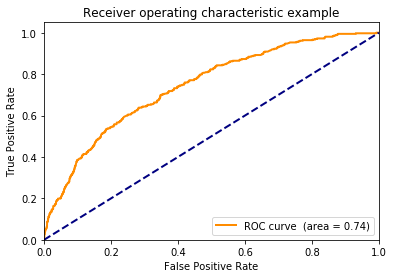

Compare to [R solution](https://github.com/WinVector/PDSwR2/blob/master/KDD2009/KDD2009vtreat.md).
!pip install /Users/johnmount/Documents/work/pyvtreat/pkg/dist/vtreat-0.1.tar.gz
#!pip install https://github.com/WinVector/pyvtreat/raw/master/pkg/dist/vtreat-0.1.tar.gz!pip install /Users/johnmount/Documents/work/wvpy/pkg/dist/wvpy-0.1.tar.gz
#!pip install https://github.com/WinVector/wvpy/raw/master/pkg/dist/wvpy-0.1.tar.gz
First read in data


```python
import pandas

dir = "../../PracticalDataScienceWithR2nd/PDSwR2/KDD2009/"
d = pandas.read_csv(dir + 'orange_small_train.data.gz', sep='\t', header=0)
vars = [c for c in d.columns]
d.shape
```


    (50000, 230)


```python
churn = pandas.read_csv(dir + 'orange_small_train_churn.labels.txt', header=None)
churn.columns = ["churn"]
churn.shape
```


    (50000, 1)


```python
churn["churn"].value_counts()
```


    -1    46328
     1     3672
    Name: churn, dtype: int64


arrange test/train split


```python
import numpy.random

n = d.shape[0]
is_train = numpy.random.uniform(size=n)<=0.9
is_test = numpy.logical_not(is_train)
```


```python
d_train = d.loc[is_train, :].copy()
churn_train = numpy.asarray(churn.loc[is_train, :]["churn"]==1)
d_test = d.loc[is_test, :].copy()
churn_test = numpy.asarray(churn.loc[is_test, :]["churn"]==1)
```

Treat variables


```python
import vtreat
```


```python
plan = vtreat.binomial_outcome_treatment(outcomename="y", outcometarget=True)
```


```python
cross_frame = plan.fit_transform(d_train, churn_train)
```


```python
sf = plan.score_frame_
sf.head()
```


<div>
<style scoped>
    .dataframe tbody tr th:only-of-type {
        vertical-align: middle;
    }

    .dataframe tbody tr th {
        vertical-align: top;
    }

    .dataframe thead th {
        text-align: right;
    }
</style>
<table border="1" class="dataframe">
  <thead>
    <tr style="text-align: right;">
      <th></th>
      <th>variable</th>
      <th>treatment</th>
      <th>y_aware</th>
      <th>PearsonR</th>
      <th>significance</th>
      <th>vcount</th>
      <th>recommended</th>
    </tr>
  </thead>
  <tbody>
    <tr>
      <th>0</th>
      <td>Var1_is_bad</td>
      <td>missing_indicator</td>
      <td>False</td>
      <td>0.001885</td>
      <td>0.688921</td>
      <td>193.0</td>
      <td>False</td>
    </tr>
    <tr>
      <th>1</th>
      <td>Var2_is_bad</td>
      <td>missing_indicator</td>
      <td>False</td>
      <td>0.018179</td>
      <td>0.000113</td>
      <td>193.0</td>
      <td>True</td>
    </tr>
    <tr>
      <th>2</th>
      <td>Var3_is_bad</td>
      <td>missing_indicator</td>
      <td>False</td>
      <td>0.018146</td>
      <td>0.000116</td>
      <td>193.0</td>
      <td>True</td>
    </tr>
    <tr>
      <th>3</th>
      <td>Var4_is_bad</td>
      <td>missing_indicator</td>
      <td>False</td>
      <td>0.018424</td>
      <td>0.000091</td>
      <td>193.0</td>
      <td>True</td>
    </tr>
    <tr>
      <th>4</th>
      <td>Var5_is_bad</td>
      <td>missing_indicator</td>
      <td>False</td>
      <td>0.018589</td>
      <td>0.000079</td>
      <td>193.0</td>
      <td>True</td>
    </tr>
  </tbody>
</table>
</div>


```python
sf.shape
```


    (519, 7)


```python
sf.loc[sf["y_aware"], :]
```


<div>
<style scoped>
    .dataframe tbody tr th:only-of-type {
        vertical-align: middle;
    }

    .dataframe tbody tr th {
        vertical-align: top;
    }

    .dataframe thead th {
        text-align: right;
    }
</style>
<table border="1" class="dataframe">
  <thead>
    <tr style="text-align: right;">
      <th></th>
      <th>variable</th>
      <th>treatment</th>
      <th>y_aware</th>
      <th>PearsonR</th>
      <th>significance</th>
      <th>vcount</th>
      <th>recommended</th>
    </tr>
  </thead>
  <tbody>
    <tr>
      <th>366</th>
      <td>Var191_logit_code</td>
      <td>logit_code</td>
      <td>True</td>
      <td>-0.010852</td>
      <td>0.021195</td>
      <td>38.0</td>
      <td>False</td>
    </tr>
    <tr>
      <th>369</th>
      <td>Var192_logit_code</td>
      <td>logit_code</td>
      <td>True</td>
      <td>-0.004734</td>
      <td>0.314785</td>
      <td>38.0</td>
      <td>False</td>
    </tr>
    <tr>
      <th>371</th>
      <td>Var193_logit_code</td>
      <td>logit_code</td>
      <td>True</td>
      <td>0.001687</td>
      <td>0.720204</td>
      <td>38.0</td>
      <td>False</td>
    </tr>
    <tr>
      <th>375</th>
      <td>Var194_logit_code</td>
      <td>logit_code</td>
      <td>True</td>
      <td>-0.007852</td>
      <td>0.095460</td>
      <td>38.0</td>
      <td>False</td>
    </tr>
    <tr>
      <th>379</th>
      <td>Var195_logit_code</td>
      <td>logit_code</td>
      <td>True</td>
      <td>0.003428</td>
      <td>0.466701</td>
      <td>38.0</td>
      <td>False</td>
    </tr>
    <tr>
      <th>382</th>
      <td>Var196_logit_code</td>
      <td>logit_code</td>
      <td>True</td>
      <td>-0.005286</td>
      <td>0.261701</td>
      <td>38.0</td>
      <td>False</td>
    </tr>
    <tr>
      <th>385</th>
      <td>Var197_logit_code</td>
      <td>logit_code</td>
      <td>True</td>
      <td>-0.001359</td>
      <td>0.772894</td>
      <td>38.0</td>
      <td>False</td>
    </tr>
    <tr>
      <th>392</th>
      <td>Var198_logit_code</td>
      <td>logit_code</td>
      <td>True</td>
      <td>-0.001283</td>
      <td>0.785333</td>
      <td>38.0</td>
      <td>False</td>
    </tr>
    <tr>
      <th>395</th>
      <td>Var199_logit_code</td>
      <td>logit_code</td>
      <td>True</td>
      <td>0.003023</td>
      <td>0.520901</td>
      <td>38.0</td>
      <td>False</td>
    </tr>
    <tr>
      <th>397</th>
      <td>Var200_logit_code</td>
      <td>logit_code</td>
      <td>True</td>
      <td>-0.003642</td>
      <td>0.439325</td>
      <td>38.0</td>
      <td>False</td>
    </tr>
    <tr>
      <th>400</th>
      <td>Var201_logit_code</td>
      <td>logit_code</td>
      <td>True</td>
      <td>-0.001239</td>
      <td>0.792423</td>
      <td>38.0</td>
      <td>False</td>
    </tr>
    <tr>
      <th>404</th>
      <td>Var202_logit_code</td>
      <td>logit_code</td>
      <td>True</td>
      <td>-0.007673</td>
      <td>0.103257</td>
      <td>38.0</td>
      <td>False</td>
    </tr>
    <tr>
      <th>406</th>
      <td>Var203_logit_code</td>
      <td>logit_code</td>
      <td>True</td>
      <td>0.002970</td>
      <td>0.528212</td>
      <td>38.0</td>
      <td>False</td>
    </tr>
    <tr>
      <th>410</th>
      <td>Var204_logit_code</td>
      <td>logit_code</td>
      <td>True</td>
      <td>-0.019010</td>
      <td>0.000054</td>
      <td>38.0</td>
      <td>False</td>
    </tr>
    <tr>
      <th>412</th>
      <td>Var205_logit_code</td>
      <td>logit_code</td>
      <td>True</td>
      <td>-0.009283</td>
      <td>0.048684</td>
      <td>38.0</td>
      <td>False</td>
    </tr>
    <tr>
      <th>417</th>
      <td>Var206_logit_code</td>
      <td>logit_code</td>
      <td>True</td>
      <td>-0.000492</td>
      <td>0.916818</td>
      <td>38.0</td>
      <td>False</td>
    </tr>
    <tr>
      <th>425</th>
      <td>Var207_logit_code</td>
      <td>logit_code</td>
      <td>True</td>
      <td>0.003874</td>
      <td>0.410697</td>
      <td>38.0</td>
      <td>False</td>
    </tr>
    <tr>
      <th>430</th>
      <td>Var208_logit_code</td>
      <td>logit_code</td>
      <td>True</td>
      <td>0.002587</td>
      <td>0.582764</td>
      <td>38.0</td>
      <td>False</td>
    </tr>
    <tr>
      <th>434</th>
      <td>Var210_logit_code</td>
      <td>logit_code</td>
      <td>True</td>
      <td>0.003884</td>
      <td>0.409481</td>
      <td>38.0</td>
      <td>False</td>
    </tr>
    <tr>
      <th>437</th>
      <td>Var211_logit_code</td>
      <td>logit_code</td>
      <td>True</td>
      <td>0.003169</td>
      <td>0.501007</td>
      <td>38.0</td>
      <td>False</td>
    </tr>
    <tr>
      <th>441</th>
      <td>Var212_logit_code</td>
      <td>logit_code</td>
      <td>True</td>
      <td>-0.000289</td>
      <td>0.951023</td>
      <td>38.0</td>
      <td>False</td>
    </tr>
    <tr>
      <th>446</th>
      <td>Var213_logit_code</td>
      <td>logit_code</td>
      <td>True</td>
      <td>-0.007102</td>
      <td>0.131521</td>
      <td>38.0</td>
      <td>False</td>
    </tr>
    <tr>
      <th>449</th>
      <td>Var214_logit_code</td>
      <td>logit_code</td>
      <td>True</td>
      <td>-0.003642</td>
      <td>0.439325</td>
      <td>38.0</td>
      <td>False</td>
    </tr>
    <tr>
      <th>452</th>
      <td>Var215_logit_code</td>
      <td>logit_code</td>
      <td>True</td>
      <td>-0.001853</td>
      <td>0.693913</td>
      <td>38.0</td>
      <td>False</td>
    </tr>
    <tr>
      <th>455</th>
      <td>Var216_logit_code</td>
      <td>logit_code</td>
      <td>True</td>
      <td>0.005447</td>
      <td>0.247431</td>
      <td>38.0</td>
      <td>False</td>
    </tr>
    <tr>
      <th>461</th>
      <td>Var217_logit_code</td>
      <td>logit_code</td>
      <td>True</td>
      <td>0.000027</td>
      <td>0.995379</td>
      <td>38.0</td>
      <td>False</td>
    </tr>
    <tr>
      <th>463</th>
      <td>Var218_logit_code</td>
      <td>logit_code</td>
      <td>True</td>
      <td>-0.000228</td>
      <td>0.961437</td>
      <td>38.0</td>
      <td>False</td>
    </tr>
    <tr>
      <th>467</th>
      <td>Var219_logit_code</td>
      <td>logit_code</td>
      <td>True</td>
      <td>-0.001743</td>
      <td>0.711341</td>
      <td>38.0</td>
      <td>False</td>
    </tr>
    <tr>
      <th>471</th>
      <td>Var220_logit_code</td>
      <td>logit_code</td>
      <td>True</td>
      <td>-0.001283</td>
      <td>0.785333</td>
      <td>38.0</td>
      <td>False</td>
    </tr>
    <tr>
      <th>474</th>
      <td>Var221_logit_code</td>
      <td>logit_code</td>
      <td>True</td>
      <td>-0.007073</td>
      <td>0.133099</td>
      <td>38.0</td>
      <td>False</td>
    </tr>
    <tr>
      <th>479</th>
      <td>Var222_logit_code</td>
      <td>logit_code</td>
      <td>True</td>
      <td>-0.001283</td>
      <td>0.785333</td>
      <td>38.0</td>
      <td>False</td>
    </tr>
    <tr>
      <th>482</th>
      <td>Var223_logit_code</td>
      <td>logit_code</td>
      <td>True</td>
      <td>-0.016637</td>
      <td>0.000411</td>
      <td>38.0</td>
      <td>False</td>
    </tr>
    <tr>
      <th>487</th>
      <td>Var224_logit_code</td>
      <td>logit_code</td>
      <td>True</td>
      <td>-0.001400</td>
      <td>0.766240</td>
      <td>38.0</td>
      <td>False</td>
    </tr>
    <tr>
      <th>490</th>
      <td>Var225_logit_code</td>
      <td>logit_code</td>
      <td>True</td>
      <td>-0.007331</td>
      <td>0.119530</td>
      <td>38.0</td>
      <td>False</td>
    </tr>
    <tr>
      <th>495</th>
      <td>Var226_logit_code</td>
      <td>logit_code</td>
      <td>True</td>
      <td>-0.010062</td>
      <td>0.032621</td>
      <td>38.0</td>
      <td>False</td>
    </tr>
    <tr>
      <th>504</th>
      <td>Var227_logit_code</td>
      <td>logit_code</td>
      <td>True</td>
      <td>0.006876</td>
      <td>0.144269</td>
      <td>38.0</td>
      <td>False</td>
    </tr>
    <tr>
      <th>509</th>
      <td>Var228_logit_code</td>
      <td>logit_code</td>
      <td>True</td>
      <td>-0.016963</td>
      <td>0.000315</td>
      <td>38.0</td>
      <td>False</td>
    </tr>
    <tr>
      <th>514</th>
      <td>Var229_logit_code</td>
      <td>logit_code</td>
      <td>True</td>
      <td>-0.005042</td>
      <td>0.284303</td>
      <td>38.0</td>
      <td>False</td>
    </tr>
  </tbody>
</table>
</div>


```python
sf.loc[numpy.logical_and(sf["recommended"],sf["y_aware"]), :]
```


<div>
<style scoped>
    .dataframe tbody tr th:only-of-type {
        vertical-align: middle;
    }

    .dataframe tbody tr th {
        vertical-align: top;
    }

    .dataframe thead th {
        text-align: right;
    }
</style>
<table border="1" class="dataframe">
  <thead>
    <tr style="text-align: right;">
      <th></th>
      <th>variable</th>
      <th>treatment</th>
      <th>y_aware</th>
      <th>PearsonR</th>
      <th>significance</th>
      <th>vcount</th>
      <th>recommended</th>
    </tr>
  </thead>
  <tbody>
  </tbody>
</table>
</div>


```python
model_vars = numpy.asarray(sf["variable"][sf["recommended"]])
len(model_vars)
```


    231


```python
cross_frame.head()
```


<div>
<style scoped>
    .dataframe tbody tr th:only-of-type {
        vertical-align: middle;
    }

    .dataframe tbody tr th {
        vertical-align: top;
    }

    .dataframe thead th {
        text-align: right;
    }
</style>
<table border="1" class="dataframe">
  <thead>
    <tr style="text-align: right;">
      <th></th>
      <th>Var1_is_bad</th>
      <th>Var2_is_bad</th>
      <th>Var3_is_bad</th>
      <th>Var4_is_bad</th>
      <th>Var5_is_bad</th>
      <th>Var6_is_bad</th>
      <th>Var7_is_bad</th>
      <th>Var9_is_bad</th>
      <th>Var10_is_bad</th>
      <th>Var11_is_bad</th>
      <th>...</th>
      <th>Var228_logit_code</th>
      <th>Var228_prevalence_code</th>
      <th>Var228_lev_F2FyR07IdsN7I</th>
      <th>Var228_lev_55YFVY9</th>
      <th>Var228_lev_ib5G6X1eUxUn6</th>
      <th>Var229_logit_code</th>
      <th>Var229_prevalence_code</th>
      <th>Var229_lev__NA_</th>
      <th>Var229_lev_am7c</th>
      <th>Var229_lev_mj86</th>
    </tr>
  </thead>
  <tbody>
    <tr>
      <th>0</th>
      <td>1.0</td>
      <td>1.0</td>
      <td>1.0</td>
      <td>1.0</td>
      <td>1.0</td>
      <td>0.0</td>
      <td>0.0</td>
      <td>1.0</td>
      <td>1.0</td>
      <td>1.0</td>
      <td>...</td>
      <td>0.007700</td>
      <td>0.654403</td>
      <td>1</td>
      <td>0</td>
      <td>0</td>
      <td>-0.009832</td>
      <td>0.568270</td>
      <td>1</td>
      <td>0</td>
      <td>0</td>
    </tr>
    <tr>
      <th>1</th>
      <td>1.0</td>
      <td>1.0</td>
      <td>1.0</td>
      <td>1.0</td>
      <td>1.0</td>
      <td>0.0</td>
      <td>0.0</td>
      <td>1.0</td>
      <td>1.0</td>
      <td>1.0</td>
      <td>...</td>
      <td>0.010584</td>
      <td>0.654403</td>
      <td>1</td>
      <td>0</td>
      <td>0</td>
      <td>-0.003556</td>
      <td>0.568270</td>
      <td>1</td>
      <td>0</td>
      <td>0</td>
    </tr>
    <tr>
      <th>2</th>
      <td>1.0</td>
      <td>1.0</td>
      <td>1.0</td>
      <td>1.0</td>
      <td>1.0</td>
      <td>0.0</td>
      <td>0.0</td>
      <td>1.0</td>
      <td>1.0</td>
      <td>1.0</td>
      <td>...</td>
      <td>0.076126</td>
      <td>0.053534</td>
      <td>0</td>
      <td>0</td>
      <td>1</td>
      <td>0.022498</td>
      <td>0.234715</td>
      <td>0</td>
      <td>1</td>
      <td>0</td>
    </tr>
    <tr>
      <th>3</th>
      <td>1.0</td>
      <td>1.0</td>
      <td>1.0</td>
      <td>1.0</td>
      <td>1.0</td>
      <td>0.0</td>
      <td>0.0</td>
      <td>1.0</td>
      <td>1.0</td>
      <td>1.0</td>
      <td>...</td>
      <td>-0.104512</td>
      <td>0.654403</td>
      <td>1</td>
      <td>0</td>
      <td>0</td>
      <td>-0.007813</td>
      <td>0.195396</td>
      <td>0</td>
      <td>0</td>
      <td>1</td>
    </tr>
    <tr>
      <th>4</th>
      <td>1.0</td>
      <td>1.0</td>
      <td>1.0</td>
      <td>1.0</td>
      <td>1.0</td>
      <td>0.0</td>
      <td>0.0</td>
      <td>1.0</td>
      <td>1.0</td>
      <td>1.0</td>
      <td>...</td>
      <td>0.010584</td>
      <td>0.018517</td>
      <td>0</td>
      <td>0</td>
      <td>0</td>
      <td>0.004001</td>
      <td>0.234715</td>
      <td>0</td>
      <td>1</td>
      <td>0</td>
    </tr>
  </tbody>
</table>
<p>5 rows × 519 columns</p>
</div>


```python
import xgboost
```


```python

fd = xgboost.DMatrix(data=cross_frame.loc[:, model_vars], label=churn_train)
x_parameters = {"max_depth":3, "objective":'binary:logistic'}
cv = xgboost.cv(x_parameters, fd, num_boost_round=100, verbose_eval=False)
```


```python
cv.head()
```


<div>
<style scoped>
    .dataframe tbody tr th:only-of-type {
        vertical-align: middle;
    }

    .dataframe tbody tr th {
        vertical-align: top;
    }

    .dataframe thead th {
        text-align: right;
    }
</style>
<table border="1" class="dataframe">
  <thead>
    <tr style="text-align: right;">
      <th></th>
      <th>train-error-mean</th>
      <th>train-error-std</th>
      <th>test-error-mean</th>
      <th>test-error-std</th>
    </tr>
  </thead>
  <tbody>
    <tr>
      <th>0</th>
      <td>0.073238</td>
      <td>0.001498</td>
      <td>0.073914</td>
      <td>0.003063</td>
    </tr>
    <tr>
      <th>1</th>
      <td>0.073404</td>
      <td>0.001476</td>
      <td>0.073404</td>
      <td>0.002952</td>
    </tr>
    <tr>
      <th>2</th>
      <td>0.073382</td>
      <td>0.001463</td>
      <td>0.073404</td>
      <td>0.002952</td>
    </tr>
    <tr>
      <th>3</th>
      <td>0.073404</td>
      <td>0.001476</td>
      <td>0.073404</td>
      <td>0.002952</td>
    </tr>
    <tr>
      <th>4</th>
      <td>0.073415</td>
      <td>0.001460</td>
      <td>0.073404</td>
      <td>0.002952</td>
    </tr>
  </tbody>
</table>
</div>


```python
best = cv.loc[cv["test-error-mean"]<= min(cv["test-error-mean"] + 1.0e-9), :]
best


```


<div>
<style scoped>
    .dataframe tbody tr th:only-of-type {
        vertical-align: middle;
    }

    .dataframe tbody tr th {
        vertical-align: top;
    }

    .dataframe thead th {
        text-align: right;
    }
</style>
<table border="1" class="dataframe">
  <thead>
    <tr style="text-align: right;">
      <th></th>
      <th>train-error-mean</th>
      <th>train-error-std</th>
      <th>test-error-mean</th>
      <th>test-error-std</th>
    </tr>
  </thead>
  <tbody>
    <tr>
      <th>42</th>
      <td>0.071763</td>
      <td>0.001751</td>
      <td>0.072894</td>
      <td>0.002462</td>
    </tr>
    <tr>
      <th>49</th>
      <td>0.071386</td>
      <td>0.001583</td>
      <td>0.072894</td>
      <td>0.002368</td>
    </tr>
    <tr>
      <th>50</th>
      <td>0.071408</td>
      <td>0.001580</td>
      <td>0.072894</td>
      <td>0.002368</td>
    </tr>
  </tbody>
</table>
</div>


```python
ntree = best.index.values[0]
ntree
```


    42


```python
fitter = xgboost.XGBClassifier(n_estimators=ntree, max_depth=3, objective='binary:logistic')
fitter
```


    XGBClassifier(base_score=0.5, booster='gbtree', colsample_bylevel=1,
                  colsample_bytree=1, gamma=0, learning_rate=0.1, max_delta_step=0,
                  max_depth=3, min_child_weight=1, missing=None, n_estimators=42,
                  n_jobs=1, nthread=None, objective='binary:logistic',
                  random_state=0, reg_alpha=0, reg_lambda=1, scale_pos_weight=1,
                  seed=None, silent=True, subsample=1)


```python
model = fitter.fit(cross_frame.loc[:, model_vars], churn_train)


```


```python
test_processed = plan.transform(d_test)
```


```python

pf = pandas.DataFrame({"churn":churn_test})
preds = model.predict_proba(test_processed.loc[:, model_vars])


```


```python
pf["pred"] = preds[:, 1]
```


```python
import wvpy.util
```


```python
wvpy.util.plot_roc(pf["pred"], pf["churn"])
```





    0.7429389347774557


```python

```


```python

```
