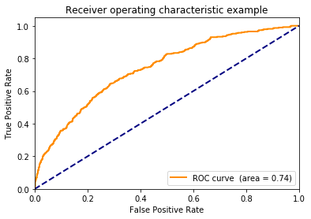

Compare to [R solution](https://github.com/WinVector/PDSwR2/blob/master/KDD2009/KDD2009vtreat.md).


```python
!pip install /Users/johnmount/Documents/work/pyvtreat/dist/vtreat-0.1.tar.gz
#!pip install https://github.com/WinVector/pyvtreat/raw/master/dist/vtreat-0.1.tar.gz
```

    Processing /Users/johnmount/Documents/work/pyvtreat/dist/vtreat-0.1.tar.gz
    Requirement already satisfied: numpy in /Users/johnmount/anaconda3/envs/aiAcademy/lib/python3.7/site-packages (from vtreat==0.1) (1.16.4)
    Requirement already satisfied: pandas in /Users/johnmount/anaconda3/envs/aiAcademy/lib/python3.7/site-packages (from vtreat==0.1) (0.24.2)
    Requirement already satisfied: statistics in /Users/johnmount/anaconda3/envs/aiAcademy/lib/python3.7/site-packages (from vtreat==0.1) (1.0.3.5)
    Requirement already satisfied: scipy in /Users/johnmount/anaconda3/envs/aiAcademy/lib/python3.7/site-packages (from vtreat==0.1) (1.2.1)
    Requirement already satisfied: python-dateutil>=2.5.0 in /Users/johnmount/anaconda3/envs/aiAcademy/lib/python3.7/site-packages (from pandas->vtreat==0.1) (2.8.0)
    Requirement already satisfied: pytz>=2011k in /Users/johnmount/anaconda3/envs/aiAcademy/lib/python3.7/site-packages (from pandas->vtreat==0.1) (2019.1)
    Requirement already satisfied: docutils>=0.3 in /Users/johnmount/anaconda3/envs/aiAcademy/lib/python3.7/site-packages (from statistics->vtreat==0.1) (0.14)
    Requirement already satisfied: six>=1.5 in /Users/johnmount/anaconda3/envs/aiAcademy/lib/python3.7/site-packages (from python-dateutil>=2.5.0->pandas->vtreat==0.1) (1.12.0)
    Building wheels for collected packages: vtreat
      Building wheel for vtreat (setup.py) ... [?25ldone
    [?25h  Stored in directory: /Users/johnmount/Library/Caches/pip/wheels/28/d1/8a/f8f4ee7c515a6c18d95d64f4d49327fe498b9e6e23d04c7159
    Successfully built vtreat
    Installing collected packages: vtreat
      Found existing installation: vtreat 0.1
        Uninstalling vtreat-0.1:
          Successfully uninstalled vtreat-0.1
    Successfully installed vtreat-0.1


First read in data


```python
import pandas

dir = "../../PracticalDataScienceWithR2nd/PDSwR2/KDD2009/"
d = pandas.read_csv(dir + 'orange_small_train.data.gz', sep='\t', header=0)
vars = [c for c in d.columns]
d.shape
```


    (50000, 230)


```python
churn = pandas.read_csv(dir + 'orange_small_train_churn.labels.txt', header=None)
churn.columns = ["churn"]
churn.shape
```


    (50000, 1)


```python
churn["churn"].value_counts()
```


    -1    46328
     1     3672
    Name: churn, dtype: int64


arrange test/train split


```python
import numpy.random

n = d.shape[0]
is_train = numpy.random.uniform(size=n)<=0.9
is_test = numpy.logical_not(is_train)
```


```python
d_train = d.loc[is_train, :].copy()
churn_train = numpy.asarray(churn.loc[is_train, :]["churn"]==1)
d_test = d.loc[is_test, :].copy()
churn_test = numpy.asarray(churn.loc[is_test, :]["churn"]==1)
```

Treat variables


```python
import vtreat
```


```python
plan = vtreat.binomial_outcome_treatment(outcomename="y", outcometarget=True)
```


```python
cross_frame = plan.fit_transform(d_train, churn_train)
```


```python
sf = plan.score_frame_
sf.head()
```


<div>
<style scoped>
    .dataframe tbody tr th:only-of-type {
        vertical-align: middle;
    }

    .dataframe tbody tr th {
        vertical-align: top;
    }

    .dataframe thead th {
        text-align: right;
    }
</style>
<table border="1" class="dataframe">
  <thead>
    <tr style="text-align: right;">
      <th></th>
      <th>variable</th>
      <th>treatment</th>
      <th>y_aware</th>
      <th>PearsonR</th>
      <th>significance</th>
      <th>vcount</th>
      <th>recommended</th>
    </tr>
  </thead>
  <tbody>
    <tr>
      <th>0</th>
      <td>Var1_is_bad</td>
      <td>missing_indicator</td>
      <td>False</td>
      <td>0.004336</td>
      <td>0.357633</td>
      <td>193.0</td>
      <td>False</td>
    </tr>
    <tr>
      <th>1</th>
      <td>Var2_is_bad</td>
      <td>missing_indicator</td>
      <td>False</td>
      <td>0.019270</td>
      <td>0.000043</td>
      <td>193.0</td>
      <td>True</td>
    </tr>
    <tr>
      <th>2</th>
      <td>Var3_is_bad</td>
      <td>missing_indicator</td>
      <td>False</td>
      <td>0.019238</td>
      <td>0.000045</td>
      <td>193.0</td>
      <td>True</td>
    </tr>
    <tr>
      <th>3</th>
      <td>Var4_is_bad</td>
      <td>missing_indicator</td>
      <td>False</td>
      <td>0.017983</td>
      <td>0.000136</td>
      <td>193.0</td>
      <td>True</td>
    </tr>
    <tr>
      <th>4</th>
      <td>Var5_is_bad</td>
      <td>missing_indicator</td>
      <td>False</td>
      <td>0.015505</td>
      <td>0.001002</td>
      <td>193.0</td>
      <td>True</td>
    </tr>
  </tbody>
</table>
</div>


```python
sf.shape
```


    (519, 7)


```python
sf.loc[numpy.logical_and(sf["recommended"],sf["y_aware"]), :]
```


<div>
<style scoped>
    .dataframe tbody tr th:only-of-type {
        vertical-align: middle;
    }

    .dataframe tbody tr th {
        vertical-align: top;
    }

    .dataframe thead th {
        text-align: right;
    }
</style>
<table border="1" class="dataframe">
  <thead>
    <tr style="text-align: right;">
      <th></th>
      <th>variable</th>
      <th>treatment</th>
      <th>y_aware</th>
      <th>PearsonR</th>
      <th>significance</th>
      <th>vcount</th>
      <th>recommended</th>
    </tr>
  </thead>
  <tbody>
    <tr>
      <th>425</th>
      <td>Var207_logit_code</td>
      <td>logit_code</td>
      <td>True</td>
      <td>0.010722</td>
      <td>0.022909</td>
      <td>38.0</td>
      <td>True</td>
    </tr>
    <tr>
      <th>490</th>
      <td>Var225_logit_code</td>
      <td>logit_code</td>
      <td>True</td>
      <td>0.012494</td>
      <td>0.008026</td>
      <td>38.0</td>
      <td>True</td>
    </tr>
  </tbody>
</table>
</div>


```python
model_vars = numpy.asarray(sf["variable"][sf["recommended"]])
len(model_vars)
```


    224


```python
cross_frame.head()
```


<div>
<style scoped>
    .dataframe tbody tr th:only-of-type {
        vertical-align: middle;
    }

    .dataframe tbody tr th {
        vertical-align: top;
    }

    .dataframe thead th {
        text-align: right;
    }
</style>
<table border="1" class="dataframe">
  <thead>
    <tr style="text-align: right;">
      <th></th>
      <th>Var1_is_bad</th>
      <th>Var2_is_bad</th>
      <th>Var3_is_bad</th>
      <th>Var4_is_bad</th>
      <th>Var5_is_bad</th>
      <th>Var6_is_bad</th>
      <th>Var7_is_bad</th>
      <th>Var9_is_bad</th>
      <th>Var10_is_bad</th>
      <th>Var11_is_bad</th>
      <th>...</th>
      <th>Var228_logit_code</th>
      <th>Var228_prevalence_code</th>
      <th>Var228_lev_F2FyR07IdsN7I</th>
      <th>Var228_lev_55YFVY9</th>
      <th>Var228_lev_ib5G6X1eUxUn6</th>
      <th>Var229_logit_code</th>
      <th>Var229_prevalence_code</th>
      <th>Var229_lev__NA_</th>
      <th>Var229_lev_am7c</th>
      <th>Var229_lev_mj86</th>
    </tr>
  </thead>
  <tbody>
    <tr>
      <th>0</th>
      <td>1.0</td>
      <td>1.0</td>
      <td>1.0</td>
      <td>1.0</td>
      <td>1.0</td>
      <td>0.0</td>
      <td>0.0</td>
      <td>1.0</td>
      <td>1.0</td>
      <td>1.0</td>
      <td>...</td>
      <td>0.001876</td>
      <td>0.654472</td>
      <td>1</td>
      <td>0</td>
      <td>0</td>
      <td>-0.000671</td>
      <td>0.568306</td>
      <td>1</td>
      <td>0</td>
      <td>0</td>
    </tr>
    <tr>
      <th>1</th>
      <td>1.0</td>
      <td>1.0</td>
      <td>1.0</td>
      <td>1.0</td>
      <td>1.0</td>
      <td>0.0</td>
      <td>0.0</td>
      <td>1.0</td>
      <td>1.0</td>
      <td>1.0</td>
      <td>...</td>
      <td>0.001876</td>
      <td>0.654472</td>
      <td>1</td>
      <td>0</td>
      <td>0</td>
      <td>-0.000671</td>
      <td>0.568306</td>
      <td>1</td>
      <td>0</td>
      <td>0</td>
    </tr>
    <tr>
      <th>2</th>
      <td>1.0</td>
      <td>1.0</td>
      <td>1.0</td>
      <td>1.0</td>
      <td>1.0</td>
      <td>0.0</td>
      <td>0.0</td>
      <td>1.0</td>
      <td>1.0</td>
      <td>1.0</td>
      <td>...</td>
      <td>-0.046118</td>
      <td>0.053045</td>
      <td>0</td>
      <td>0</td>
      <td>1</td>
      <td>-0.014519</td>
      <td>0.234440</td>
      <td>0</td>
      <td>1</td>
      <td>0</td>
    </tr>
    <tr>
      <th>3</th>
      <td>1.0</td>
      <td>1.0</td>
      <td>1.0</td>
      <td>1.0</td>
      <td>1.0</td>
      <td>1.0</td>
      <td>0.0</td>
      <td>1.0</td>
      <td>1.0</td>
      <td>1.0</td>
      <td>...</td>
      <td>0.013857</td>
      <td>0.654472</td>
      <td>1</td>
      <td>0</td>
      <td>0</td>
      <td>-0.000938</td>
      <td>0.568306</td>
      <td>1</td>
      <td>0</td>
      <td>0</td>
    </tr>
    <tr>
      <th>4</th>
      <td>1.0</td>
      <td>1.0</td>
      <td>1.0</td>
      <td>1.0</td>
      <td>1.0</td>
      <td>0.0</td>
      <td>0.0</td>
      <td>1.0</td>
      <td>1.0</td>
      <td>1.0</td>
      <td>...</td>
      <td>-0.056743</td>
      <td>0.018659</td>
      <td>0</td>
      <td>0</td>
      <td>0</td>
      <td>-0.000671</td>
      <td>0.234440</td>
      <td>0</td>
      <td>1</td>
      <td>0</td>
    </tr>
  </tbody>
</table>
<p>5 rows × 519 columns</p>
</div>


```python
import xgboost
```


```python

fd = xgboost.DMatrix(data=cross_frame.loc[:, model_vars], label=churn_train)
x_parameters = {"max_depth":3, "objective":'binary:logistic'}
cv = xgboost.cv(x_parameters, fd, num_boost_round=100, verbose_eval=False)
```


```python
cv.head()
```


<div>
<style scoped>
    .dataframe tbody tr th:only-of-type {
        vertical-align: middle;
    }

    .dataframe tbody tr th {
        vertical-align: top;
    }

    .dataframe thead th {
        text-align: right;
    }
</style>
<table border="1" class="dataframe">
  <thead>
    <tr style="text-align: right;">
      <th></th>
      <th>train-error-mean</th>
      <th>train-error-std</th>
      <th>test-error-mean</th>
      <th>test-error-std</th>
    </tr>
  </thead>
  <tbody>
    <tr>
      <th>0</th>
      <td>0.073171</td>
      <td>0.000892</td>
      <td>0.073926</td>
      <td>0.001910</td>
    </tr>
    <tr>
      <th>1</th>
      <td>0.073293</td>
      <td>0.000770</td>
      <td>0.073304</td>
      <td>0.001517</td>
    </tr>
    <tr>
      <th>2</th>
      <td>0.073293</td>
      <td>0.000770</td>
      <td>0.073304</td>
      <td>0.001517</td>
    </tr>
    <tr>
      <th>3</th>
      <td>0.073304</td>
      <td>0.000758</td>
      <td>0.073304</td>
      <td>0.001517</td>
    </tr>
    <tr>
      <th>4</th>
      <td>0.073282</td>
      <td>0.000781</td>
      <td>0.073304</td>
      <td>0.001517</td>
    </tr>
  </tbody>
</table>
</div>


```python
best = cv.loc[cv["test-error-mean"]<= min(cv["test-error-mean"] + 1.0e-9), :]
best


```


<div>
<style scoped>
    .dataframe tbody tr th:only-of-type {
        vertical-align: middle;
    }

    .dataframe tbody tr th {
        vertical-align: top;
    }

    .dataframe thead th {
        text-align: right;
    }
</style>
<table border="1" class="dataframe">
  <thead>
    <tr style="text-align: right;">
      <th></th>
      <th>train-error-mean</th>
      <th>train-error-std</th>
      <th>test-error-mean</th>
      <th>test-error-std</th>
    </tr>
  </thead>
  <tbody>
    <tr>
      <th>57</th>
      <td>0.071116</td>
      <td>0.000884</td>
      <td>0.072526</td>
      <td>0.001948</td>
    </tr>
  </tbody>
</table>
</div>


```python
ntree = best.index.values[0]
ntree
```


    57


```python
fitter = xgboost.XGBClassifier(n_estimators=ntree, max_depth=3, objective='binary:logistic')
fitter
```


    XGBClassifier(base_score=0.5, booster='gbtree', colsample_bylevel=1,
                  colsample_bytree=1, gamma=0, learning_rate=0.1, max_delta_step=0,
                  max_depth=3, min_child_weight=1, missing=None, n_estimators=57,
                  n_jobs=1, nthread=None, objective='binary:logistic',
                  random_state=0, reg_alpha=0, reg_lambda=1, scale_pos_weight=1,
                  seed=None, silent=True, subsample=1)


```python
model = fitter.fit(cross_frame.loc[:, model_vars], churn_train)


```


```python
test_processed = plan.transform(d_test)
```


```python

pf = pandas.DataFrame({"churn":churn_test})
preds = model.predict_proba(test_processed.loc[:, model_vars])


```


```python
pf["pred"] = preds[:, 1]
```


```python
import wvpy.util
```


```python
wvpy.util.plot_roc(pf["pred"], pf["churn"])
```





    0.7384554381545494


```python

```


```python

```
