```python

```
!pip install /Users/johnmount/Documents/work/pyvtreat/pkg/dist/vtreat-0.1.tar.gz
#!pip install https://github.com/WinVector/pyvtreat/raw/master/pkg/dist/vtreat-0.1.tar.gz

```python
import pandas
import numpy.random
import vtreat
import sklearn.linear_model
import sklearn.metrics
import seaborn
import matplotlib.pyplot
import statsmodels.api
import scipy.stats
import re

```


```python
n_rows = 5000
n_signal_variables = 10
n_noise_variables = 100
n_levels = 500
```


```python
d = pandas.DataFrame({"y":0.01*numpy.random.normal(size = n_rows)})
```


```python
def mk_var_values(n_levels):
    values = {}
    for i in range(n_levels):
        values["level_" + str(i)] = numpy.random.uniform(low=-10, high=10, size=1)[0]
    return values
```


```python
for i in range(n_signal_variables):
    var_name = "var_" + str(i)
    levs = mk_var_values(n_levels)
    keys = [ k for k in levs.keys() ]
    observed = [ keys[i] for i in numpy.random.choice(len(keys), size=n_rows, replace=True)]
    effect = numpy.asarray([ levs[k] for k in observed ])
    d[var_name] = observed
    d["y"] = d["y"] + effect
```


```python
for i in range(n_noise_variables):
    var_name = "noise_" + str(i)
    levs = mk_var_values(n_levels)
    keys = [ k for k in levs.keys() ]
    observed = [ keys[i] for i in numpy.random.choice(len(keys), size=n_rows, replace=True)]
    d[var_name] = observed
```


```python
d.head()
```


<div>
<style scoped>
    .dataframe tbody tr th:only-of-type {
        vertical-align: middle;
    }

    .dataframe tbody tr th {
        vertical-align: top;
    }

    .dataframe thead th {
        text-align: right;
    }
</style>
<table border="1" class="dataframe">
  <thead>
    <tr style="text-align: right;">
      <th></th>
      <th>y</th>
      <th>var_0</th>
      <th>var_1</th>
      <th>var_2</th>
      <th>var_3</th>
      <th>var_4</th>
      <th>var_5</th>
      <th>var_6</th>
      <th>var_7</th>
      <th>var_8</th>
      <th>...</th>
      <th>noise_90</th>
      <th>noise_91</th>
      <th>noise_92</th>
      <th>noise_93</th>
      <th>noise_94</th>
      <th>noise_95</th>
      <th>noise_96</th>
      <th>noise_97</th>
      <th>noise_98</th>
      <th>noise_99</th>
    </tr>
  </thead>
  <tbody>
    <tr>
      <th>0</th>
      <td>32.953417</td>
      <td>level_472</td>
      <td>level_114</td>
      <td>level_249</td>
      <td>level_493</td>
      <td>level_61</td>
      <td>level_399</td>
      <td>level_185</td>
      <td>level_219</td>
      <td>level_223</td>
      <td>...</td>
      <td>level_455</td>
      <td>level_421</td>
      <td>level_118</td>
      <td>level_450</td>
      <td>level_320</td>
      <td>level_267</td>
      <td>level_467</td>
      <td>level_450</td>
      <td>level_230</td>
      <td>level_79</td>
    </tr>
    <tr>
      <th>1</th>
      <td>56.313112</td>
      <td>level_256</td>
      <td>level_223</td>
      <td>level_281</td>
      <td>level_234</td>
      <td>level_218</td>
      <td>level_260</td>
      <td>level_94</td>
      <td>level_357</td>
      <td>level_483</td>
      <td>...</td>
      <td>level_22</td>
      <td>level_355</td>
      <td>level_55</td>
      <td>level_438</td>
      <td>level_447</td>
      <td>level_2</td>
      <td>level_253</td>
      <td>level_296</td>
      <td>level_169</td>
      <td>level_31</td>
    </tr>
    <tr>
      <th>2</th>
      <td>14.644008</td>
      <td>level_8</td>
      <td>level_401</td>
      <td>level_188</td>
      <td>level_495</td>
      <td>level_402</td>
      <td>level_249</td>
      <td>level_300</td>
      <td>level_300</td>
      <td>level_29</td>
      <td>...</td>
      <td>level_474</td>
      <td>level_153</td>
      <td>level_276</td>
      <td>level_363</td>
      <td>level_260</td>
      <td>level_116</td>
      <td>level_262</td>
      <td>level_335</td>
      <td>level_272</td>
      <td>level_349</td>
    </tr>
    <tr>
      <th>3</th>
      <td>17.347639</td>
      <td>level_257</td>
      <td>level_412</td>
      <td>level_168</td>
      <td>level_165</td>
      <td>level_476</td>
      <td>level_272</td>
      <td>level_116</td>
      <td>level_479</td>
      <td>level_225</td>
      <td>...</td>
      <td>level_361</td>
      <td>level_353</td>
      <td>level_276</td>
      <td>level_358</td>
      <td>level_263</td>
      <td>level_316</td>
      <td>level_138</td>
      <td>level_104</td>
      <td>level_251</td>
      <td>level_21</td>
    </tr>
    <tr>
      <th>4</th>
      <td>-3.090683</td>
      <td>level_344</td>
      <td>level_415</td>
      <td>level_416</td>
      <td>level_223</td>
      <td>level_485</td>
      <td>level_169</td>
      <td>level_441</td>
      <td>level_194</td>
      <td>level_186</td>
      <td>...</td>
      <td>level_38</td>
      <td>level_285</td>
      <td>level_374</td>
      <td>level_241</td>
      <td>level_98</td>
      <td>level_385</td>
      <td>level_187</td>
      <td>level_247</td>
      <td>level_146</td>
      <td>level_139</td>
    </tr>
  </tbody>
</table>
<p>5 rows × 111 columns</p>
</div>


```python
is_train = numpy.random.uniform(size=n_rows)<=0.5
```


```python
d_train = d.loc[is_train,:].copy()
d_train.reset_index(inplace=True, drop=True)
y_train = numpy.asarray(d_train["y"])
d_train.drop(["y"], axis=1, inplace=True)
d_test = d.loc[numpy.logical_not(is_train),:].copy()
d_test.reset_index(inplace=True, drop=True)
y_test = numpy.asarray(d_test["y"])
d_test.drop(["y"], axis=1, inplace=True)
```


```python
plan = vtreat.NumericOutcomeTreatment(params=vtreat.vtreat_parameters({'filter_to_recommended':False,
                                                                       'coders':['impact_code']}))
cross_frame = plan.fit_transform(d_train, y_train)
prepared_test = plan.transform(d_test)
naive_train_hierarchical = plan.transform(d_train)
```


```python
p2 = vtreat.NumericOutcomeTreatment(params=vtreat.vtreat_parameters({'filter_to_recommended':False,
                                                                     'coders':['impact_code'],
                                                                     'use_hierarchical_estimate':False}))
p2.fit_transform(d_train, y_train)
naive_train_empirical = p2.transform(d_train)
```


```python
naive_train_empirical.head()
```


<div>
<style scoped>
    .dataframe tbody tr th:only-of-type {
        vertical-align: middle;
    }

    .dataframe tbody tr th {
        vertical-align: top;
    }

    .dataframe thead th {
        text-align: right;
    }
</style>
<table border="1" class="dataframe">
  <thead>
    <tr style="text-align: right;">
      <th></th>
      <th>var_0_impact_code</th>
      <th>var_1_impact_code</th>
      <th>var_2_impact_code</th>
      <th>var_3_impact_code</th>
      <th>var_4_impact_code</th>
      <th>var_5_impact_code</th>
      <th>var_6_impact_code</th>
      <th>var_7_impact_code</th>
      <th>var_8_impact_code</th>
      <th>var_9_impact_code</th>
      <th>...</th>
      <th>noise_90_impact_code</th>
      <th>noise_91_impact_code</th>
      <th>noise_92_impact_code</th>
      <th>noise_93_impact_code</th>
      <th>noise_94_impact_code</th>
      <th>noise_95_impact_code</th>
      <th>noise_96_impact_code</th>
      <th>noise_97_impact_code</th>
      <th>noise_98_impact_code</th>
      <th>noise_99_impact_code</th>
    </tr>
  </thead>
  <tbody>
    <tr>
      <th>0</th>
      <td>-4.673179</td>
      <td>16.307761</td>
      <td>-1.835570</td>
      <td>-3.274785</td>
      <td>-4.836221</td>
      <td>13.347705</td>
      <td>11.445770</td>
      <td>-6.012089</td>
      <td>5.777856</td>
      <td>-2.621204</td>
      <td>...</td>
      <td>-4.344973</td>
      <td>-7.720059</td>
      <td>-15.250439</td>
      <td>-6.886434</td>
      <td>-0.964033</td>
      <td>-15.706591</td>
      <td>2.292695</td>
      <td>-1.621501</td>
      <td>0.501099</td>
      <td>8.385406</td>
    </tr>
    <tr>
      <th>1</th>
      <td>10.148874</td>
      <td>14.498385</td>
      <td>-7.670774</td>
      <td>-2.290139</td>
      <td>-2.991847</td>
      <td>-7.128922</td>
      <td>0.014543</td>
      <td>3.887444</td>
      <td>5.833638</td>
      <td>-9.348501</td>
      <td>...</td>
      <td>-5.476798</td>
      <td>-3.101221</td>
      <td>10.104321</td>
      <td>-2.997845</td>
      <td>-1.096442</td>
      <td>10.413723</td>
      <td>-0.754989</td>
      <td>6.560894</td>
      <td>-1.551815</td>
      <td>-3.398027</td>
    </tr>
    <tr>
      <th>2</th>
      <td>1.397137</td>
      <td>8.756452</td>
      <td>3.797650</td>
      <td>9.278713</td>
      <td>-9.820176</td>
      <td>-18.413746</td>
      <td>0.496032</td>
      <td>-2.118673</td>
      <td>1.203910</td>
      <td>-11.344638</td>
      <td>...</td>
      <td>-5.883330</td>
      <td>-6.248407</td>
      <td>-10.018048</td>
      <td>-1.589503</td>
      <td>-16.117634</td>
      <td>-1.707205</td>
      <td>-3.497092</td>
      <td>-5.055679</td>
      <td>0.422256</td>
      <td>0.495418</td>
    </tr>
    <tr>
      <th>3</th>
      <td>7.444756</td>
      <td>-3.129098</td>
      <td>3.243500</td>
      <td>-9.729788</td>
      <td>-5.116614</td>
      <td>3.014591</td>
      <td>-0.274780</td>
      <td>7.666469</td>
      <td>2.714763</td>
      <td>-16.932550</td>
      <td>...</td>
      <td>1.078797</td>
      <td>-3.737346</td>
      <td>-2.612686</td>
      <td>-13.888298</td>
      <td>-6.165070</td>
      <td>1.342555</td>
      <td>4.801690</td>
      <td>-10.286528</td>
      <td>-3.411152</td>
      <td>-0.775671</td>
    </tr>
    <tr>
      <th>4</th>
      <td>-11.959556</td>
      <td>-1.175389</td>
      <td>0.046115</td>
      <td>-10.127159</td>
      <td>-8.447581</td>
      <td>9.737756</td>
      <td>-3.642272</td>
      <td>1.586098</td>
      <td>-0.202192</td>
      <td>8.430744</td>
      <td>...</td>
      <td>12.235622</td>
      <td>-6.070448</td>
      <td>-7.188081</td>
      <td>-1.993155</td>
      <td>-6.460613</td>
      <td>4.172180</td>
      <td>2.544103</td>
      <td>-4.737562</td>
      <td>-9.638839</td>
      <td>-11.886692</td>
    </tr>
  </tbody>
</table>
<p>5 rows × 110 columns</p>
</div>


```python
naive_train_hierarchical.head()
```


<div>
<style scoped>
    .dataframe tbody tr th:only-of-type {
        vertical-align: middle;
    }

    .dataframe tbody tr th {
        vertical-align: top;
    }

    .dataframe thead th {
        text-align: right;
    }
</style>
<table border="1" class="dataframe">
  <thead>
    <tr style="text-align: right;">
      <th></th>
      <th>var_0_impact_code</th>
      <th>var_1_impact_code</th>
      <th>var_2_impact_code</th>
      <th>var_3_impact_code</th>
      <th>var_4_impact_code</th>
      <th>var_5_impact_code</th>
      <th>var_6_impact_code</th>
      <th>var_7_impact_code</th>
      <th>var_8_impact_code</th>
      <th>var_9_impact_code</th>
      <th>...</th>
      <th>noise_90_impact_code</th>
      <th>noise_91_impact_code</th>
      <th>noise_92_impact_code</th>
      <th>noise_93_impact_code</th>
      <th>noise_94_impact_code</th>
      <th>noise_95_impact_code</th>
      <th>noise_96_impact_code</th>
      <th>noise_97_impact_code</th>
      <th>noise_98_impact_code</th>
      <th>noise_99_impact_code</th>
    </tr>
  </thead>
  <tbody>
    <tr>
      <th>0</th>
      <td>-4.308848</td>
      <td>9.622860</td>
      <td>-1.052080</td>
      <td>-2.004236</td>
      <td>-1.429330</td>
      <td>11.235514</td>
      <td>6.655041</td>
      <td>-5.417849</td>
      <td>4.612841</td>
      <td>-2.449054</td>
      <td>...</td>
      <td>-2.562810</td>
      <td>-5.067930</td>
      <td>-9.613871</td>
      <td>-5.438371</td>
      <td>0.000000</td>
      <td>-7.045862</td>
      <td>0.956835</td>
      <td>-0.902832</td>
      <td>0.195488</td>
      <td>5.075942</td>
    </tr>
    <tr>
      <th>1</th>
      <td>6.895765</td>
      <td>8.683699</td>
      <td>-6.683362</td>
      <td>-1.550084</td>
      <td>-2.109240</td>
      <td>-5.820586</td>
      <td>0.007585</td>
      <td>2.871564</td>
      <td>4.006404</td>
      <td>-5.084208</td>
      <td>...</td>
      <td>-3.314760</td>
      <td>-1.570601</td>
      <td>8.159274</td>
      <td>-1.853139</td>
      <td>-0.901207</td>
      <td>6.535482</td>
      <td>-0.433082</td>
      <td>2.222499</td>
      <td>-1.387943</td>
      <td>-1.969398</td>
    </tr>
    <tr>
      <th>2</th>
      <td>0.927376</td>
      <td>4.900863</td>
      <td>2.644084</td>
      <td>5.426286</td>
      <td>-5.313941</td>
      <td>-14.661610</td>
      <td>0.295251</td>
      <td>-1.234800</td>
      <td>0.901558</td>
      <td>-9.222310</td>
      <td>...</td>
      <td>-4.036317</td>
      <td>-3.042619</td>
      <td>-4.426053</td>
      <td>-1.193376</td>
      <td>-7.377464</td>
      <td>-0.925199</td>
      <td>-0.626346</td>
      <td>-1.878684</td>
      <td>0.144019</td>
      <td>0.290223</td>
    </tr>
    <tr>
      <th>3</th>
      <td>5.204390</td>
      <td>-1.905181</td>
      <td>2.586329</td>
      <td>-9.678492</td>
      <td>-4.448866</td>
      <td>2.498164</td>
      <td>-0.240508</td>
      <td>1.040392</td>
      <td>2.041081</td>
      <td>-13.101609</td>
      <td>...</td>
      <td>0.677143</td>
      <td>-1.405798</td>
      <td>-1.591135</td>
      <td>-11.810920</td>
      <td>-3.839472</td>
      <td>0.581943</td>
      <td>3.693526</td>
      <td>0.000000</td>
      <td>-1.922095</td>
      <td>-0.536682</td>
    </tr>
    <tr>
      <th>4</th>
      <td>-11.048366</td>
      <td>-0.710837</td>
      <td>0.023732</td>
      <td>-4.601125</td>
      <td>-6.968068</td>
      <td>4.996955</td>
      <td>-2.978319</td>
      <td>0.932433</td>
      <td>-0.095085</td>
      <td>3.746343</td>
      <td>...</td>
      <td>7.162030</td>
      <td>-4.248840</td>
      <td>-2.937162</td>
      <td>-1.642292</td>
      <td>-4.706714</td>
      <td>2.768769</td>
      <td>1.662724</td>
      <td>-2.060737</td>
      <td>-7.045601</td>
      <td>-5.425888</td>
    </tr>
  </tbody>
</table>
<p>5 rows × 110 columns</p>
</div>


```python
cross_frame.head()
```


<div>
<style scoped>
    .dataframe tbody tr th:only-of-type {
        vertical-align: middle;
    }

    .dataframe tbody tr th {
        vertical-align: top;
    }

    .dataframe thead th {
        text-align: right;
    }
</style>
<table border="1" class="dataframe">
  <thead>
    <tr style="text-align: right;">
      <th></th>
      <th>var_0_impact_code</th>
      <th>var_1_impact_code</th>
      <th>var_2_impact_code</th>
      <th>var_3_impact_code</th>
      <th>var_4_impact_code</th>
      <th>var_5_impact_code</th>
      <th>var_6_impact_code</th>
      <th>var_7_impact_code</th>
      <th>var_8_impact_code</th>
      <th>var_9_impact_code</th>
      <th>...</th>
      <th>noise_90_impact_code</th>
      <th>noise_91_impact_code</th>
      <th>noise_92_impact_code</th>
      <th>noise_93_impact_code</th>
      <th>noise_94_impact_code</th>
      <th>noise_95_impact_code</th>
      <th>noise_96_impact_code</th>
      <th>noise_97_impact_code</th>
      <th>noise_98_impact_code</th>
      <th>noise_99_impact_code</th>
    </tr>
  </thead>
  <tbody>
    <tr>
      <th>0</th>
      <td>-2.794515</td>
      <td>25.843520</td>
      <td>-0.952568</td>
      <td>-2.413245</td>
      <td>-1.143265</td>
      <td>11.224154</td>
      <td>2.837059e+00</td>
      <td>-1.477894</td>
      <td>2.757408</td>
      <td>-1.231092</td>
      <td>...</td>
      <td>-2.669097</td>
      <td>-5.473489</td>
      <td>-11.126930</td>
      <td>-6.343433</td>
      <td>0.000000</td>
      <td>-2.581924</td>
      <td>-0.484872</td>
      <td>-8.299490</td>
      <td>-0.891588</td>
      <td>3.115995</td>
    </tr>
    <tr>
      <th>1</th>
      <td>7.297792</td>
      <td>18.414220</td>
      <td>-12.225123</td>
      <td>-2.158587</td>
      <td>-3.326959</td>
      <td>-7.489695</td>
      <td>-1.110223e-16</td>
      <td>4.872122</td>
      <td>4.153404</td>
      <td>-5.922103</td>
      <td>...</td>
      <td>0.000000</td>
      <td>-9.000699</td>
      <td>9.181367</td>
      <td>-2.546549</td>
      <td>-4.857672</td>
      <td>6.756112</td>
      <td>-0.917190</td>
      <td>1.839762</td>
      <td>-3.240169</td>
      <td>-1.157338</td>
    </tr>
    <tr>
      <th>2</th>
      <td>2.508605</td>
      <td>8.967246</td>
      <td>3.230739</td>
      <td>9.902077</td>
      <td>-0.057197</td>
      <td>-18.876498</td>
      <td>5.311209e+00</td>
      <td>0.431411</td>
      <td>2.037987</td>
      <td>-7.475579</td>
      <td>...</td>
      <td>-1.767429</td>
      <td>-1.832740</td>
      <td>-3.255172</td>
      <td>1.152405</td>
      <td>-2.504952</td>
      <td>0.962577</td>
      <td>0.213004</td>
      <td>0.470695</td>
      <td>0.000000</td>
      <td>3.103324</td>
    </tr>
    <tr>
      <th>3</th>
      <td>7.875360</td>
      <td>-1.043123</td>
      <td>5.485336</td>
      <td>0.000000</td>
      <td>-7.939550</td>
      <td>5.497701</td>
      <td>2.864248e+00</td>
      <td>0.000000</td>
      <td>-1.587353</td>
      <td>-9.736937</td>
      <td>...</td>
      <td>0.000000</td>
      <td>-0.145857</td>
      <td>-0.207791</td>
      <td>-12.196343</td>
      <td>-3.272191</td>
      <td>-3.279481</td>
      <td>5.743529</td>
      <td>0.000000</td>
      <td>-1.136381</td>
      <td>-0.051860</td>
    </tr>
    <tr>
      <th>4</th>
      <td>-9.700812</td>
      <td>1.869098</td>
      <td>8.042215</td>
      <td>-2.508789</td>
      <td>-5.047414</td>
      <td>9.934602</td>
      <td>-1.755789e+00</td>
      <td>2.079819</td>
      <td>-4.532953</td>
      <td>9.663465</td>
      <td>...</td>
      <td>16.274615</td>
      <td>-1.893414</td>
      <td>2.990288</td>
      <td>0.351084</td>
      <td>-2.660321</td>
      <td>3.989550</td>
      <td>1.656375</td>
      <td>-0.901947</td>
      <td>-3.756706</td>
      <td>-11.301720</td>
    </tr>
  </tbody>
</table>
<p>5 rows × 110 columns</p>
</div>


```python

```


```python
all_vars = [vi for vi in plan.score_frame_["variable"]]
corr_frame = pandas.DataFrame({"variable":[vi for vi in all_vars if re.match(".*_impact_.*", vi)]})
corr_frame["naive_train_empirical_correlation"] = [ 
    scipy.stats.pearsonr(naive_train_empirical[vi], y_train)[0] for vi in corr_frame["variable"]]
corr_frame["naive_train_hierarchical_correlation"] = [ 
    scipy.stats.pearsonr(naive_train_hierarchical[vi], y_train)[0] for vi in corr_frame["variable"]]
corr_frame["cross_frame_correlation"] = [ 
    scipy.stats.pearsonr(cross_frame[vi], y_train)[0] for vi in corr_frame["variable"]]
corr_frame["test_correlation"] = [ 
    scipy.stats.pearsonr(prepared_test[vi], y_test)[0] for vi in corr_frame["variable"]]
corr_frame["is_noise"] = [re.match("^noise_.*", vi) is not None for vi in corr_frame["variable"]]
corr_frame

```


<div>
<style scoped>
    .dataframe tbody tr th:only-of-type {
        vertical-align: middle;
    }

    .dataframe tbody tr th {
        vertical-align: top;
    }

    .dataframe thead th {
        text-align: right;
    }
</style>
<table border="1" class="dataframe">
  <thead>
    <tr style="text-align: right;">
      <th></th>
      <th>variable</th>
      <th>naive_train_empirical_correlation</th>
      <th>naive_train_hierarchical_correlation</th>
      <th>cross_frame_correlation</th>
      <th>test_correlation</th>
      <th>is_noise</th>
    </tr>
  </thead>
  <tbody>
    <tr>
      <th>0</th>
      <td>var_0_impact_code</td>
      <td>0.533628</td>
      <td>0.510046</td>
      <td>0.199854</td>
      <td>0.186810</td>
      <td>False</td>
    </tr>
    <tr>
      <th>1</th>
      <td>var_1_impact_code</td>
      <td>0.538164</td>
      <td>0.509894</td>
      <td>0.166599</td>
      <td>0.137920</td>
      <td>False</td>
    </tr>
    <tr>
      <th>2</th>
      <td>var_2_impact_code</td>
      <td>0.538965</td>
      <td>0.510303</td>
      <td>0.160173</td>
      <td>0.165016</td>
      <td>False</td>
    </tr>
    <tr>
      <th>3</th>
      <td>var_3_impact_code</td>
      <td>0.543869</td>
      <td>0.515396</td>
      <td>0.150827</td>
      <td>0.182116</td>
      <td>False</td>
    </tr>
    <tr>
      <th>4</th>
      <td>var_4_impact_code</td>
      <td>0.518601</td>
      <td>0.494725</td>
      <td>0.153814</td>
      <td>0.169745</td>
      <td>False</td>
    </tr>
    <tr>
      <th>5</th>
      <td>var_5_impact_code</td>
      <td>0.520213</td>
      <td>0.492880</td>
      <td>0.140456</td>
      <td>0.217553</td>
      <td>False</td>
    </tr>
    <tr>
      <th>6</th>
      <td>var_6_impact_code</td>
      <td>0.528795</td>
      <td>0.498022</td>
      <td>0.148856</td>
      <td>0.151696</td>
      <td>False</td>
    </tr>
    <tr>
      <th>7</th>
      <td>var_7_impact_code</td>
      <td>0.513034</td>
      <td>0.486897</td>
      <td>0.123272</td>
      <td>0.172081</td>
      <td>False</td>
    </tr>
    <tr>
      <th>8</th>
      <td>var_8_impact_code</td>
      <td>0.513327</td>
      <td>0.488710</td>
      <td>0.117395</td>
      <td>0.174978</td>
      <td>False</td>
    </tr>
    <tr>
      <th>9</th>
      <td>var_9_impact_code</td>
      <td>0.528941</td>
      <td>0.500803</td>
      <td>0.161970</td>
      <td>0.161616</td>
      <td>False</td>
    </tr>
    <tr>
      <th>10</th>
      <td>noise_0_impact_code</td>
      <td>0.453741</td>
      <td>0.421506</td>
      <td>0.009315</td>
      <td>-0.019255</td>
      <td>True</td>
    </tr>
    <tr>
      <th>11</th>
      <td>noise_1_impact_code</td>
      <td>0.452221</td>
      <td>0.423100</td>
      <td>0.014443</td>
      <td>0.022248</td>
      <td>True</td>
    </tr>
    <tr>
      <th>12</th>
      <td>noise_2_impact_code</td>
      <td>0.435445</td>
      <td>0.401979</td>
      <td>-0.005910</td>
      <td>-0.012415</td>
      <td>True</td>
    </tr>
    <tr>
      <th>13</th>
      <td>noise_3_impact_code</td>
      <td>0.450803</td>
      <td>0.417039</td>
      <td>0.025709</td>
      <td>-0.060905</td>
      <td>True</td>
    </tr>
    <tr>
      <th>14</th>
      <td>noise_4_impact_code</td>
      <td>0.441603</td>
      <td>0.407281</td>
      <td>-0.003283</td>
      <td>0.028604</td>
      <td>True</td>
    </tr>
    <tr>
      <th>15</th>
      <td>noise_5_impact_code</td>
      <td>0.448021</td>
      <td>0.413176</td>
      <td>-0.006476</td>
      <td>-0.019246</td>
      <td>True</td>
    </tr>
    <tr>
      <th>16</th>
      <td>noise_6_impact_code</td>
      <td>0.445353</td>
      <td>0.415184</td>
      <td>-0.005943</td>
      <td>-0.003808</td>
      <td>True</td>
    </tr>
    <tr>
      <th>17</th>
      <td>noise_7_impact_code</td>
      <td>0.441180</td>
      <td>0.410747</td>
      <td>0.007648</td>
      <td>-0.011690</td>
      <td>True</td>
    </tr>
    <tr>
      <th>18</th>
      <td>noise_8_impact_code</td>
      <td>0.459695</td>
      <td>0.432473</td>
      <td>0.054476</td>
      <td>0.028435</td>
      <td>True</td>
    </tr>
    <tr>
      <th>19</th>
      <td>noise_9_impact_code</td>
      <td>0.441293</td>
      <td>0.406284</td>
      <td>-0.017876</td>
      <td>0.005663</td>
      <td>True</td>
    </tr>
    <tr>
      <th>20</th>
      <td>noise_10_impact_code</td>
      <td>0.448221</td>
      <td>0.414937</td>
      <td>0.030045</td>
      <td>0.024673</td>
      <td>True</td>
    </tr>
    <tr>
      <th>21</th>
      <td>noise_11_impact_code</td>
      <td>0.455699</td>
      <td>0.422313</td>
      <td>0.014108</td>
      <td>-0.023537</td>
      <td>True</td>
    </tr>
    <tr>
      <th>22</th>
      <td>noise_12_impact_code</td>
      <td>0.427542</td>
      <td>0.394255</td>
      <td>-0.042566</td>
      <td>0.001101</td>
      <td>True</td>
    </tr>
    <tr>
      <th>23</th>
      <td>noise_13_impact_code</td>
      <td>0.456561</td>
      <td>0.424258</td>
      <td>0.023546</td>
      <td>-0.035535</td>
      <td>True</td>
    </tr>
    <tr>
      <th>24</th>
      <td>noise_14_impact_code</td>
      <td>0.437513</td>
      <td>0.410543</td>
      <td>0.028559</td>
      <td>0.034841</td>
      <td>True</td>
    </tr>
    <tr>
      <th>25</th>
      <td>noise_15_impact_code</td>
      <td>0.442594</td>
      <td>0.412839</td>
      <td>0.010382</td>
      <td>-0.020442</td>
      <td>True</td>
    </tr>
    <tr>
      <th>26</th>
      <td>noise_16_impact_code</td>
      <td>0.462967</td>
      <td>0.433592</td>
      <td>0.034570</td>
      <td>0.000293</td>
      <td>True</td>
    </tr>
    <tr>
      <th>27</th>
      <td>noise_17_impact_code</td>
      <td>0.461029</td>
      <td>0.429919</td>
      <td>0.028107</td>
      <td>-0.001816</td>
      <td>True</td>
    </tr>
    <tr>
      <th>28</th>
      <td>noise_18_impact_code</td>
      <td>0.450010</td>
      <td>0.420908</td>
      <td>-0.011405</td>
      <td>-0.029497</td>
      <td>True</td>
    </tr>
    <tr>
      <th>29</th>
      <td>noise_19_impact_code</td>
      <td>0.420522</td>
      <td>0.390029</td>
      <td>-0.023738</td>
      <td>-0.020832</td>
      <td>True</td>
    </tr>
    <tr>
      <th>...</th>
      <td>...</td>
      <td>...</td>
      <td>...</td>
      <td>...</td>
      <td>...</td>
      <td>...</td>
    </tr>
    <tr>
      <th>80</th>
      <td>noise_70_impact_code</td>
      <td>0.438177</td>
      <td>0.401343</td>
      <td>0.012197</td>
      <td>0.016836</td>
      <td>True</td>
    </tr>
    <tr>
      <th>81</th>
      <td>noise_71_impact_code</td>
      <td>0.426480</td>
      <td>0.395065</td>
      <td>-0.019432</td>
      <td>-0.015711</td>
      <td>True</td>
    </tr>
    <tr>
      <th>82</th>
      <td>noise_72_impact_code</td>
      <td>0.410506</td>
      <td>0.375385</td>
      <td>-0.055795</td>
      <td>-0.026123</td>
      <td>True</td>
    </tr>
    <tr>
      <th>83</th>
      <td>noise_73_impact_code</td>
      <td>0.422994</td>
      <td>0.384398</td>
      <td>-0.031504</td>
      <td>0.000938</td>
      <td>True</td>
    </tr>
    <tr>
      <th>84</th>
      <td>noise_74_impact_code</td>
      <td>0.427080</td>
      <td>0.395981</td>
      <td>-0.048023</td>
      <td>-0.020513</td>
      <td>True</td>
    </tr>
    <tr>
      <th>85</th>
      <td>noise_75_impact_code</td>
      <td>0.440933</td>
      <td>0.411271</td>
      <td>0.030712</td>
      <td>0.002101</td>
      <td>True</td>
    </tr>
    <tr>
      <th>86</th>
      <td>noise_76_impact_code</td>
      <td>0.439768</td>
      <td>0.411517</td>
      <td>0.022989</td>
      <td>0.014482</td>
      <td>True</td>
    </tr>
    <tr>
      <th>87</th>
      <td>noise_77_impact_code</td>
      <td>0.444105</td>
      <td>0.413734</td>
      <td>-0.008700</td>
      <td>-0.003227</td>
      <td>True</td>
    </tr>
    <tr>
      <th>88</th>
      <td>noise_78_impact_code</td>
      <td>0.424693</td>
      <td>0.392589</td>
      <td>-0.062911</td>
      <td>-0.007960</td>
      <td>True</td>
    </tr>
    <tr>
      <th>89</th>
      <td>noise_79_impact_code</td>
      <td>0.470054</td>
      <td>0.436534</td>
      <td>0.053830</td>
      <td>0.009770</td>
      <td>True</td>
    </tr>
    <tr>
      <th>90</th>
      <td>noise_80_impact_code</td>
      <td>0.444003</td>
      <td>0.410478</td>
      <td>-0.001863</td>
      <td>0.029230</td>
      <td>True</td>
    </tr>
    <tr>
      <th>91</th>
      <td>noise_81_impact_code</td>
      <td>0.446461</td>
      <td>0.414126</td>
      <td>-0.009439</td>
      <td>-0.004797</td>
      <td>True</td>
    </tr>
    <tr>
      <th>92</th>
      <td>noise_82_impact_code</td>
      <td>0.436391</td>
      <td>0.406467</td>
      <td>-0.014373</td>
      <td>0.022396</td>
      <td>True</td>
    </tr>
    <tr>
      <th>93</th>
      <td>noise_83_impact_code</td>
      <td>0.455556</td>
      <td>0.422864</td>
      <td>0.024051</td>
      <td>-0.022885</td>
      <td>True</td>
    </tr>
    <tr>
      <th>94</th>
      <td>noise_84_impact_code</td>
      <td>0.456577</td>
      <td>0.427907</td>
      <td>-0.006984</td>
      <td>-0.025416</td>
      <td>True</td>
    </tr>
    <tr>
      <th>95</th>
      <td>noise_85_impact_code</td>
      <td>0.446025</td>
      <td>0.415440</td>
      <td>-0.012267</td>
      <td>0.005939</td>
      <td>True</td>
    </tr>
    <tr>
      <th>96</th>
      <td>noise_86_impact_code</td>
      <td>0.443090</td>
      <td>0.407688</td>
      <td>-0.014657</td>
      <td>-0.004590</td>
      <td>True</td>
    </tr>
    <tr>
      <th>97</th>
      <td>noise_87_impact_code</td>
      <td>0.434666</td>
      <td>0.403062</td>
      <td>-0.005045</td>
      <td>0.016833</td>
      <td>True</td>
    </tr>
    <tr>
      <th>98</th>
      <td>noise_88_impact_code</td>
      <td>0.435593</td>
      <td>0.403372</td>
      <td>-0.015064</td>
      <td>0.021016</td>
      <td>True</td>
    </tr>
    <tr>
      <th>99</th>
      <td>noise_89_impact_code</td>
      <td>0.446586</td>
      <td>0.416413</td>
      <td>0.028730</td>
      <td>-0.011857</td>
      <td>True</td>
    </tr>
    <tr>
      <th>100</th>
      <td>noise_90_impact_code</td>
      <td>0.462642</td>
      <td>0.435703</td>
      <td>0.037903</td>
      <td>0.022093</td>
      <td>True</td>
    </tr>
    <tr>
      <th>101</th>
      <td>noise_91_impact_code</td>
      <td>0.435992</td>
      <td>0.406467</td>
      <td>-0.029154</td>
      <td>0.008001</td>
      <td>True</td>
    </tr>
    <tr>
      <th>102</th>
      <td>noise_92_impact_code</td>
      <td>0.447646</td>
      <td>0.420394</td>
      <td>0.026081</td>
      <td>0.021423</td>
      <td>True</td>
    </tr>
    <tr>
      <th>103</th>
      <td>noise_93_impact_code</td>
      <td>0.424077</td>
      <td>0.394741</td>
      <td>-0.024818</td>
      <td>0.009303</td>
      <td>True</td>
    </tr>
    <tr>
      <th>104</th>
      <td>noise_94_impact_code</td>
      <td>0.466858</td>
      <td>0.431238</td>
      <td>0.016774</td>
      <td>-0.000705</td>
      <td>True</td>
    </tr>
    <tr>
      <th>105</th>
      <td>noise_95_impact_code</td>
      <td>0.444873</td>
      <td>0.409727</td>
      <td>-0.013663</td>
      <td>-0.002652</td>
      <td>True</td>
    </tr>
    <tr>
      <th>106</th>
      <td>noise_96_impact_code</td>
      <td>0.440130</td>
      <td>0.408790</td>
      <td>-0.009555</td>
      <td>-0.005007</td>
      <td>True</td>
    </tr>
    <tr>
      <th>107</th>
      <td>noise_97_impact_code</td>
      <td>0.452629</td>
      <td>0.416742</td>
      <td>0.004867</td>
      <td>0.000537</td>
      <td>True</td>
    </tr>
    <tr>
      <th>108</th>
      <td>noise_98_impact_code</td>
      <td>0.438254</td>
      <td>0.404018</td>
      <td>-0.020744</td>
      <td>0.022920</td>
      <td>True</td>
    </tr>
    <tr>
      <th>109</th>
      <td>noise_99_impact_code</td>
      <td>0.427937</td>
      <td>0.391513</td>
      <td>0.003021</td>
      <td>0.029690</td>
      <td>True</td>
    </tr>
  </tbody>
</table>
<p>110 rows × 6 columns</p>
</div>


```python
print(scipy.stats.pearsonr(corr_frame['naive_train_empirical_correlation'], corr_frame['test_correlation']))
seaborn.scatterplot(x = "naive_train_empirical_correlation", y = "test_correlation", data = corr_frame, hue = "is_noise")
matplotlib.pyplot.plot([-1, 1], [-1, 1], color="red")
matplotlib.pyplot.xlim(-.2,1)
matplotlib.pyplot.ylim(-.2,1)
matplotlib.pyplot.gca().set_aspect('equal', adjustable='box')
```

    (0.8242723903829436, 1.934245179102965e-28)


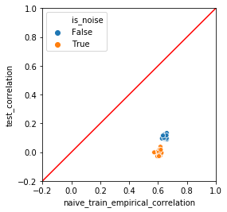


```python
print(scipy.stats.pearsonr(corr_frame['naive_train_hierarchical_correlation'], corr_frame['test_correlation']))
seaborn.scatterplot(x = "naive_train_hierarchical_correlation", y = "test_correlation", data = corr_frame, hue = "is_noise")
matplotlib.pyplot.plot([-1, 1], [-1, 1], color="red")
matplotlib.pyplot.xlim(-.2,1)
matplotlib.pyplot.ylim(-.2,1)
matplotlib.pyplot.gca().set_aspect('equal', adjustable='box')
```

    (0.8258065364890432, 1.2583430410297576e-28)


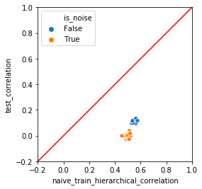


```python
print(scipy.stats.pearsonr(corr_frame['cross_frame_correlation'], corr_frame['test_correlation']))
seaborn.scatterplot(x = "cross_frame_correlation", y = "test_correlation", data = corr_frame,  hue = "is_noise")
matplotlib.pyplot.plot([-1, 1], [-1, 1], color="red")
matplotlib.pyplot.xlim(-.2,1)
matplotlib.pyplot.ylim(-.2,1)
matplotlib.pyplot.gca().set_aspect('equal', adjustable='box')
```

    (0.8133870647375077, 3.6414183722068735e-27)


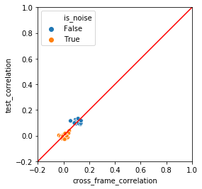


```python
plan.score_frame_.tail()
```


<div>
<style scoped>
    .dataframe tbody tr th:only-of-type {
        vertical-align: middle;
    }

    .dataframe tbody tr th {
        vertical-align: top;
    }

    .dataframe thead th {
        text-align: right;
    }
</style>
<table border="1" class="dataframe">
  <thead>
    <tr style="text-align: right;">
      <th></th>
      <th>variable</th>
      <th>orig_variable</th>
      <th>treatment</th>
      <th>y_aware</th>
      <th>has_range</th>
      <th>PearsonR</th>
      <th>significance</th>
      <th>vcount</th>
      <th>recommended</th>
    </tr>
  </thead>
  <tbody>
    <tr>
      <th>105</th>
      <td>noise_95_impact_code</td>
      <td>noise_95</td>
      <td>impact_code</td>
      <td>True</td>
      <td>True</td>
      <td>-0.013663</td>
      <td>0.494352</td>
      <td>110.0</td>
      <td>False</td>
    </tr>
    <tr>
      <th>106</th>
      <td>noise_96_impact_code</td>
      <td>noise_96</td>
      <td>impact_code</td>
      <td>True</td>
      <td>True</td>
      <td>-0.009555</td>
      <td>0.632710</td>
      <td>110.0</td>
      <td>False</td>
    </tr>
    <tr>
      <th>107</th>
      <td>noise_97_impact_code</td>
      <td>noise_97</td>
      <td>impact_code</td>
      <td>True</td>
      <td>True</td>
      <td>0.004867</td>
      <td>0.807658</td>
      <td>110.0</td>
      <td>False</td>
    </tr>
    <tr>
      <th>108</th>
      <td>noise_98_impact_code</td>
      <td>noise_98</td>
      <td>impact_code</td>
      <td>True</td>
      <td>True</td>
      <td>-0.020744</td>
      <td>0.299457</td>
      <td>110.0</td>
      <td>False</td>
    </tr>
    <tr>
      <th>109</th>
      <td>noise_99_impact_code</td>
      <td>noise_99</td>
      <td>impact_code</td>
      <td>True</td>
      <td>True</td>
      <td>0.003021</td>
      <td>0.879883</td>
      <td>110.0</td>
      <td>False</td>
    </tr>
  </tbody>
</table>
</div>


```python
recommended_vars = [vi for vi in plan.score_frame_["variable"][plan.score_frame_["recommended"]]]
recommended_vars
```


    ['var_0_impact_code',
     'var_1_impact_code',
     'var_2_impact_code',
     'var_3_impact_code',
     'var_4_impact_code',
     'var_5_impact_code',
     'var_6_impact_code',
     'var_7_impact_code',
     'var_8_impact_code',
     'var_9_impact_code',
     'noise_8_impact_code',
     'noise_30_impact_code',
     'noise_33_impact_code',
     'noise_79_impact_code']


```python

```


```python
plot_train = pandas.DataFrame({"y":y_train})
plot_test = pandas.DataFrame({"y":y_test})
```


```python
fitter = sklearn.linear_model.LinearRegression(fit_intercept = True)
```


```python
fitter.fit(cross_frame[all_vars], y_train)
plot_train["predict_cross_all_vars"] = fitter.predict(cross_frame[all_vars])
plot_test["predict_cross_all_vars"] = fitter.predict(prepared_test[all_vars])
```


```python
fitter.fit(cross_frame[recommended_vars], y_train)
plot_train["predict_cross_recommended_vars"] = fitter.predict(cross_frame[recommended_vars])
plot_test["predict_cross_recommended_vars"] = fitter.predict(prepared_test[recommended_vars])
```


```python
fitter.fit(naive_train_empirical[all_vars], y_train)
plot_train["predict_naive_empirical_all_vars"] = fitter.predict(naive_train_empirical[all_vars])
plot_test["predict_naive_empirical_all_vars"] = fitter.predict(prepared_test[all_vars])
```


```python
fitter.fit(naive_train_hierarchical[all_vars], y_train)
plot_train["predict_naive_hierarchical_all_vars"] = fitter.predict(naive_train_hierarchical[all_vars])
plot_test["predict_naive_hierarchical_all_vars"] = fitter.predict(prepared_test[all_vars])
```


```python
plot_test.head()
```


<div>
<style scoped>
    .dataframe tbody tr th:only-of-type {
        vertical-align: middle;
    }

    .dataframe tbody tr th {
        vertical-align: top;
    }

    .dataframe thead th {
        text-align: right;
    }
</style>
<table border="1" class="dataframe">
  <thead>
    <tr style="text-align: right;">
      <th></th>
      <th>y</th>
      <th>predict_cross_all_vars</th>
      <th>predict_cross_recommended_vars</th>
      <th>predict_naive_empirical_all_vars</th>
      <th>predict_naive_hierarchical_all_vars</th>
    </tr>
  </thead>
  <tbody>
    <tr>
      <th>0</th>
      <td>32.953417</td>
      <td>22.125107</td>
      <td>18.611290</td>
      <td>4.016931</td>
      <td>8.329277</td>
    </tr>
    <tr>
      <th>1</th>
      <td>56.313112</td>
      <td>22.567463</td>
      <td>19.654361</td>
      <td>2.231262</td>
      <td>4.961036</td>
    </tr>
    <tr>
      <th>2</th>
      <td>14.644008</td>
      <td>-1.837711</td>
      <td>4.899909</td>
      <td>1.861847</td>
      <td>2.383202</td>
    </tr>
    <tr>
      <th>3</th>
      <td>17.347639</td>
      <td>17.751063</td>
      <td>11.575775</td>
      <td>0.907482</td>
      <td>4.277905</td>
    </tr>
    <tr>
      <th>4</th>
      <td>-3.090683</td>
      <td>-3.724826</td>
      <td>-2.466523</td>
      <td>1.450413</td>
      <td>2.619052</td>
    </tr>
  </tbody>
</table>
</div>


```python

```


```python
def rmse(x, y):
    return numpy.sqrt(numpy.mean((x-y)**2))
```


```python
print(rmse(plot_train["predict_naive_empirical_all_vars"], plot_train["y"]))
seaborn.scatterplot(x="predict_naive_empirical_all_vars", y ="y", data = plot_train)
plt = matplotlib.pyplot.title("Naive empirical prediction on train")
```

    3.1155720636032127


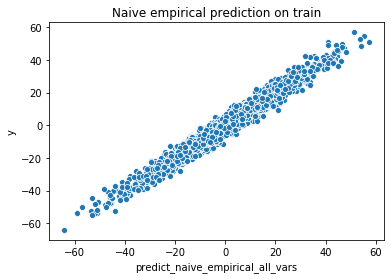


```python
print(rmse(plot_train["predict_naive_hierarchical_all_vars"], plot_train["y"]))
seaborn.scatterplot(x="predict_naive_hierarchical_all_vars", y ="y", data = plot_train)
plt = matplotlib.pyplot.title("Naive hierarchical prediction on train")
```

    4.56073488480497


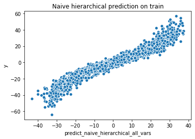


```python
print(rmse(plot_train["predict_cross_all_vars"], plot_train["y"]))
seaborn.scatterplot(x="predict_cross_all_vars", y ="y", data = plot_train)
plt = matplotlib.pyplot.title("Cross prediction on (all vars) train")
```

    15.153936637709865


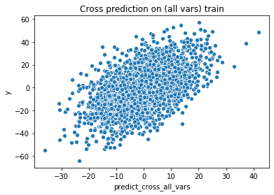


```python
print(rmse(plot_train["predict_cross_recommended_vars"], plot_train["y"]))
seaborn.scatterplot(x="predict_cross_recommended_vars", y ="y", data = plot_train)
plt = matplotlib.pyplot.title("Cross prediction (recommended vars) on train")
```

    15.557983087694414


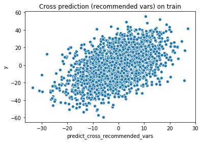


```python
print(rmse(plot_test["predict_naive_empirical_all_vars"], plot_test["y"]))
seaborn.scatterplot(x="predict_naive_empirical_all_vars", y ="y", data = plot_test)
plt = matplotlib.pyplot.title("Naive empirical prediction on test")
```

    17.550106395523475


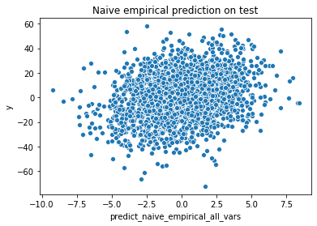


```python
print(rmse(plot_test["predict_naive_hierarchical_all_vars"], plot_test["y"]))
seaborn.scatterplot(x="predict_naive_hierarchical_all_vars", y ="y", data = plot_test)
plt = matplotlib.pyplot.title("Naive hierarchical prediction on test")
```

    17.21981240385328


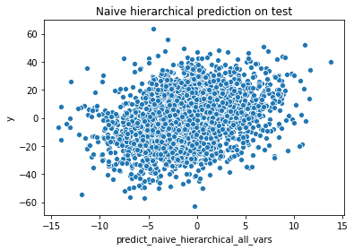


```python
print(rmse(plot_test["predict_cross_all_vars"], plot_test["y"]))
seaborn.scatterplot(x="predict_cross_all_vars", y ="y", data = plot_test)
plt = matplotlib.pyplot.title("Cross prediction on (all vars) test")
```

    15.750238207066912


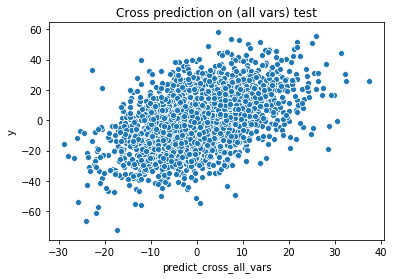


```python
print(rmse(plot_test["predict_cross_recommended_vars"], plot_test["y"]))
seaborn.scatterplot(x="predict_cross_recommended_vars", y ="y", data = plot_test)
plt = matplotlib.pyplot.title("Cross prediction (recommended vars) on test")
```

    15.471036130701433


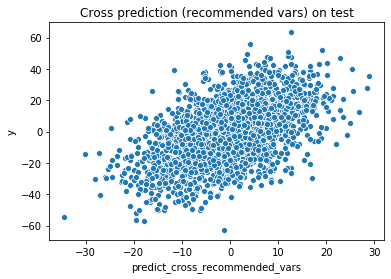


```python
smf1 = statsmodels.api.OLS(
    y_train, 
    statsmodels.api.add_constant(naive_train_empirical[all_vars])).fit()
smf1.summary()
```


<table class="simpletable">
<caption>OLS Regression Results</caption>
<tr>
  <th>Dep. Variable:</th>            <td>y</td>        <th>  R-squared:         </th> <td>   0.970</td> 
</tr>
<tr>
  <th>Model:</th>                   <td>OLS</td>       <th>  Adj. R-squared:    </th> <td>   0.968</td> 
</tr>
<tr>
  <th>Method:</th>             <td>Least Squares</td>  <th>  F-statistic:       </th> <td>   698.8</td> 
</tr>
<tr>
  <th>Date:</th>             <td>Sat, 27 Jul 2019</td> <th>  Prob (F-statistic):</th>  <td>  0.00</td>  
</tr>
<tr>
  <th>Time:</th>                 <td>16:28:05</td>     <th>  Log-Likelihood:    </th> <td> -6398.6</td> 
</tr>
<tr>
  <th>No. Observations:</th>      <td>  2504</td>      <th>  AIC:               </th> <td>1.302e+04</td>
</tr>
<tr>
  <th>Df Residuals:</th>          <td>  2393</td>      <th>  BIC:               </th> <td>1.367e+04</td>
</tr>
<tr>
  <th>Df Model:</th>              <td>   110</td>      <th>                     </th>     <td> </td>    
</tr>
<tr>
  <th>Covariance Type:</th>      <td>nonrobust</td>    <th>                     </th>     <td> </td>    
</tr>
</table>
<table class="simpletable">
<tr>
            <td></td>              <th>coef</th>     <th>std err</th>      <th>t</th>      <th>P>|t|</th>  <th>[0.025</th>    <th>0.975]</th>  
</tr>
<tr>
  <th>const</th>                <td>   -1.0312</td> <td>    0.064</td> <td>  -16.191</td> <td> 0.000</td> <td>   -1.156</td> <td>   -0.906</td>
</tr>
<tr>
  <th>var_0_impact_code</th>    <td>    0.0694</td> <td>    0.008</td> <td>    8.711</td> <td> 0.000</td> <td>    0.054</td> <td>    0.085</td>
</tr>
<tr>
  <th>var_1_impact_code</th>    <td>    0.0637</td> <td>    0.008</td> <td>    7.995</td> <td> 0.000</td> <td>    0.048</td> <td>    0.079</td>
</tr>
<tr>
  <th>var_2_impact_code</th>    <td>    0.0677</td> <td>    0.008</td> <td>    8.531</td> <td> 0.000</td> <td>    0.052</td> <td>    0.083</td>
</tr>
<tr>
  <th>var_3_impact_code</th>    <td>    0.0633</td> <td>    0.008</td> <td>    8.042</td> <td> 0.000</td> <td>    0.048</td> <td>    0.079</td>
</tr>
<tr>
  <th>var_4_impact_code</th>    <td>    0.0670</td> <td>    0.008</td> <td>    8.238</td> <td> 0.000</td> <td>    0.051</td> <td>    0.083</td>
</tr>
<tr>
  <th>var_5_impact_code</th>    <td>    0.0546</td> <td>    0.008</td> <td>    6.708</td> <td> 0.000</td> <td>    0.039</td> <td>    0.071</td>
</tr>
<tr>
  <th>var_6_impact_code</th>    <td>    0.0504</td> <td>    0.008</td> <td>    6.276</td> <td> 0.000</td> <td>    0.035</td> <td>    0.066</td>
</tr>
<tr>
  <th>var_7_impact_code</th>    <td>    0.0604</td> <td>    0.008</td> <td>    7.356</td> <td> 0.000</td> <td>    0.044</td> <td>    0.077</td>
</tr>
<tr>
  <th>var_8_impact_code</th>    <td>    0.0665</td> <td>    0.008</td> <td>    8.145</td> <td> 0.000</td> <td>    0.051</td> <td>    0.083</td>
</tr>
<tr>
  <th>var_9_impact_code</th>    <td>    0.0658</td> <td>    0.008</td> <td>    8.169</td> <td> 0.000</td> <td>    0.050</td> <td>    0.082</td>
</tr>
<tr>
  <th>noise_0_impact_code</th>  <td>    0.0507</td> <td>    0.009</td> <td>    5.723</td> <td> 0.000</td> <td>    0.033</td> <td>    0.068</td>
</tr>
<tr>
  <th>noise_1_impact_code</th>  <td>    0.0347</td> <td>    0.009</td> <td>    3.862</td> <td> 0.000</td> <td>    0.017</td> <td>    0.052</td>
</tr>
<tr>
  <th>noise_2_impact_code</th>  <td>    0.0378</td> <td>    0.009</td> <td>    4.109</td> <td> 0.000</td> <td>    0.020</td> <td>    0.056</td>
</tr>
<tr>
  <th>noise_3_impact_code</th>  <td>    0.0355</td> <td>    0.009</td> <td>    3.951</td> <td> 0.000</td> <td>    0.018</td> <td>    0.053</td>
</tr>
<tr>
  <th>noise_4_impact_code</th>  <td>    0.0368</td> <td>    0.009</td> <td>    4.032</td> <td> 0.000</td> <td>    0.019</td> <td>    0.055</td>
</tr>
<tr>
  <th>noise_5_impact_code</th>  <td>    0.0432</td> <td>    0.009</td> <td>    4.772</td> <td> 0.000</td> <td>    0.025</td> <td>    0.061</td>
</tr>
<tr>
  <th>noise_6_impact_code</th>  <td>    0.0488</td> <td>    0.009</td> <td>    5.379</td> <td> 0.000</td> <td>    0.031</td> <td>    0.067</td>
</tr>
<tr>
  <th>noise_7_impact_code</th>  <td>    0.0381</td> <td>    0.009</td> <td>    4.181</td> <td> 0.000</td> <td>    0.020</td> <td>    0.056</td>
</tr>
<tr>
  <th>noise_8_impact_code</th>  <td>    0.0525</td> <td>    0.009</td> <td>    5.954</td> <td> 0.000</td> <td>    0.035</td> <td>    0.070</td>
</tr>
<tr>
  <th>noise_9_impact_code</th>  <td>    0.0439</td> <td>    0.009</td> <td>    4.835</td> <td> 0.000</td> <td>    0.026</td> <td>    0.062</td>
</tr>
<tr>
  <th>noise_10_impact_code</th> <td>    0.0489</td> <td>    0.009</td> <td>    5.399</td> <td> 0.000</td> <td>    0.031</td> <td>    0.067</td>
</tr>
<tr>
  <th>noise_11_impact_code</th> <td>    0.0529</td> <td>    0.009</td> <td>    5.909</td> <td> 0.000</td> <td>    0.035</td> <td>    0.070</td>
</tr>
<tr>
  <th>noise_12_impact_code</th> <td>    0.0356</td> <td>    0.009</td> <td>    3.786</td> <td> 0.000</td> <td>    0.017</td> <td>    0.054</td>
</tr>
<tr>
  <th>noise_13_impact_code</th> <td>    0.0375</td> <td>    0.009</td> <td>    4.196</td> <td> 0.000</td> <td>    0.020</td> <td>    0.055</td>
</tr>
<tr>
  <th>noise_14_impact_code</th> <td>    0.0479</td> <td>    0.009</td> <td>    5.222</td> <td> 0.000</td> <td>    0.030</td> <td>    0.066</td>
</tr>
<tr>
  <th>noise_15_impact_code</th> <td>    0.0266</td> <td>    0.009</td> <td>    2.912</td> <td> 0.004</td> <td>    0.009</td> <td>    0.044</td>
</tr>
<tr>
  <th>noise_16_impact_code</th> <td>    0.0281</td> <td>    0.009</td> <td>    3.205</td> <td> 0.001</td> <td>    0.011</td> <td>    0.045</td>
</tr>
<tr>
  <th>noise_17_impact_code</th> <td>    0.0497</td> <td>    0.009</td> <td>    5.658</td> <td> 0.000</td> <td>    0.033</td> <td>    0.067</td>
</tr>
<tr>
  <th>noise_18_impact_code</th> <td>    0.0509</td> <td>    0.009</td> <td>    5.664</td> <td> 0.000</td> <td>    0.033</td> <td>    0.069</td>
</tr>
<tr>
  <th>noise_19_impact_code</th> <td>    0.0497</td> <td>    0.009</td> <td>    5.248</td> <td> 0.000</td> <td>    0.031</td> <td>    0.068</td>
</tr>
<tr>
  <th>noise_20_impact_code</th> <td>    0.0331</td> <td>    0.009</td> <td>    3.564</td> <td> 0.000</td> <td>    0.015</td> <td>    0.051</td>
</tr>
<tr>
  <th>noise_21_impact_code</th> <td>    0.0451</td> <td>    0.009</td> <td>    4.770</td> <td> 0.000</td> <td>    0.027</td> <td>    0.064</td>
</tr>
<tr>
  <th>noise_22_impact_code</th> <td>    0.0406</td> <td>    0.009</td> <td>    4.365</td> <td> 0.000</td> <td>    0.022</td> <td>    0.059</td>
</tr>
<tr>
  <th>noise_23_impact_code</th> <td>    0.0564</td> <td>    0.009</td> <td>    6.122</td> <td> 0.000</td> <td>    0.038</td> <td>    0.074</td>
</tr>
<tr>
  <th>noise_24_impact_code</th> <td>    0.0297</td> <td>    0.009</td> <td>    3.195</td> <td> 0.001</td> <td>    0.011</td> <td>    0.048</td>
</tr>
<tr>
  <th>noise_25_impact_code</th> <td>    0.0523</td> <td>    0.009</td> <td>    5.880</td> <td> 0.000</td> <td>    0.035</td> <td>    0.070</td>
</tr>
<tr>
  <th>noise_26_impact_code</th> <td>    0.0479</td> <td>    0.009</td> <td>    5.475</td> <td> 0.000</td> <td>    0.031</td> <td>    0.065</td>
</tr>
<tr>
  <th>noise_27_impact_code</th> <td>    0.0339</td> <td>    0.009</td> <td>    3.806</td> <td> 0.000</td> <td>    0.016</td> <td>    0.051</td>
</tr>
<tr>
  <th>noise_28_impact_code</th> <td>    0.0314</td> <td>    0.009</td> <td>    3.376</td> <td> 0.001</td> <td>    0.013</td> <td>    0.050</td>
</tr>
<tr>
  <th>noise_29_impact_code</th> <td>    0.0199</td> <td>    0.009</td> <td>    2.120</td> <td> 0.034</td> <td>    0.001</td> <td>    0.038</td>
</tr>
<tr>
  <th>noise_30_impact_code</th> <td>    0.0453</td> <td>    0.009</td> <td>    5.156</td> <td> 0.000</td> <td>    0.028</td> <td>    0.063</td>
</tr>
<tr>
  <th>noise_31_impact_code</th> <td>    0.0483</td> <td>    0.009</td> <td>    5.382</td> <td> 0.000</td> <td>    0.031</td> <td>    0.066</td>
</tr>
<tr>
  <th>noise_32_impact_code</th> <td>    0.0341</td> <td>    0.009</td> <td>    3.685</td> <td> 0.000</td> <td>    0.016</td> <td>    0.052</td>
</tr>
<tr>
  <th>noise_33_impact_code</th> <td>    0.0469</td> <td>    0.009</td> <td>    5.428</td> <td> 0.000</td> <td>    0.030</td> <td>    0.064</td>
</tr>
<tr>
  <th>noise_34_impact_code</th> <td>    0.0431</td> <td>    0.009</td> <td>    4.884</td> <td> 0.000</td> <td>    0.026</td> <td>    0.060</td>
</tr>
<tr>
  <th>noise_35_impact_code</th> <td>    0.0456</td> <td>    0.009</td> <td>    5.100</td> <td> 0.000</td> <td>    0.028</td> <td>    0.063</td>
</tr>
<tr>
  <th>noise_36_impact_code</th> <td>    0.0314</td> <td>    0.009</td> <td>    3.451</td> <td> 0.001</td> <td>    0.014</td> <td>    0.049</td>
</tr>
<tr>
  <th>noise_37_impact_code</th> <td>    0.0411</td> <td>    0.009</td> <td>    4.519</td> <td> 0.000</td> <td>    0.023</td> <td>    0.059</td>
</tr>
<tr>
  <th>noise_38_impact_code</th> <td>    0.0413</td> <td>    0.009</td> <td>    4.559</td> <td> 0.000</td> <td>    0.024</td> <td>    0.059</td>
</tr>
<tr>
  <th>noise_39_impact_code</th> <td>    0.0454</td> <td>    0.009</td> <td>    4.940</td> <td> 0.000</td> <td>    0.027</td> <td>    0.063</td>
</tr>
<tr>
  <th>noise_40_impact_code</th> <td>    0.0288</td> <td>    0.009</td> <td>    3.265</td> <td> 0.001</td> <td>    0.011</td> <td>    0.046</td>
</tr>
<tr>
  <th>noise_41_impact_code</th> <td>    0.0476</td> <td>    0.009</td> <td>    5.161</td> <td> 0.000</td> <td>    0.029</td> <td>    0.066</td>
</tr>
<tr>
  <th>noise_42_impact_code</th> <td>    0.0370</td> <td>    0.009</td> <td>    4.161</td> <td> 0.000</td> <td>    0.020</td> <td>    0.054</td>
</tr>
<tr>
  <th>noise_43_impact_code</th> <td>    0.0375</td> <td>    0.009</td> <td>    4.059</td> <td> 0.000</td> <td>    0.019</td> <td>    0.056</td>
</tr>
<tr>
  <th>noise_44_impact_code</th> <td>    0.0405</td> <td>    0.009</td> <td>    4.518</td> <td> 0.000</td> <td>    0.023</td> <td>    0.058</td>
</tr>
<tr>
  <th>noise_45_impact_code</th> <td>    0.0383</td> <td>    0.009</td> <td>    4.087</td> <td> 0.000</td> <td>    0.020</td> <td>    0.057</td>
</tr>
<tr>
  <th>noise_46_impact_code</th> <td>    0.0342</td> <td>    0.009</td> <td>    3.726</td> <td> 0.000</td> <td>    0.016</td> <td>    0.052</td>
</tr>
<tr>
  <th>noise_47_impact_code</th> <td>    0.0551</td> <td>    0.009</td> <td>    6.072</td> <td> 0.000</td> <td>    0.037</td> <td>    0.073</td>
</tr>
<tr>
  <th>noise_48_impact_code</th> <td>    0.0292</td> <td>    0.009</td> <td>    3.203</td> <td> 0.001</td> <td>    0.011</td> <td>    0.047</td>
</tr>
<tr>
  <th>noise_49_impact_code</th> <td>    0.0380</td> <td>    0.009</td> <td>    4.079</td> <td> 0.000</td> <td>    0.020</td> <td>    0.056</td>
</tr>
<tr>
  <th>noise_50_impact_code</th> <td>    0.0399</td> <td>    0.009</td> <td>    4.264</td> <td> 0.000</td> <td>    0.022</td> <td>    0.058</td>
</tr>
<tr>
  <th>noise_51_impact_code</th> <td>    0.0492</td> <td>    0.009</td> <td>    5.332</td> <td> 0.000</td> <td>    0.031</td> <td>    0.067</td>
</tr>
<tr>
  <th>noise_52_impact_code</th> <td>    0.0455</td> <td>    0.009</td> <td>    4.966</td> <td> 0.000</td> <td>    0.028</td> <td>    0.063</td>
</tr>
<tr>
  <th>noise_53_impact_code</th> <td>    0.0312</td> <td>    0.009</td> <td>    3.462</td> <td> 0.001</td> <td>    0.014</td> <td>    0.049</td>
</tr>
<tr>
  <th>noise_54_impact_code</th> <td>    0.0447</td> <td>    0.009</td> <td>    4.924</td> <td> 0.000</td> <td>    0.027</td> <td>    0.063</td>
</tr>
<tr>
  <th>noise_55_impact_code</th> <td>    0.0529</td> <td>    0.009</td> <td>    5.742</td> <td> 0.000</td> <td>    0.035</td> <td>    0.071</td>
</tr>
<tr>
  <th>noise_56_impact_code</th> <td>    0.0597</td> <td>    0.009</td> <td>    6.445</td> <td> 0.000</td> <td>    0.042</td> <td>    0.078</td>
</tr>
<tr>
  <th>noise_57_impact_code</th> <td>    0.0247</td> <td>    0.009</td> <td>    2.724</td> <td> 0.006</td> <td>    0.007</td> <td>    0.042</td>
</tr>
<tr>
  <th>noise_58_impact_code</th> <td>    0.0302</td> <td>    0.009</td> <td>    3.255</td> <td> 0.001</td> <td>    0.012</td> <td>    0.048</td>
</tr>
<tr>
  <th>noise_59_impact_code</th> <td>    0.0245</td> <td>    0.009</td> <td>    2.621</td> <td> 0.009</td> <td>    0.006</td> <td>    0.043</td>
</tr>
<tr>
  <th>noise_60_impact_code</th> <td>    0.0443</td> <td>    0.009</td> <td>    4.983</td> <td> 0.000</td> <td>    0.027</td> <td>    0.062</td>
</tr>
<tr>
  <th>noise_61_impact_code</th> <td>    0.0520</td> <td>    0.009</td> <td>    5.763</td> <td> 0.000</td> <td>    0.034</td> <td>    0.070</td>
</tr>
<tr>
  <th>noise_62_impact_code</th> <td>    0.0481</td> <td>    0.009</td> <td>    5.099</td> <td> 0.000</td> <td>    0.030</td> <td>    0.067</td>
</tr>
<tr>
  <th>noise_63_impact_code</th> <td>    0.0329</td> <td>    0.009</td> <td>    3.657</td> <td> 0.000</td> <td>    0.015</td> <td>    0.051</td>
</tr>
<tr>
  <th>noise_64_impact_code</th> <td>    0.0345</td> <td>    0.009</td> <td>    3.778</td> <td> 0.000</td> <td>    0.017</td> <td>    0.052</td>
</tr>
<tr>
  <th>noise_65_impact_code</th> <td>    0.0428</td> <td>    0.009</td> <td>    4.601</td> <td> 0.000</td> <td>    0.025</td> <td>    0.061</td>
</tr>
<tr>
  <th>noise_66_impact_code</th> <td>    0.0359</td> <td>    0.009</td> <td>    3.882</td> <td> 0.000</td> <td>    0.018</td> <td>    0.054</td>
</tr>
<tr>
  <th>noise_67_impact_code</th> <td>    0.0417</td> <td>    0.009</td> <td>    4.698</td> <td> 0.000</td> <td>    0.024</td> <td>    0.059</td>
</tr>
<tr>
  <th>noise_68_impact_code</th> <td>    0.0423</td> <td>    0.009</td> <td>    4.671</td> <td> 0.000</td> <td>    0.025</td> <td>    0.060</td>
</tr>
<tr>
  <th>noise_69_impact_code</th> <td>    0.0362</td> <td>    0.009</td> <td>    4.085</td> <td> 0.000</td> <td>    0.019</td> <td>    0.054</td>
</tr>
<tr>
  <th>noise_70_impact_code</th> <td>    0.0295</td> <td>    0.009</td> <td>    3.191</td> <td> 0.001</td> <td>    0.011</td> <td>    0.048</td>
</tr>
<tr>
  <th>noise_71_impact_code</th> <td>    0.0377</td> <td>    0.009</td> <td>    4.018</td> <td> 0.000</td> <td>    0.019</td> <td>    0.056</td>
</tr>
<tr>
  <th>noise_72_impact_code</th> <td>    0.0546</td> <td>    0.010</td> <td>    5.653</td> <td> 0.000</td> <td>    0.036</td> <td>    0.073</td>
</tr>
<tr>
  <th>noise_73_impact_code</th> <td>    0.0251</td> <td>    0.009</td> <td>    2.659</td> <td> 0.008</td> <td>    0.007</td> <td>    0.044</td>
</tr>
<tr>
  <th>noise_74_impact_code</th> <td>    0.0599</td> <td>    0.009</td> <td>    6.420</td> <td> 0.000</td> <td>    0.042</td> <td>    0.078</td>
</tr>
<tr>
  <th>noise_75_impact_code</th> <td>    0.0442</td> <td>    0.009</td> <td>    4.844</td> <td> 0.000</td> <td>    0.026</td> <td>    0.062</td>
</tr>
<tr>
  <th>noise_76_impact_code</th> <td>    0.0248</td> <td>    0.009</td> <td>    2.687</td> <td> 0.007</td> <td>    0.007</td> <td>    0.043</td>
</tr>
<tr>
  <th>noise_77_impact_code</th> <td>    0.0396</td> <td>    0.009</td> <td>    4.372</td> <td> 0.000</td> <td>    0.022</td> <td>    0.057</td>
</tr>
<tr>
  <th>noise_78_impact_code</th> <td>    0.0493</td> <td>    0.009</td> <td>    5.232</td> <td> 0.000</td> <td>    0.031</td> <td>    0.068</td>
</tr>
<tr>
  <th>noise_79_impact_code</th> <td>    0.0257</td> <td>    0.009</td> <td>    2.954</td> <td> 0.003</td> <td>    0.009</td> <td>    0.043</td>
</tr>
<tr>
  <th>noise_80_impact_code</th> <td>    0.0390</td> <td>    0.009</td> <td>    4.288</td> <td> 0.000</td> <td>    0.021</td> <td>    0.057</td>
</tr>
<tr>
  <th>noise_81_impact_code</th> <td>    0.0379</td> <td>    0.009</td> <td>    4.189</td> <td> 0.000</td> <td>    0.020</td> <td>    0.056</td>
</tr>
<tr>
  <th>noise_82_impact_code</th> <td>    0.0326</td> <td>    0.009</td> <td>    3.542</td> <td> 0.000</td> <td>    0.015</td> <td>    0.051</td>
</tr>
<tr>
  <th>noise_83_impact_code</th> <td>    0.0353</td> <td>    0.009</td> <td>    3.967</td> <td> 0.000</td> <td>    0.018</td> <td>    0.053</td>
</tr>
<tr>
  <th>noise_84_impact_code</th> <td>    0.0289</td> <td>    0.009</td> <td>    3.241</td> <td> 0.001</td> <td>    0.011</td> <td>    0.046</td>
</tr>
<tr>
  <th>noise_85_impact_code</th> <td>    0.0235</td> <td>    0.009</td> <td>    2.581</td> <td> 0.010</td> <td>    0.006</td> <td>    0.041</td>
</tr>
<tr>
  <th>noise_86_impact_code</th> <td>    0.0321</td> <td>    0.009</td> <td>    3.504</td> <td> 0.000</td> <td>    0.014</td> <td>    0.050</td>
</tr>
<tr>
  <th>noise_87_impact_code</th> <td>    0.0688</td> <td>    0.009</td> <td>    7.466</td> <td> 0.000</td> <td>    0.051</td> <td>    0.087</td>
</tr>
<tr>
  <th>noise_88_impact_code</th> <td>    0.0409</td> <td>    0.009</td> <td>    4.437</td> <td> 0.000</td> <td>    0.023</td> <td>    0.059</td>
</tr>
<tr>
  <th>noise_89_impact_code</th> <td>    0.0540</td> <td>    0.009</td> <td>    5.986</td> <td> 0.000</td> <td>    0.036</td> <td>    0.072</td>
</tr>
<tr>
  <th>noise_90_impact_code</th> <td>    0.0414</td> <td>    0.009</td> <td>    4.690</td> <td> 0.000</td> <td>    0.024</td> <td>    0.059</td>
</tr>
<tr>
  <th>noise_91_impact_code</th> <td>    0.0333</td> <td>    0.009</td> <td>    3.623</td> <td> 0.000</td> <td>    0.015</td> <td>    0.051</td>
</tr>
<tr>
  <th>noise_92_impact_code</th> <td>    0.0499</td> <td>    0.009</td> <td>    5.514</td> <td> 0.000</td> <td>    0.032</td> <td>    0.068</td>
</tr>
<tr>
  <th>noise_93_impact_code</th> <td>    0.0360</td> <td>    0.009</td> <td>    3.820</td> <td> 0.000</td> <td>    0.018</td> <td>    0.054</td>
</tr>
<tr>
  <th>noise_94_impact_code</th> <td>    0.0280</td> <td>    0.009</td> <td>    3.181</td> <td> 0.001</td> <td>    0.011</td> <td>    0.045</td>
</tr>
<tr>
  <th>noise_95_impact_code</th> <td>    0.0544</td> <td>    0.009</td> <td>    6.009</td> <td> 0.000</td> <td>    0.037</td> <td>    0.072</td>
</tr>
<tr>
  <th>noise_96_impact_code</th> <td>    0.0492</td> <td>    0.009</td> <td>    5.383</td> <td> 0.000</td> <td>    0.031</td> <td>    0.067</td>
</tr>
<tr>
  <th>noise_97_impact_code</th> <td>    0.0323</td> <td>    0.009</td> <td>    3.595</td> <td> 0.000</td> <td>    0.015</td> <td>    0.050</td>
</tr>
<tr>
  <th>noise_98_impact_code</th> <td>    0.0295</td> <td>    0.009</td> <td>    3.210</td> <td> 0.001</td> <td>    0.011</td> <td>    0.048</td>
</tr>
<tr>
  <th>noise_99_impact_code</th> <td>    0.0470</td> <td>    0.009</td> <td>    5.046</td> <td> 0.000</td> <td>    0.029</td> <td>    0.065</td>
</tr>
</table>
<table class="simpletable">
<tr>
  <th>Omnibus:</th>       <td> 0.122</td> <th>  Durbin-Watson:     </th> <td>   2.003</td>
</tr>
<tr>
  <th>Prob(Omnibus):</th> <td> 0.941</td> <th>  Jarque-Bera (JB):  </th> <td>   0.165</td>
</tr>
<tr>
  <th>Skew:</th>          <td> 0.009</td> <th>  Prob(JB):          </th> <td>   0.921</td>
</tr>
<tr>
  <th>Kurtosis:</th>      <td> 2.964</td> <th>  Cond. No.          </th> <td>    39.3</td>
</tr>
</table><br/><br/>Warnings:<br/>[1] Standard Errors assume that the covariance matrix of the errors is correctly specified.


```python
sklearn.metrics.r2_score(plot_train["y"],plot_train["predict_naive_empirical_all_vars"])
```


    0.9698069759290067


```python
sklearn.metrics.r2_score(plot_test["y"],plot_test["predict_naive_empirical_all_vars"])
```


    0.05881321441094223


```python
smf2 = statsmodels.api.OLS(
    y_train, 
    statsmodels.api.add_constant(cross_frame[all_vars])).fit()
smf2.summary()
```


<table class="simpletable">
<caption>OLS Regression Results</caption>
<tr>
  <th>Dep. Variable:</th>            <td>y</td>        <th>  R-squared:         </th> <td>   0.286</td> 
</tr>
<tr>
  <th>Model:</th>                   <td>OLS</td>       <th>  Adj. R-squared:    </th> <td>   0.253</td> 
</tr>
<tr>
  <th>Method:</th>             <td>Least Squares</td>  <th>  F-statistic:       </th> <td>   8.701</td> 
</tr>
<tr>
  <th>Date:</th>             <td>Sat, 27 Jul 2019</td> <th>  Prob (F-statistic):</th> <td>1.64e-109</td>
</tr>
<tr>
  <th>Time:</th>                 <td>16:28:05</td>     <th>  Log-Likelihood:    </th> <td> -10360.</td> 
</tr>
<tr>
  <th>No. Observations:</th>      <td>  2504</td>      <th>  AIC:               </th> <td>2.094e+04</td>
</tr>
<tr>
  <th>Df Residuals:</th>          <td>  2393</td>      <th>  BIC:               </th> <td>2.159e+04</td>
</tr>
<tr>
  <th>Df Model:</th>              <td>   110</td>      <th>                     </th>     <td> </td>    
</tr>
<tr>
  <th>Covariance Type:</th>      <td>nonrobust</td>    <th>                     </th>     <td> </td>    
</tr>
</table>
<table class="simpletable">
<tr>
            <td></td>              <th>coef</th>     <th>std err</th>      <th>t</th>      <th>P>|t|</th>  <th>[0.025</th>    <th>0.975]</th>  
</tr>
<tr>
  <th>const</th>                <td>   -0.7600</td> <td>    0.314</td> <td>   -2.419</td> <td> 0.016</td> <td>   -1.376</td> <td>   -0.144</td>
</tr>
<tr>
  <th>var_0_impact_code</th>    <td>    0.4666</td> <td>    0.045</td> <td>   10.333</td> <td> 0.000</td> <td>    0.378</td> <td>    0.555</td>
</tr>
<tr>
  <th>var_1_impact_code</th>    <td>    0.4203</td> <td>    0.046</td> <td>    9.166</td> <td> 0.000</td> <td>    0.330</td> <td>    0.510</td>
</tr>
<tr>
  <th>var_2_impact_code</th>    <td>    0.4468</td> <td>    0.048</td> <td>    9.315</td> <td> 0.000</td> <td>    0.353</td> <td>    0.541</td>
</tr>
<tr>
  <th>var_3_impact_code</th>    <td>    0.3698</td> <td>    0.047</td> <td>    7.920</td> <td> 0.000</td> <td>    0.278</td> <td>    0.461</td>
</tr>
<tr>
  <th>var_4_impact_code</th>    <td>    0.4220</td> <td>    0.048</td> <td>    8.837</td> <td> 0.000</td> <td>    0.328</td> <td>    0.516</td>
</tr>
<tr>
  <th>var_5_impact_code</th>    <td>    0.3820</td> <td>    0.048</td> <td>    8.028</td> <td> 0.000</td> <td>    0.289</td> <td>    0.475</td>
</tr>
<tr>
  <th>var_6_impact_code</th>    <td>    0.3643</td> <td>    0.047</td> <td>    7.690</td> <td> 0.000</td> <td>    0.271</td> <td>    0.457</td>
</tr>
<tr>
  <th>var_7_impact_code</th>    <td>    0.3202</td> <td>    0.048</td> <td>    6.702</td> <td> 0.000</td> <td>    0.226</td> <td>    0.414</td>
</tr>
<tr>
  <th>var_8_impact_code</th>    <td>    0.3699</td> <td>    0.048</td> <td>    7.685</td> <td> 0.000</td> <td>    0.276</td> <td>    0.464</td>
</tr>
<tr>
  <th>var_9_impact_code</th>    <td>    0.4387</td> <td>    0.047</td> <td>    9.243</td> <td> 0.000</td> <td>    0.346</td> <td>    0.532</td>
</tr>
<tr>
  <th>noise_0_impact_code</th>  <td>    0.0446</td> <td>    0.059</td> <td>    0.757</td> <td> 0.449</td> <td>   -0.071</td> <td>    0.160</td>
</tr>
<tr>
  <th>noise_1_impact_code</th>  <td>    0.0014</td> <td>    0.058</td> <td>    0.025</td> <td> 0.980</td> <td>   -0.113</td> <td>    0.116</td>
</tr>
<tr>
  <th>noise_2_impact_code</th>  <td>   -0.0381</td> <td>    0.061</td> <td>   -0.629</td> <td> 0.529</td> <td>   -0.157</td> <td>    0.081</td>
</tr>
<tr>
  <th>noise_3_impact_code</th>  <td>    0.0638</td> <td>    0.059</td> <td>    1.089</td> <td> 0.276</td> <td>   -0.051</td> <td>    0.179</td>
</tr>
<tr>
  <th>noise_4_impact_code</th>  <td>   -0.0026</td> <td>    0.059</td> <td>   -0.045</td> <td> 0.964</td> <td>   -0.118</td> <td>    0.113</td>
</tr>
<tr>
  <th>noise_5_impact_code</th>  <td>   -0.0546</td> <td>    0.057</td> <td>   -0.959</td> <td> 0.338</td> <td>   -0.166</td> <td>    0.057</td>
</tr>
<tr>
  <th>noise_6_impact_code</th>  <td>   -0.0144</td> <td>    0.059</td> <td>   -0.243</td> <td> 0.808</td> <td>   -0.131</td> <td>    0.102</td>
</tr>
<tr>
  <th>noise_7_impact_code</th>  <td>    0.0429</td> <td>    0.060</td> <td>    0.710</td> <td> 0.478</td> <td>   -0.076</td> <td>    0.162</td>
</tr>
<tr>
  <th>noise_8_impact_code</th>  <td>    0.1150</td> <td>    0.055</td> <td>    2.073</td> <td> 0.038</td> <td>    0.006</td> <td>    0.224</td>
</tr>
<tr>
  <th>noise_9_impact_code</th>  <td>   -0.0820</td> <td>    0.059</td> <td>   -1.393</td> <td> 0.164</td> <td>   -0.197</td> <td>    0.033</td>
</tr>
<tr>
  <th>noise_10_impact_code</th> <td>    0.0656</td> <td>    0.055</td> <td>    1.196</td> <td> 0.232</td> <td>   -0.042</td> <td>    0.173</td>
</tr>
<tr>
  <th>noise_11_impact_code</th> <td>    0.0296</td> <td>    0.056</td> <td>    0.528</td> <td> 0.597</td> <td>   -0.080</td> <td>    0.139</td>
</tr>
<tr>
  <th>noise_12_impact_code</th> <td>   -0.1157</td> <td>    0.060</td> <td>   -1.919</td> <td> 0.055</td> <td>   -0.234</td> <td>    0.003</td>
</tr>
<tr>
  <th>noise_13_impact_code</th> <td>    0.0559</td> <td>    0.058</td> <td>    0.972</td> <td> 0.331</td> <td>   -0.057</td> <td>    0.169</td>
</tr>
<tr>
  <th>noise_14_impact_code</th> <td>    0.1143</td> <td>    0.063</td> <td>    1.822</td> <td> 0.069</td> <td>   -0.009</td> <td>    0.237</td>
</tr>
<tr>
  <th>noise_15_impact_code</th> <td>    0.0208</td> <td>    0.055</td> <td>    0.376</td> <td> 0.707</td> <td>   -0.088</td> <td>    0.129</td>
</tr>
<tr>
  <th>noise_16_impact_code</th> <td>    0.1164</td> <td>    0.056</td> <td>    2.078</td> <td> 0.038</td> <td>    0.007</td> <td>    0.226</td>
</tr>
<tr>
  <th>noise_17_impact_code</th> <td>    0.0584</td> <td>    0.054</td> <td>    1.092</td> <td> 0.275</td> <td>   -0.047</td> <td>    0.163</td>
</tr>
<tr>
  <th>noise_18_impact_code</th> <td>   -0.0035</td> <td>    0.057</td> <td>   -0.062</td> <td> 0.951</td> <td>   -0.116</td> <td>    0.109</td>
</tr>
<tr>
  <th>noise_19_impact_code</th> <td>   -0.0368</td> <td>    0.061</td> <td>   -0.605</td> <td> 0.545</td> <td>   -0.156</td> <td>    0.083</td>
</tr>
<tr>
  <th>noise_20_impact_code</th> <td>    0.0045</td> <td>    0.060</td> <td>    0.075</td> <td> 0.941</td> <td>   -0.113</td> <td>    0.122</td>
</tr>
<tr>
  <th>noise_21_impact_code</th> <td>   -0.1072</td> <td>    0.061</td> <td>   -1.770</td> <td> 0.077</td> <td>   -0.226</td> <td>    0.012</td>
</tr>
<tr>
  <th>noise_22_impact_code</th> <td>   -0.0778</td> <td>    0.060</td> <td>   -1.305</td> <td> 0.192</td> <td>   -0.195</td> <td>    0.039</td>
</tr>
<tr>
  <th>noise_23_impact_code</th> <td>    0.0212</td> <td>    0.063</td> <td>    0.338</td> <td> 0.736</td> <td>   -0.102</td> <td>    0.144</td>
</tr>
<tr>
  <th>noise_24_impact_code</th> <td>   -0.1660</td> <td>    0.062</td> <td>   -2.698</td> <td> 0.007</td> <td>   -0.287</td> <td>   -0.045</td>
</tr>
<tr>
  <th>noise_25_impact_code</th> <td>   -0.0151</td> <td>    0.056</td> <td>   -0.268</td> <td> 0.789</td> <td>   -0.126</td> <td>    0.096</td>
</tr>
<tr>
  <th>noise_26_impact_code</th> <td>    0.0335</td> <td>    0.054</td> <td>    0.622</td> <td> 0.534</td> <td>   -0.072</td> <td>    0.139</td>
</tr>
<tr>
  <th>noise_27_impact_code</th> <td>    0.0514</td> <td>    0.059</td> <td>    0.876</td> <td> 0.381</td> <td>   -0.064</td> <td>    0.166</td>
</tr>
<tr>
  <th>noise_28_impact_code</th> <td>   -0.0313</td> <td>    0.060</td> <td>   -0.525</td> <td> 0.600</td> <td>   -0.148</td> <td>    0.086</td>
</tr>
<tr>
  <th>noise_29_impact_code</th> <td>   -0.0770</td> <td>    0.059</td> <td>   -1.308</td> <td> 0.191</td> <td>   -0.193</td> <td>    0.038</td>
</tr>
<tr>
  <th>noise_30_impact_code</th> <td>    0.1788</td> <td>    0.057</td> <td>    3.136</td> <td> 0.002</td> <td>    0.067</td> <td>    0.291</td>
</tr>
<tr>
  <th>noise_31_impact_code</th> <td>    0.1151</td> <td>    0.057</td> <td>    2.021</td> <td> 0.043</td> <td>    0.003</td> <td>    0.227</td>
</tr>
<tr>
  <th>noise_32_impact_code</th> <td>   -0.0904</td> <td>    0.061</td> <td>   -1.470</td> <td> 0.142</td> <td>   -0.211</td> <td>    0.030</td>
</tr>
<tr>
  <th>noise_33_impact_code</th> <td>    0.1972</td> <td>    0.057</td> <td>    3.434</td> <td> 0.001</td> <td>    0.085</td> <td>    0.310</td>
</tr>
<tr>
  <th>noise_34_impact_code</th> <td>    0.0772</td> <td>    0.057</td> <td>    1.359</td> <td> 0.174</td> <td>   -0.034</td> <td>    0.189</td>
</tr>
<tr>
  <th>noise_35_impact_code</th> <td>    0.0065</td> <td>    0.054</td> <td>    0.121</td> <td> 0.904</td> <td>   -0.099</td> <td>    0.112</td>
</tr>
<tr>
  <th>noise_36_impact_code</th> <td>    0.0795</td> <td>    0.058</td> <td>    1.367</td> <td> 0.172</td> <td>   -0.035</td> <td>    0.193</td>
</tr>
<tr>
  <th>noise_37_impact_code</th> <td>   -0.0337</td> <td>    0.058</td> <td>   -0.582</td> <td> 0.561</td> <td>   -0.148</td> <td>    0.080</td>
</tr>
<tr>
  <th>noise_38_impact_code</th> <td>    0.0481</td> <td>    0.059</td> <td>    0.820</td> <td> 0.412</td> <td>   -0.067</td> <td>    0.163</td>
</tr>
<tr>
  <th>noise_39_impact_code</th> <td>   -0.0396</td> <td>    0.062</td> <td>   -0.637</td> <td> 0.524</td> <td>   -0.162</td> <td>    0.082</td>
</tr>
<tr>
  <th>noise_40_impact_code</th> <td>    0.0832</td> <td>    0.059</td> <td>    1.414</td> <td> 0.158</td> <td>   -0.032</td> <td>    0.199</td>
</tr>
<tr>
  <th>noise_41_impact_code</th> <td>   -0.0178</td> <td>    0.062</td> <td>   -0.287</td> <td> 0.774</td> <td>   -0.140</td> <td>    0.104</td>
</tr>
<tr>
  <th>noise_42_impact_code</th> <td>    0.0353</td> <td>    0.057</td> <td>    0.618</td> <td> 0.536</td> <td>   -0.077</td> <td>    0.147</td>
</tr>
<tr>
  <th>noise_43_impact_code</th> <td>   -0.0926</td> <td>    0.062</td> <td>   -1.488</td> <td> 0.137</td> <td>   -0.215</td> <td>    0.029</td>
</tr>
<tr>
  <th>noise_44_impact_code</th> <td>    0.0615</td> <td>    0.056</td> <td>    1.095</td> <td> 0.274</td> <td>   -0.049</td> <td>    0.172</td>
</tr>
<tr>
  <th>noise_45_impact_code</th> <td>   -0.1540</td> <td>    0.061</td> <td>   -2.534</td> <td> 0.011</td> <td>   -0.273</td> <td>   -0.035</td>
</tr>
<tr>
  <th>noise_46_impact_code</th> <td>    0.0084</td> <td>    0.057</td> <td>    0.147</td> <td> 0.883</td> <td>   -0.104</td> <td>    0.120</td>
</tr>
<tr>
  <th>noise_47_impact_code</th> <td>    0.0722</td> <td>    0.059</td> <td>    1.226</td> <td> 0.220</td> <td>   -0.043</td> <td>    0.188</td>
</tr>
<tr>
  <th>noise_48_impact_code</th> <td>   -0.1043</td> <td>    0.061</td> <td>   -1.721</td> <td> 0.085</td> <td>   -0.223</td> <td>    0.015</td>
</tr>
<tr>
  <th>noise_49_impact_code</th> <td>   -0.0796</td> <td>    0.058</td> <td>   -1.363</td> <td> 0.173</td> <td>   -0.194</td> <td>    0.035</td>
</tr>
<tr>
  <th>noise_50_impact_code</th> <td>   -0.1132</td> <td>    0.067</td> <td>   -1.684</td> <td> 0.092</td> <td>   -0.245</td> <td>    0.019</td>
</tr>
<tr>
  <th>noise_51_impact_code</th> <td>   -0.1507</td> <td>    0.057</td> <td>   -2.655</td> <td> 0.008</td> <td>   -0.262</td> <td>   -0.039</td>
</tr>
<tr>
  <th>noise_52_impact_code</th> <td>    0.0194</td> <td>    0.056</td> <td>    0.346</td> <td> 0.729</td> <td>   -0.090</td> <td>    0.129</td>
</tr>
<tr>
  <th>noise_53_impact_code</th> <td>   -0.0034</td> <td>    0.057</td> <td>   -0.060</td> <td> 0.952</td> <td>   -0.116</td> <td>    0.109</td>
</tr>
<tr>
  <th>noise_54_impact_code</th> <td>    0.1070</td> <td>    0.059</td> <td>    1.803</td> <td> 0.072</td> <td>   -0.009</td> <td>    0.223</td>
</tr>
<tr>
  <th>noise_55_impact_code</th> <td>   -0.0822</td> <td>    0.056</td> <td>   -1.474</td> <td> 0.141</td> <td>   -0.192</td> <td>    0.027</td>
</tr>
<tr>
  <th>noise_56_impact_code</th> <td>   -0.0306</td> <td>    0.061</td> <td>   -0.504</td> <td> 0.615</td> <td>   -0.150</td> <td>    0.089</td>
</tr>
<tr>
  <th>noise_57_impact_code</th> <td>   -0.0032</td> <td>    0.058</td> <td>   -0.055</td> <td> 0.956</td> <td>   -0.116</td> <td>    0.110</td>
</tr>
<tr>
  <th>noise_58_impact_code</th> <td>   -0.0258</td> <td>    0.062</td> <td>   -0.415</td> <td> 0.679</td> <td>   -0.148</td> <td>    0.096</td>
</tr>
<tr>
  <th>noise_59_impact_code</th> <td>   -0.0241</td> <td>    0.057</td> <td>   -0.419</td> <td> 0.675</td> <td>   -0.137</td> <td>    0.089</td>
</tr>
<tr>
  <th>noise_60_impact_code</th> <td>    0.0199</td> <td>    0.057</td> <td>    0.347</td> <td> 0.729</td> <td>   -0.092</td> <td>    0.132</td>
</tr>
<tr>
  <th>noise_61_impact_code</th> <td>   -0.0341</td> <td>    0.059</td> <td>   -0.582</td> <td> 0.560</td> <td>   -0.149</td> <td>    0.081</td>
</tr>
<tr>
  <th>noise_62_impact_code</th> <td>   -0.0625</td> <td>    0.062</td> <td>   -1.016</td> <td> 0.310</td> <td>   -0.183</td> <td>    0.058</td>
</tr>
<tr>
  <th>noise_63_impact_code</th> <td> 1.924e-05</td> <td>    0.057</td> <td>    0.000</td> <td> 1.000</td> <td>   -0.112</td> <td>    0.112</td>
</tr>
<tr>
  <th>noise_64_impact_code</th> <td>   -0.0151</td> <td>    0.058</td> <td>   -0.260</td> <td> 0.795</td> <td>   -0.129</td> <td>    0.099</td>
</tr>
<tr>
  <th>noise_65_impact_code</th> <td>    0.0140</td> <td>    0.062</td> <td>    0.225</td> <td> 0.822</td> <td>   -0.108</td> <td>    0.136</td>
</tr>
<tr>
  <th>noise_66_impact_code</th> <td>   -0.0315</td> <td>    0.059</td> <td>   -0.536</td> <td> 0.592</td> <td>   -0.147</td> <td>    0.084</td>
</tr>
<tr>
  <th>noise_67_impact_code</th> <td>   -0.0002</td> <td>    0.055</td> <td>   -0.003</td> <td> 0.997</td> <td>   -0.107</td> <td>    0.107</td>
</tr>
<tr>
  <th>noise_68_impact_code</th> <td>    0.0402</td> <td>    0.058</td> <td>    0.691</td> <td> 0.489</td> <td>   -0.074</td> <td>    0.154</td>
</tr>
<tr>
  <th>noise_69_impact_code</th> <td>    0.0446</td> <td>    0.058</td> <td>    0.766</td> <td> 0.444</td> <td>   -0.070</td> <td>    0.159</td>
</tr>
<tr>
  <th>noise_70_impact_code</th> <td>    0.0375</td> <td>    0.062</td> <td>    0.609</td> <td> 0.543</td> <td>   -0.083</td> <td>    0.158</td>
</tr>
<tr>
  <th>noise_71_impact_code</th> <td>   -0.1024</td> <td>    0.062</td> <td>   -1.641</td> <td> 0.101</td> <td>   -0.225</td> <td>    0.020</td>
</tr>
<tr>
  <th>noise_72_impact_code</th> <td>   -0.1462</td> <td>    0.061</td> <td>   -2.406</td> <td> 0.016</td> <td>   -0.265</td> <td>   -0.027</td>
</tr>
<tr>
  <th>noise_73_impact_code</th> <td>   -0.0404</td> <td>    0.062</td> <td>   -0.656</td> <td> 0.512</td> <td>   -0.161</td> <td>    0.080</td>
</tr>
<tr>
  <th>noise_74_impact_code</th> <td>   -0.1398</td> <td>    0.063</td> <td>   -2.228</td> <td> 0.026</td> <td>   -0.263</td> <td>   -0.017</td>
</tr>
<tr>
  <th>noise_75_impact_code</th> <td>    0.0296</td> <td>    0.058</td> <td>    0.509</td> <td> 0.611</td> <td>   -0.084</td> <td>    0.144</td>
</tr>
<tr>
  <th>noise_76_impact_code</th> <td>    0.1011</td> <td>    0.061</td> <td>    1.660</td> <td> 0.097</td> <td>   -0.018</td> <td>    0.220</td>
</tr>
<tr>
  <th>noise_77_impact_code</th> <td>   -0.0237</td> <td>    0.057</td> <td>   -0.417</td> <td> 0.677</td> <td>   -0.135</td> <td>    0.088</td>
</tr>
<tr>
  <th>noise_78_impact_code</th> <td>   -0.1888</td> <td>    0.061</td> <td>   -3.083</td> <td> 0.002</td> <td>   -0.309</td> <td>   -0.069</td>
</tr>
<tr>
  <th>noise_79_impact_code</th> <td>    0.1041</td> <td>    0.053</td> <td>    1.947</td> <td> 0.052</td> <td>   -0.001</td> <td>    0.209</td>
</tr>
<tr>
  <th>noise_80_impact_code</th> <td>    0.0619</td> <td>    0.057</td> <td>    1.079</td> <td> 0.281</td> <td>   -0.051</td> <td>    0.174</td>
</tr>
<tr>
  <th>noise_81_impact_code</th> <td>    0.0076</td> <td>    0.056</td> <td>    0.138</td> <td> 0.891</td> <td>   -0.101</td> <td>    0.116</td>
</tr>
<tr>
  <th>noise_82_impact_code</th> <td>   -0.0285</td> <td>    0.060</td> <td>   -0.478</td> <td> 0.633</td> <td>   -0.146</td> <td>    0.089</td>
</tr>
<tr>
  <th>noise_83_impact_code</th> <td>    0.0581</td> <td>    0.058</td> <td>    1.009</td> <td> 0.313</td> <td>   -0.055</td> <td>    0.171</td>
</tr>
<tr>
  <th>noise_84_impact_code</th> <td>    0.0093</td> <td>    0.055</td> <td>    0.168</td> <td> 0.867</td> <td>   -0.100</td> <td>    0.118</td>
</tr>
<tr>
  <th>noise_85_impact_code</th> <td>   -0.0105</td> <td>    0.057</td> <td>   -0.184</td> <td> 0.854</td> <td>   -0.123</td> <td>    0.102</td>
</tr>
<tr>
  <th>noise_86_impact_code</th> <td>   -0.0996</td> <td>    0.059</td> <td>   -1.687</td> <td> 0.092</td> <td>   -0.215</td> <td>    0.016</td>
</tr>
<tr>
  <th>noise_87_impact_code</th> <td>   -0.0037</td> <td>    0.062</td> <td>   -0.060</td> <td> 0.952</td> <td>   -0.125</td> <td>    0.118</td>
</tr>
<tr>
  <th>noise_88_impact_code</th> <td>   -0.0036</td> <td>    0.062</td> <td>   -0.058</td> <td> 0.954</td> <td>   -0.125</td> <td>    0.118</td>
</tr>
<tr>
  <th>noise_89_impact_code</th> <td>    0.0703</td> <td>    0.058</td> <td>    1.210</td> <td> 0.226</td> <td>   -0.044</td> <td>    0.184</td>
</tr>
<tr>
  <th>noise_90_impact_code</th> <td>    0.0508</td> <td>    0.056</td> <td>    0.910</td> <td> 0.363</td> <td>   -0.059</td> <td>    0.160</td>
</tr>
<tr>
  <th>noise_91_impact_code</th> <td>   -0.0571</td> <td>    0.059</td> <td>   -0.967</td> <td> 0.334</td> <td>   -0.173</td> <td>    0.059</td>
</tr>
<tr>
  <th>noise_92_impact_code</th> <td>    0.1036</td> <td>    0.058</td> <td>    1.783</td> <td> 0.075</td> <td>   -0.010</td> <td>    0.217</td>
</tr>
<tr>
  <th>noise_93_impact_code</th> <td>   -0.0973</td> <td>    0.061</td> <td>   -1.599</td> <td> 0.110</td> <td>   -0.217</td> <td>    0.022</td>
</tr>
<tr>
  <th>noise_94_impact_code</th> <td>    0.0168</td> <td>    0.057</td> <td>    0.296</td> <td> 0.767</td> <td>   -0.095</td> <td>    0.128</td>
</tr>
<tr>
  <th>noise_95_impact_code</th> <td>    0.0085</td> <td>    0.059</td> <td>    0.145</td> <td> 0.885</td> <td>   -0.107</td> <td>    0.123</td>
</tr>
<tr>
  <th>noise_96_impact_code</th> <td>   -0.0051</td> <td>    0.061</td> <td>   -0.084</td> <td> 0.933</td> <td>   -0.124</td> <td>    0.114</td>
</tr>
<tr>
  <th>noise_97_impact_code</th> <td>    0.0374</td> <td>    0.058</td> <td>    0.647</td> <td> 0.518</td> <td>   -0.076</td> <td>    0.151</td>
</tr>
<tr>
  <th>noise_98_impact_code</th> <td>   -0.0370</td> <td>    0.064</td> <td>   -0.577</td> <td> 0.564</td> <td>   -0.163</td> <td>    0.089</td>
</tr>
<tr>
  <th>noise_99_impact_code</th> <td>    0.0839</td> <td>    0.062</td> <td>    1.359</td> <td> 0.174</td> <td>   -0.037</td> <td>    0.205</td>
</tr>
</table>
<table class="simpletable">
<tr>
  <th>Omnibus:</th>       <td> 2.112</td> <th>  Durbin-Watson:     </th> <td>   2.054</td>
</tr>
<tr>
  <th>Prob(Omnibus):</th> <td> 0.348</td> <th>  Jarque-Bera (JB):  </th> <td>   2.001</td>
</tr>
<tr>
  <th>Skew:</th>          <td> 0.002</td> <th>  Prob(JB):          </th> <td>   0.368</td>
</tr>
<tr>
  <th>Kurtosis:</th>      <td> 2.862</td> <th>  Cond. No.          </th> <td>    7.44</td>
</tr>
</table><br/><br/>Warnings:<br/>[1] Standard Errors assume that the covariance matrix of the errors is correctly specified.


```python
sklearn.metrics.r2_score(plot_train["y"],plot_train["predict_cross_all_vars"])
```


    0.28569786977501777


```python
sklearn.metrics.r2_score(plot_test["y"],plot_test["predict_cross_all_vars"])
```


    0.2419627165880761


```python
smf3 = statsmodels.api.OLS(
    y_train, 
    statsmodels.api.add_constant(cross_frame[recommended_vars])).fit()
smf3.summary()
```


<table class="simpletable">
<caption>OLS Regression Results</caption>
<tr>
  <th>Dep. Variable:</th>            <td>y</td>        <th>  R-squared:         </th> <td>   0.247</td> 
</tr>
<tr>
  <th>Model:</th>                   <td>OLS</td>       <th>  Adj. R-squared:    </th> <td>   0.243</td> 
</tr>
<tr>
  <th>Method:</th>             <td>Least Squares</td>  <th>  F-statistic:       </th> <td>   58.35</td> 
</tr>
<tr>
  <th>Date:</th>             <td>Sat, 27 Jul 2019</td> <th>  Prob (F-statistic):</th> <td>4.83e-142</td>
</tr>
<tr>
  <th>Time:</th>                 <td>16:28:06</td>     <th>  Log-Likelihood:    </th> <td> -10425.</td> 
</tr>
<tr>
  <th>No. Observations:</th>      <td>  2504</td>      <th>  AIC:               </th> <td>2.088e+04</td>
</tr>
<tr>
  <th>Df Residuals:</th>          <td>  2489</td>      <th>  BIC:               </th> <td>2.097e+04</td>
</tr>
<tr>
  <th>Df Model:</th>              <td>    14</td>      <th>                     </th>     <td> </td>    
</tr>
<tr>
  <th>Covariance Type:</th>      <td>nonrobust</td>    <th>                     </th>     <td> </td>    
</tr>
</table>
<table class="simpletable">
<tr>
            <td></td>              <th>coef</th>     <th>std err</th>      <th>t</th>      <th>P>|t|</th>  <th>[0.025</th>    <th>0.975]</th>  
</tr>
<tr>
  <th>const</th>                <td>   -0.8224</td> <td>    0.312</td> <td>   -2.632</td> <td> 0.009</td> <td>   -1.435</td> <td>   -0.210</td>
</tr>
<tr>
  <th>var_0_impact_code</th>    <td>    0.4704</td> <td>    0.045</td> <td>   10.541</td> <td> 0.000</td> <td>    0.383</td> <td>    0.558</td>
</tr>
<tr>
  <th>var_1_impact_code</th>    <td>    0.4177</td> <td>    0.045</td> <td>    9.243</td> <td> 0.000</td> <td>    0.329</td> <td>    0.506</td>
</tr>
<tr>
  <th>var_2_impact_code</th>    <td>    0.4550</td> <td>    0.047</td> <td>    9.623</td> <td> 0.000</td> <td>    0.362</td> <td>    0.548</td>
</tr>
<tr>
  <th>var_3_impact_code</th>    <td>    0.3849</td> <td>    0.046</td> <td>    8.342</td> <td> 0.000</td> <td>    0.294</td> <td>    0.475</td>
</tr>
<tr>
  <th>var_4_impact_code</th>    <td>    0.4161</td> <td>    0.047</td> <td>    8.824</td> <td> 0.000</td> <td>    0.324</td> <td>    0.509</td>
</tr>
<tr>
  <th>var_5_impact_code</th>    <td>    0.3823</td> <td>    0.047</td> <td>    8.154</td> <td> 0.000</td> <td>    0.290</td> <td>    0.474</td>
</tr>
<tr>
  <th>var_6_impact_code</th>    <td>    0.3653</td> <td>    0.047</td> <td>    7.831</td> <td> 0.000</td> <td>    0.274</td> <td>    0.457</td>
</tr>
<tr>
  <th>var_7_impact_code</th>    <td>    0.3379</td> <td>    0.047</td> <td>    7.150</td> <td> 0.000</td> <td>    0.245</td> <td>    0.431</td>
</tr>
<tr>
  <th>var_8_impact_code</th>    <td>    0.3552</td> <td>    0.048</td> <td>    7.470</td> <td> 0.000</td> <td>    0.262</td> <td>    0.448</td>
</tr>
<tr>
  <th>var_9_impact_code</th>    <td>    0.4576</td> <td>    0.047</td> <td>    9.756</td> <td> 0.000</td> <td>    0.366</td> <td>    0.550</td>
</tr>
<tr>
  <th>noise_8_impact_code</th>  <td>    0.1237</td> <td>    0.055</td> <td>    2.260</td> <td> 0.024</td> <td>    0.016</td> <td>    0.231</td>
</tr>
<tr>
  <th>noise_30_impact_code</th> <td>    0.2004</td> <td>    0.056</td> <td>    3.573</td> <td> 0.000</td> <td>    0.090</td> <td>    0.310</td>
</tr>
<tr>
  <th>noise_33_impact_code</th> <td>    0.1864</td> <td>    0.057</td> <td>    3.295</td> <td> 0.001</td> <td>    0.075</td> <td>    0.297</td>
</tr>
<tr>
  <th>noise_79_impact_code</th> <td>    0.1159</td> <td>    0.053</td> <td>    2.192</td> <td> 0.028</td> <td>    0.012</td> <td>    0.220</td>
</tr>
</table>
<table class="simpletable">
<tr>
  <th>Omnibus:</th>       <td> 2.149</td> <th>  Durbin-Watson:     </th> <td>   2.041</td>
</tr>
<tr>
  <th>Prob(Omnibus):</th> <td> 0.342</td> <th>  Jarque-Bera (JB):  </th> <td>   2.038</td>
</tr>
<tr>
  <th>Skew:</th>          <td> 0.010</td> <th>  Prob(JB):          </th> <td>   0.361</td>
</tr>
<tr>
  <th>Kurtosis:</th>      <td> 2.862</td> <th>  Cond. No.          </th> <td>    7.17</td>
</tr>
</table><br/><br/>Warnings:<br/>[1] Standard Errors assume that the covariance matrix of the errors is correctly specified.


```python
sklearn.metrics.r2_score(plot_train["y"],plot_train["predict_cross_recommended_vars"])
```


    0.24709947261140064


```python
sklearn.metrics.r2_score(plot_test["y"],plot_test["predict_cross_recommended_vars"])
```


    0.26859973327372155


```python

```
