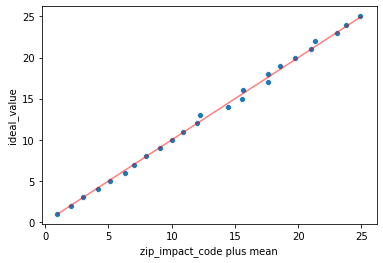
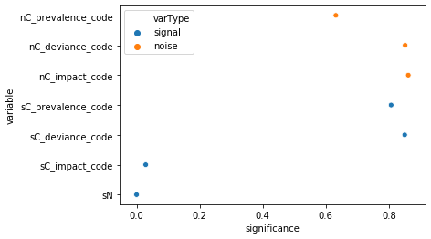

Translating the R sequences from https://arxiv.org/abs/1611.09477 into Python vtreat https://github.com/WinVector/pyvtreat


```python

```

R original
## ----msleep, tidy=TRUE---------------------------------------------------
library("ggplot2")
data("msleep")
str(msleep, width=70, strict.width='cut')


## ----isbad---------------------------------------------------------------
msleep$sleep_rem_isBAD <- is.na(msleep$sleep_rem)
msleep$sleep_rem <- ifelse(msleep$sleep_rem_isBAD, 
                           mean(msleep$sleep_rem, na.rm=TRUE), 
		           msleep$sleep_rem)
Python translation


```python
## ----msleep, tidy=TRUE---------------------------------------------------
```


```python
import pandas
import vtreat # https://github.com/WinVector/pyvtreat


msleep = pandas.read_csv('msleep.csv')
msleep.head()
```


<div>
<style scoped>
    .dataframe tbody tr th:only-of-type {
        vertical-align: middle;
    }

    .dataframe tbody tr th {
        vertical-align: top;
    }

    .dataframe thead th {
        text-align: right;
    }
</style>
<table border="1" class="dataframe">
  <thead>
    <tr style="text-align: right;">
      <th></th>
      <th>name</th>
      <th>genus</th>
      <th>vore</th>
      <th>order</th>
      <th>conservation</th>
      <th>sleep_total</th>
      <th>sleep_rem</th>
      <th>sleep_cycle</th>
      <th>awake</th>
      <th>brainwt</th>
      <th>bodywt</th>
    </tr>
  </thead>
  <tbody>
    <tr>
      <th>0</th>
      <td>Cheetah</td>
      <td>Acinonyx</td>
      <td>carni</td>
      <td>Carnivora</td>
      <td>lc</td>
      <td>12.1</td>
      <td>NaN</td>
      <td>NaN</td>
      <td>11.9</td>
      <td>NaN</td>
      <td>50.000</td>
    </tr>
    <tr>
      <th>1</th>
      <td>Owl monkey</td>
      <td>Aotus</td>
      <td>omni</td>
      <td>Primates</td>
      <td>NaN</td>
      <td>17.0</td>
      <td>1.8</td>
      <td>NaN</td>
      <td>7.0</td>
      <td>0.01550</td>
      <td>0.480</td>
    </tr>
    <tr>
      <th>2</th>
      <td>Mountain beaver</td>
      <td>Aplodontia</td>
      <td>herbi</td>
      <td>Rodentia</td>
      <td>nt</td>
      <td>14.4</td>
      <td>2.4</td>
      <td>NaN</td>
      <td>9.6</td>
      <td>NaN</td>
      <td>1.350</td>
    </tr>
    <tr>
      <th>3</th>
      <td>Greater short-tailed shrew</td>
      <td>Blarina</td>
      <td>omni</td>
      <td>Soricomorpha</td>
      <td>lc</td>
      <td>14.9</td>
      <td>2.3</td>
      <td>0.133333</td>
      <td>9.1</td>
      <td>0.00029</td>
      <td>0.019</td>
    </tr>
    <tr>
      <th>4</th>
      <td>Cow</td>
      <td>Bos</td>
      <td>herbi</td>
      <td>Artiodactyla</td>
      <td>domesticated</td>
      <td>4.0</td>
      <td>0.7</td>
      <td>0.666667</td>
      <td>20.0</td>
      <td>0.42300</td>
      <td>600.000</td>
    </tr>
  </tbody>
</table>
</div>


```python
msleep.dtypes
```


    name             object
    genus            object
    vore             object
    order            object
    conservation     object
    sleep_total     float64
    sleep_rem       float64
    sleep_cycle     float64
    awake           float64
    brainwt         float64
    bodywt          float64
    dtype: object


```python
## ----isbad---------------------------------------------------------------
```


```python
unsupervised_transform = vtreat.UnsupervisedTreatment()
msleep_prepared = unsupervised_transform.fit_transform(msleep)
msleep_prepared.head()
```


<div>
<style scoped>
    .dataframe tbody tr th:only-of-type {
        vertical-align: middle;
    }

    .dataframe tbody tr th {
        vertical-align: top;
    }

    .dataframe thead th {
        text-align: right;
    }
</style>
<table border="1" class="dataframe">
  <thead>
    <tr style="text-align: right;">
      <th></th>
      <th>vore_is_bad</th>
      <th>conservation_is_bad</th>
      <th>sleep_rem_is_bad</th>
      <th>sleep_cycle_is_bad</th>
      <th>brainwt_is_bad</th>
      <th>sleep_total</th>
      <th>sleep_rem</th>
      <th>sleep_cycle</th>
      <th>awake</th>
      <th>brainwt</th>
      <th>...</th>
      <th>order_lev_Rodentia</th>
      <th>order_lev_Primates</th>
      <th>order_lev_Carnivora</th>
      <th>order_lev_Artiodactyla</th>
      <th>order_lev_Soricomorpha</th>
      <th>conservation_prevalence_code</th>
      <th>conservation_lev__NA_</th>
      <th>conservation_lev_lc</th>
      <th>conservation_lev_domesticated</th>
      <th>conservation_lev_vu</th>
    </tr>
  </thead>
  <tbody>
    <tr>
      <th>0</th>
      <td>0.0</td>
      <td>0.0</td>
      <td>1.0</td>
      <td>1.0</td>
      <td>1.0</td>
      <td>12.1</td>
      <td>1.87541</td>
      <td>0.439583</td>
      <td>11.9</td>
      <td>0.281581</td>
      <td>...</td>
      <td>0</td>
      <td>0</td>
      <td>1</td>
      <td>0</td>
      <td>0</td>
      <td>0.313253</td>
      <td>0</td>
      <td>1</td>
      <td>0</td>
      <td>0</td>
    </tr>
    <tr>
      <th>1</th>
      <td>0.0</td>
      <td>1.0</td>
      <td>0.0</td>
      <td>1.0</td>
      <td>0.0</td>
      <td>17.0</td>
      <td>1.80000</td>
      <td>0.439583</td>
      <td>7.0</td>
      <td>0.015500</td>
      <td>...</td>
      <td>0</td>
      <td>1</td>
      <td>0</td>
      <td>0</td>
      <td>0</td>
      <td>0.337349</td>
      <td>1</td>
      <td>0</td>
      <td>0</td>
      <td>0</td>
    </tr>
    <tr>
      <th>2</th>
      <td>0.0</td>
      <td>0.0</td>
      <td>0.0</td>
      <td>1.0</td>
      <td>1.0</td>
      <td>14.4</td>
      <td>2.40000</td>
      <td>0.439583</td>
      <td>9.6</td>
      <td>0.281581</td>
      <td>...</td>
      <td>1</td>
      <td>0</td>
      <td>0</td>
      <td>0</td>
      <td>0</td>
      <td>0.036145</td>
      <td>0</td>
      <td>0</td>
      <td>0</td>
      <td>0</td>
    </tr>
    <tr>
      <th>3</th>
      <td>0.0</td>
      <td>0.0</td>
      <td>0.0</td>
      <td>0.0</td>
      <td>0.0</td>
      <td>14.9</td>
      <td>2.30000</td>
      <td>0.133333</td>
      <td>9.1</td>
      <td>0.000290</td>
      <td>...</td>
      <td>0</td>
      <td>0</td>
      <td>0</td>
      <td>0</td>
      <td>1</td>
      <td>0.313253</td>
      <td>0</td>
      <td>1</td>
      <td>0</td>
      <td>0</td>
    </tr>
    <tr>
      <th>4</th>
      <td>0.0</td>
      <td>0.0</td>
      <td>0.0</td>
      <td>0.0</td>
      <td>0.0</td>
      <td>4.0</td>
      <td>0.70000</td>
      <td>0.666667</td>
      <td>20.0</td>
      <td>0.423000</td>
      <td>...</td>
      <td>0</td>
      <td>0</td>
      <td>0</td>
      <td>1</td>
      <td>0</td>
      <td>0.108434</td>
      <td>0</td>
      <td>0</td>
      <td>1</td>
      <td>0</td>
    </tr>
  </tbody>
</table>
<p>5 rows × 29 columns</p>
</div>


```python
msleep_prepared.columns
```


    Index(['vore_is_bad', 'conservation_is_bad', 'sleep_rem_is_bad',
           'sleep_cycle_is_bad', 'brainwt_is_bad', 'sleep_total', 'sleep_rem',
           'sleep_cycle', 'awake', 'brainwt', 'bodywt', 'genus_prevalence_code',
           'vore_prevalence_code', 'vore_lev_herbi', 'vore_lev_omni',
           'vore_lev_carni', 'vore_lev__NA_', 'vore_lev_insecti',
           'order_prevalence_code', 'order_lev_Rodentia', 'order_lev_Primates',
           'order_lev_Carnivora', 'order_lev_Artiodactyla',
           'order_lev_Soricomorpha', 'conservation_prevalence_code',
           'conservation_lev__NA_', 'conservation_lev_lc',
           'conservation_lev_domesticated', 'conservation_lev_vu'],
          dtype='object')


```python

```

R original
## ----novel, error=TRUE---------------------------------------------------
df <- data.frame(x=c('a', 'a', 'b', 'b', 'c', 'c'), 
                 y=1:6, 
                 stringsAsFactors=FALSE)
model <- lm(y~x, data=df)
newdata <- data.frame(x=c('a', 'b', 'c', 'd'), 
                      stringsAsFactors=FALSE)
tryCatch(
   predict(model, newdata=newdata), 
   error = function(e) print(strwrap(e)))


## ----vtreat, results='hide'----------------------------------------------
library("vtreat")
treatplan <- designTreatmentsN(df, 'x', 'y')
varnames <- treatplan$scoreFrame$varName[treatplan$scoreFrame$cod=="lev"]
newdata_treat <- prepare(treatplan, newdata, 
                         pruneSig=NULL, varRestriction=varnames)


## ----indicators1---------------------------------------------------------
print(newdata)


## ----indicators2---------------------------------------------------------
print(newdata_treat)
Python translation


```python
## ----novel, error=TRUE---------------------------------------------------
```


```python
import pandas
import sklearn.linear_model
import vtreat # https://github.com/WinVector/pyvtreat


df = pandas.DataFrame({'x':['a', 'a', 'b', 'b', 'c', 'c'], 
                       'y':[i+1 for i in range(6)]})
df
```


<div>
<style scoped>
    .dataframe tbody tr th:only-of-type {
        vertical-align: middle;
    }

    .dataframe tbody tr th {
        vertical-align: top;
    }

    .dataframe thead th {
        text-align: right;
    }
</style>
<table border="1" class="dataframe">
  <thead>
    <tr style="text-align: right;">
      <th></th>
      <th>x</th>
      <th>y</th>
    </tr>
  </thead>
  <tbody>
    <tr>
      <th>0</th>
      <td>a</td>
      <td>1</td>
    </tr>
    <tr>
      <th>1</th>
      <td>a</td>
      <td>2</td>
    </tr>
    <tr>
      <th>2</th>
      <td>b</td>
      <td>3</td>
    </tr>
    <tr>
      <th>3</th>
      <td>b</td>
      <td>4</td>
    </tr>
    <tr>
      <th>4</th>
      <td>c</td>
      <td>5</td>
    </tr>
    <tr>
      <th>5</th>
      <td>c</td>
      <td>6</td>
    </tr>
  </tbody>
</table>
</div>


```python
try:
    model = sklearn.linear_model.LinearRegression(fit_intercept = True).fit(df[['x']], df['y'])
except Exception as ex:
    print(ex)
```

    could not convert string to float: 'a'


```python
## ----vtreat, results='hide'----------------------------------------------
```


```python
treatplan = vtreat.NumericOutcomeTreatment(outcome_name='y')
df_treated = treatplan.fit_transform(df, y = df['y'])
df_treated
```


<div>
<style scoped>
    .dataframe tbody tr th:only-of-type {
        vertical-align: middle;
    }

    .dataframe tbody tr th {
        vertical-align: top;
    }

    .dataframe thead th {
        text-align: right;
    }
</style>
<table border="1" class="dataframe">
  <thead>
    <tr style="text-align: right;">
      <th></th>
      <th>y</th>
      <th>x_impact_code</th>
      <th>x_lev_a</th>
      <th>x_lev_c</th>
    </tr>
  </thead>
  <tbody>
    <tr>
      <th>0</th>
      <td>1</td>
      <td>-1.777432</td>
      <td>1</td>
      <td>0</td>
    </tr>
    <tr>
      <th>1</th>
      <td>2</td>
      <td>-1.777432</td>
      <td>1</td>
      <td>0</td>
    </tr>
    <tr>
      <th>2</th>
      <td>3</td>
      <td>0.000000</td>
      <td>0</td>
      <td>0</td>
    </tr>
    <tr>
      <th>3</th>
      <td>4</td>
      <td>0.000000</td>
      <td>0</td>
      <td>0</td>
    </tr>
    <tr>
      <th>4</th>
      <td>5</td>
      <td>1.777432</td>
      <td>0</td>
      <td>1</td>
    </tr>
    <tr>
      <th>5</th>
      <td>6</td>
      <td>1.777432</td>
      <td>0</td>
      <td>1</td>
    </tr>
  </tbody>
</table>
</div>


```python
vars = [c for c in df_treated.columns if not c == 'y']
model = sklearn.linear_model.LinearRegression(fit_intercept = True).fit(df_treated[vars], df_treated['y'])
```


```python
## ----indicators1---------------------------------------------------------
```


```python
newdata = pandas.DataFrame({'x':['a', 'b', 'c', 'd']})
newdata
```


<div>
<style scoped>
    .dataframe tbody tr th:only-of-type {
        vertical-align: middle;
    }

    .dataframe tbody tr th {
        vertical-align: top;
    }

    .dataframe thead th {
        text-align: right;
    }
</style>
<table border="1" class="dataframe">
  <thead>
    <tr style="text-align: right;">
      <th></th>
      <th>x</th>
    </tr>
  </thead>
  <tbody>
    <tr>
      <th>0</th>
      <td>a</td>
    </tr>
    <tr>
      <th>1</th>
      <td>b</td>
    </tr>
    <tr>
      <th>2</th>
      <td>c</td>
    </tr>
    <tr>
      <th>3</th>
      <td>d</td>
    </tr>
  </tbody>
</table>
</div>


```python
## ----indicators2---------------------------------------------------------
```


```python
newdata_treated = treatplan.transform(newdata)
newdata_treated
```


<div>
<style scoped>
    .dataframe tbody tr th:only-of-type {
        vertical-align: middle;
    }

    .dataframe tbody tr th {
        vertical-align: top;
    }

    .dataframe thead th {
        text-align: right;
    }
</style>
<table border="1" class="dataframe">
  <thead>
    <tr style="text-align: right;">
      <th></th>
      <th>x_impact_code</th>
      <th>x_lev_a</th>
      <th>x_lev_c</th>
    </tr>
  </thead>
  <tbody>
    <tr>
      <th>0</th>
      <td>-1.777432</td>
      <td>1</td>
      <td>0</td>
    </tr>
    <tr>
      <th>1</th>
      <td>0.000000</td>
      <td>0</td>
      <td>0</td>
    </tr>
    <tr>
      <th>2</th>
      <td>1.777432</td>
      <td>0</td>
      <td>1</td>
    </tr>
    <tr>
      <th>3</th>
      <td>0.000000</td>
      <td>0</td>
      <td>0</td>
    </tr>
  </tbody>
</table>
</div>


```python
model.predict(newdata_treated)
```


    array([1.5, 3.5, 5.5, 3.5])


```python

```

R original
## ----zipcode-------------------------------------------------------------
set.seed(235)
Nz <- 25
zip <- paste0('z', format(1:Nz, justify="right"))
zip <- gsub(' ', '0', zip, fixed=TRUE)
zipval <- 1:Nz; names(zipval) <- zip
n <- 3; m <- Nz - n
p <- c(numeric(n) + (0.8/n), numeric(m) + 0.2/m)
N <- 1000
zipvar <- sample(zip, N, replace=TRUE, prob=p)
signal <-  zipval[zipvar] + rnorm(N)
d <- data.frame(zip=zipvar, 
                y=signal + rnorm(N))


## ----vzip, results="hide", warning=FALSE, message=FALSE------------------
library("vtreat")
treatplan <- designTreatmentsN(d, varlist="zip", outcome="y", verbose=FALSE)


## ----ziptreatplan--------------------------------------------------------
treatplan$meanY
scoreFrame <- treatplan$scoreFrame
scoreFrame[, c('varName', 'sig', 'extraModelDegrees', 'origName', 'code')]


## ----preparezip----------------------------------------------------------
vars <- scoreFrame$varName[!(scoreFrame$code %in% c("catP", "catD"))]
dtreated <- prepare(treatplan, d, pruneSig=NULL, 
                    varRestriction=vars)


## ----zipfig, echo=FALSE, message=FALSE, warning=FALSE, fig.width=6, fig.height=4----
# compare the impact coding (zip_catN) with the conditional outcome means
# to show that the impact model is the conditional outcome - global outcome
compf <- merge(data.frame(zip=zip), 
                data.frame(zip= d$zip, impact=dtreated$zip_catN, y=d$y), 
                by="zip", all.x=TRUE)
compf$meany <- treatplan$meanY
library("ggplot2")
ggplot(compf, aes(x=zip)) +
geom_point(aes(y=impact+meany), shape=23, fill="blue", size=3, alpha=0.7) +
geom_point(aes(y=y), alpha=0.3) +
coord_flip()
Python translation


```python
## ----zipcode-------------------------------------------------------------
```


```python
import numpy.random
import pandas
import seaborn
import matplotlib.pyplot
import vtreat # https://github.com/WinVector/pyvtreat


numpy.random.seed(235)
Nz = 25
zip = ['z' + str(i+1).zfill(5) for i in range(Nz)]
zipval = { zip[i]:(i+1) for i in range(Nz) }
n = 3
m = Nz - n
p = [(0.8/n) for i in range(n)] + [0.2/m for i in range(m)]
N = 1000
zipvar = numpy.random.choice(zip, size=N, p=p)
zipvar
signal = [zipval[zv] for zv in zipvar]
d = pandas.DataFrame({'zip':zipvar, 
                      'y':signal + numpy.random.normal(size=N)})
d.head()
```


<div>
<style scoped>
    .dataframe tbody tr th:only-of-type {
        vertical-align: middle;
    }

    .dataframe tbody tr th {
        vertical-align: top;
    }

    .dataframe thead th {
        text-align: right;
    }
</style>
<table border="1" class="dataframe">
  <thead>
    <tr style="text-align: right;">
      <th></th>
      <th>zip</th>
      <th>y</th>
    </tr>
  </thead>
  <tbody>
    <tr>
      <th>0</th>
      <td>z00018</td>
      <td>18.522012</td>
    </tr>
    <tr>
      <th>1</th>
      <td>z00002</td>
      <td>1.193435</td>
    </tr>
    <tr>
      <th>2</th>
      <td>z00001</td>
      <td>0.739880</td>
    </tr>
    <tr>
      <th>3</th>
      <td>z00018</td>
      <td>17.157941</td>
    </tr>
    <tr>
      <th>4</th>
      <td>z00002</td>
      <td>2.243728</td>
    </tr>
  </tbody>
</table>
</div>


```python
## ----vzip, results="hide", warning=FALSE, message=FALSE------------------
```


```python
treatplan = vtreat.NumericOutcomeTreatment(outcome_name='y')
d_treated = treatplan.fit_transform(d, d["y"])
d_treated.head()
```


<div>
<style scoped>
    .dataframe tbody tr th:only-of-type {
        vertical-align: middle;
    }

    .dataframe tbody tr th {
        vertical-align: top;
    }

    .dataframe thead th {
        text-align: right;
    }
</style>
<table border="1" class="dataframe">
  <thead>
    <tr style="text-align: right;">
      <th></th>
      <th>y</th>
      <th>zip_impact_code</th>
      <th>zip_prevalence_code</th>
      <th>zip_lev_z00002</th>
      <th>zip_lev_z00003</th>
      <th>zip_lev_z00001</th>
    </tr>
  </thead>
  <tbody>
    <tr>
      <th>0</th>
      <td>18.522012</td>
      <td>12.660483</td>
      <td>0.013</td>
      <td>0</td>
      <td>0</td>
      <td>0</td>
    </tr>
    <tr>
      <th>1</th>
      <td>1.193435</td>
      <td>-2.851277</td>
      <td>0.276</td>
      <td>1</td>
      <td>0</td>
      <td>0</td>
    </tr>
    <tr>
      <th>2</th>
      <td>0.739880</td>
      <td>-3.928832</td>
      <td>0.234</td>
      <td>0</td>
      <td>0</td>
      <td>1</td>
    </tr>
    <tr>
      <th>3</th>
      <td>17.157941</td>
      <td>12.776066</td>
      <td>0.013</td>
      <td>0</td>
      <td>0</td>
      <td>0</td>
    </tr>
    <tr>
      <th>4</th>
      <td>2.243728</td>
      <td>-2.851277</td>
      <td>0.276</td>
      <td>1</td>
      <td>0</td>
      <td>0</td>
    </tr>
  </tbody>
</table>
</div>


```python
## ----ziptreatplan--------------------------------------------------------
```


```python
treatplan.score_frame_
```


<div>
<style scoped>
    .dataframe tbody tr th:only-of-type {
        vertical-align: middle;
    }

    .dataframe tbody tr th {
        vertical-align: top;
    }

    .dataframe thead th {
        text-align: right;
    }
</style>
<table border="1" class="dataframe">
  <thead>
    <tr style="text-align: right;">
      <th></th>
      <th>variable</th>
      <th>orig_variable</th>
      <th>treatment</th>
      <th>y_aware</th>
      <th>has_range</th>
      <th>PearsonR</th>
      <th>significance</th>
      <th>vcount</th>
      <th>recommended</th>
    </tr>
  </thead>
  <tbody>
    <tr>
      <th>0</th>
      <td>zip_impact_code</td>
      <td>zip</td>
      <td>impact_code</td>
      <td>True</td>
      <td>True</td>
      <td>0.987907</td>
      <td>0.000000e+00</td>
      <td>1.0</td>
      <td>True</td>
    </tr>
    <tr>
      <th>1</th>
      <td>zip_deviance_code</td>
      <td>zip</td>
      <td>deviance_code</td>
      <td>True</td>
      <td>True</td>
      <td>-0.049652</td>
      <td>1.166190e-01</td>
      <td>1.0</td>
      <td>False</td>
    </tr>
    <tr>
      <th>2</th>
      <td>zip_prevalence_code</td>
      <td>zip</td>
      <td>prevalence_code</td>
      <td>False</td>
      <td>True</td>
      <td>-0.833001</td>
      <td>8.590593e-259</td>
      <td>1.0</td>
      <td>True</td>
    </tr>
    <tr>
      <th>3</th>
      <td>zip_lev_z00002</td>
      <td>zip</td>
      <td>indicator_code</td>
      <td>False</td>
      <td>True</td>
      <td>-0.283480</td>
      <td>6.165256e-20</td>
      <td>3.0</td>
      <td>True</td>
    </tr>
    <tr>
      <th>4</th>
      <td>zip_lev_z00003</td>
      <td>zip</td>
      <td>indicator_code</td>
      <td>False</td>
      <td>True</td>
      <td>-0.179725</td>
      <td>1.046927e-08</td>
      <td>3.0</td>
      <td>True</td>
    </tr>
    <tr>
      <th>5</th>
      <td>zip_lev_z00001</td>
      <td>zip</td>
      <td>indicator_code</td>
      <td>False</td>
      <td>True</td>
      <td>-0.348631</td>
      <td>5.932392e-30</td>
      <td>3.0</td>
      <td>True</td>
    </tr>
  </tbody>
</table>
</div>


```python
## ----zipfig, echo=FALSE, message=FALSE, warning=FALSE, fig.width=6, fig.height=4----
```


```python
# show, subject to mean shift impact estimates track un-observed (pre-noise) ideal values
d_new = pandas.DataFrame({'zip':zip})
d_new_treated = treatplan.transform(d_new)[['zip_impact_code']]
d_new_treated["zip"] = d_new["zip"]
d_new_treated["ideal_value"] = [zipval[k] for k in d_new_treated["zip"]]
d_new_treated["zip_impact_code plus mean"] = d_new_treated["zip_impact_code"] + numpy.mean(d["y"])
seaborn.scatterplot(x="zip_impact_code plus mean", y='ideal_value', data = d_new_treated)
min = numpy.min(d_new_treated["ideal_value"])
max = numpy.max(d_new_treated["ideal_value"])
matplotlib.pyplot.plot([min, max], [min, max], color = 'red', alpha=0.5)
```


    [<matplotlib.lines.Line2D at 0x1a1d3de160>]





```python

```

R original
## ----zipmissing, warning=FALSE, message=FALSE----------------------------
N <- 100
zipvar <- sample(zip, N, replace=TRUE, prob=p)
signal <- zipval[zipvar] + rnorm(N)
d <- data.frame(zip=zipvar, 
                y=signal+rnorm(N))
length(unique(d$zip))
omitted <- setdiff(zip, unique(d$zip))
print(omitted)


## ----zipmissing2, warning=FALSE, message=FALSE---------------------------
treatplan <- designTreatmentsN(d, varlist="zip", outcome="y", verbose=FALSE)
dnew <- data.frame(zip = zip)
dtreated <- prepare(treatplan, dnew, pruneSig=NULL, 
                   varRestriction=vars)


## ----zipmissingprint-----------------------------------------------------
dtreated[dnew$zip %in% omitted, "zip_catN"]
Python translation


```python
## ----zipmissing, warning=FALSE, message=FALSE----------------------------
```


```python
N = 100
zipvar = numpy.random.choice(zip, size=N, p=p)
d = pandas.DataFrame({'zip':zipvar, 
                      'y':[zipval[zv] for zv in zipvar] + numpy.random.normal(size=N)})
len(numpy.unique(d['zip']))
```


    16


```python
omitted = set(zip) - set(d['zip'])
omitted
```


    {'z00004',
     'z00006',
     'z00008',
     'z00009',
     'z00014',
     'z00016',
     'z00017',
     'z00023',
     'z00025'}


```python
## ----zipmissing2, warning=FALSE, message=FALSE---------------------------
```


```python
treatplan = vtreat.NumericOutcomeTreatment(outcome_name='y')
d_treated = treatplan.fit_transform(d, d["y"])
dnew = pandas.DataFrame({'zip':zip})
dtreated = treatplan.transform(dnew)
dtreated["zip"] = dnew["zip"]
dtreated.head()
```


<div>
<style scoped>
    .dataframe tbody tr th:only-of-type {
        vertical-align: middle;
    }

    .dataframe tbody tr th {
        vertical-align: top;
    }

    .dataframe thead th {
        text-align: right;
    }
</style>
<table border="1" class="dataframe">
  <thead>
    <tr style="text-align: right;">
      <th></th>
      <th>zip_impact_code</th>
      <th>zip_prevalence_code</th>
      <th>zip_lev_z00001</th>
      <th>zip_lev_z00002</th>
      <th>zip</th>
    </tr>
  </thead>
  <tbody>
    <tr>
      <th>0</th>
      <td>-4.152427</td>
      <td>0.25</td>
      <td>1</td>
      <td>0</td>
      <td>z00001</td>
    </tr>
    <tr>
      <th>1</th>
      <td>-3.061531</td>
      <td>0.20</td>
      <td>0</td>
      <td>1</td>
      <td>z00002</td>
    </tr>
    <tr>
      <th>2</th>
      <td>-1.925327</td>
      <td>0.26</td>
      <td>0</td>
      <td>0</td>
      <td>z00003</td>
    </tr>
    <tr>
      <th>3</th>
      <td>0.000000</td>
      <td>0.00</td>
      <td>0</td>
      <td>0</td>
      <td>z00004</td>
    </tr>
    <tr>
      <th>4</th>
      <td>0.517125</td>
      <td>0.04</td>
      <td>0</td>
      <td>0</td>
      <td>z00005</td>
    </tr>
  </tbody>
</table>
</div>


```python
## ----zipmissingprint-----------------------------------------------------
```


```python
dtreated.loc[[zi in omitted for zi in dnew["zip"]], :].head()
```


<div>
<style scoped>
    .dataframe tbody tr th:only-of-type {
        vertical-align: middle;
    }

    .dataframe tbody tr th {
        vertical-align: top;
    }

    .dataframe thead th {
        text-align: right;
    }
</style>
<table border="1" class="dataframe">
  <thead>
    <tr style="text-align: right;">
      <th></th>
      <th>zip_impact_code</th>
      <th>zip_prevalence_code</th>
      <th>zip_lev_z00001</th>
      <th>zip_lev_z00002</th>
      <th>zip</th>
    </tr>
  </thead>
  <tbody>
    <tr>
      <th>3</th>
      <td>0.0</td>
      <td>0.0</td>
      <td>0</td>
      <td>0</td>
      <td>z00004</td>
    </tr>
    <tr>
      <th>5</th>
      <td>0.0</td>
      <td>0.0</td>
      <td>0</td>
      <td>0</td>
      <td>z00006</td>
    </tr>
    <tr>
      <th>7</th>
      <td>0.0</td>
      <td>0.0</td>
      <td>0</td>
      <td>0</td>
      <td>z00008</td>
    </tr>
    <tr>
      <th>8</th>
      <td>0.0</td>
      <td>0.0</td>
      <td>0</td>
      <td>0</td>
      <td>z00009</td>
    </tr>
    <tr>
      <th>13</th>
      <td>0.0</td>
      <td>0.0</td>
      <td>0</td>
      <td>0</td>
      <td>z00014</td>
    </tr>
  </tbody>
</table>
</div>


```python

```

R original
## ----nested--------------------------------------------------------------
set.seed(2262)
nLev <- 500
n <- 3000
d <- data.frame(xBad1=sample(paste('level', 1:nLev, sep=''), n, replace=TRUE), 
                xBad2=sample(paste('level', 1:nLev, sep=''), n, replace=TRUE), 
                xGood1=sample(paste('level', 1:nLev, sep=''), n, replace=TRUE), 
                xGood2=sample(paste('level', 1:nLev, sep=''), n, replace=TRUE))
d$y <- (0.2*rnorm(nrow(d)) + 0.5*ifelse(as.numeric(d$xGood1)>nLev/2, 1, -1) +
        0.3*ifelse(as.numeric(d$xGood2)>nLev/2, 1, -1))>0
d$rgroup <- sample(c("cal", "train", "test"), nrow(d), replace=TRUE, 
                   prob=c(0.6, 0.2, 0.2))

plotRes <- function(d, predName, yName, title) {
  print(title)
  tab <- table(truth=d[[yName]], pred=d[[predName]]>0.5)
  print(tab)
  diag <- sum(vapply(seq_len(min(dim(tab))), 
                     function(i) tab[i, i], numeric(1)))
  acc <- diag/sum(tab)
  # depends on both truth and target being logicals
  # and FALSE ordered before TRUE
  sens <- tab[2, 2]/sum(tab[2, ])
  spec <- tab[1, 1]/sum(tab[1, ])
  print(paste('accuracy', format(acc, scientific=FALSE, digits=3)))
  print(paste('sensitivity', format(sens, scientific=FALSE, digits=3)))
  print(paste('specificity', format(spec, scientific=FALSE, digits=3)))
}
Python translation


```python
## ----nested--------------------------------------------------------------
```


```python
numpy.random.seed(2262)
nLev = 500
n = 3000
d = pandas.DataFrame({'xBad1':numpy.random.choice(['level' + str(i+1) for i in range(nLev)], size=n), 
                      'xBad2':numpy.random.choice(['level' + str(i+1) for i in range(nLev)], size=n), 
                      'xGood1':numpy.random.choice(['level' + str(i+1) for i in range(nLev)], size=n), 
                      'xGood2':numpy.random.choice(['level' + str(i+1) for i in range(nLev)], size=n)})
target = set(['level' + str(i+1) for i in range(int(numpy.floor(nLev/2)))])
d['y'] = (0.2*numpy.random.normal(size=n) + 
          0.5*numpy.asarray([1 if (v in target) else -1 for v in d['xGood1']]) +
          0.3*numpy.asarray([1 if (v in target) else -1 for v in d['xGood2']]))>0
d['rgroup'] = numpy.random.choice(["cal", "train", "test"], size=n,
                   p=[0.6, 0.2, 0.2])
d.head()
```


<div>
<style scoped>
    .dataframe tbody tr th:only-of-type {
        vertical-align: middle;
    }

    .dataframe tbody tr th {
        vertical-align: top;
    }

    .dataframe thead th {
        text-align: right;
    }
</style>
<table border="1" class="dataframe">
  <thead>
    <tr style="text-align: right;">
      <th></th>
      <th>xBad1</th>
      <th>xBad2</th>
      <th>xGood1</th>
      <th>xGood2</th>
      <th>y</th>
      <th>rgroup</th>
    </tr>
  </thead>
  <tbody>
    <tr>
      <th>0</th>
      <td>level246</td>
      <td>level135</td>
      <td>level316</td>
      <td>level324</td>
      <td>False</td>
      <td>train</td>
    </tr>
    <tr>
      <th>1</th>
      <td>level462</td>
      <td>level92</td>
      <td>level165</td>
      <td>level95</td>
      <td>True</td>
      <td>test</td>
    </tr>
    <tr>
      <th>2</th>
      <td>level93</td>
      <td>level163</td>
      <td>level57</td>
      <td>level426</td>
      <td>False</td>
      <td>train</td>
    </tr>
    <tr>
      <th>3</th>
      <td>level96</td>
      <td>level291</td>
      <td>level14</td>
      <td>level104</td>
      <td>True</td>
      <td>test</td>
    </tr>
    <tr>
      <th>4</th>
      <td>level21</td>
      <td>level422</td>
      <td>level111</td>
      <td>level179</td>
      <td>True</td>
      <td>train</td>
    </tr>
  </tbody>
</table>
</div>


```python
import sklearn.metrics 

def plotRes(d, predName, yName, title, threshold=0.5):
    print(title)
    decision = d[predName]>threshold
    tab = sklearn.metrics.confusion_matrix(y_true=d[yName], y_pred=decision)
    print('confusion matrix:\n', tab)
    acc = sklearn.metrics.accuracy_score(y_true=d[yName], y_pred=decision)
    prec = sklearn.metrics.precision_score(y_true=d[yName], y_pred=decision)
    recall = sklearn.metrics.recall_score(y_true=d[yName], y_pred=decision)
    fpr, tpr, thresholds = sklearn.metrics.roc_curve(d[yName], d[predName], pos_label=True)
    auc = sklearn.metrics.auc(fpr, tpr)
    print('auc:', format("{:.2f}".format(auc)))
    print('accuracy:', format("{:.2f}".format(acc)))
    print('precision:', format("{:.2f}".format(prec)))
    print('recall:', format("{:.2f}".format(recall)))
```


```python

```

R original
## ----naivesplit----------------------------------------------------------
dTrain <- d[d$rgroup!='test', , drop=FALSE]
dTest <- d[d$rgroup=='test', , drop=FALSE]
treatments <- vtreat::designTreatmentsC(dTrain, 
                     varlist = c('xBad1', 'xBad2', 'xGood1', 'xGood2'), 
                     outcomename='y', outcometarget=TRUE, 
                     verbose=FALSE)
dTrainTreated <- vtreat::prepare(treatments, dTrain, pruneSig=NULL)


## ----naivefit, warning=FALSE---------------------------------------------
m1 <- glm(y~xBad1_catB + xBad2_catB + xGood1_catB + xGood2_catB, 
          data=dTrainTreated, family=binomial(link='logit'))
print(summary(m1))


## ----nf2-----------------------------------------------------------------
dTrain$predM1 <- predict(m1, newdata=dTrainTreated, type='response')
plotRes(dTrain, 'predM1', 'y', 'model1 on train')

Python translation


```python
## ----naivesplit----------------------------------------------------------
```


```python
dTrain = d.loc[d['rgroup']!='test', :].copy()
dTest = d.loc[d['rgroup']=='test', :].copy()
treatments = vtreat.BinomialOutcomeTreatment(outcome_name='y',
                                             cols_to_copy=['rgroup'],
                                             outcome_target=True,
                                             params = vtreat.vtreat_parameters({
                                                 'filter_to_recommended':False,
                                                 'coders':['logit_code']
                                             }))
treatments.fit(dTrain, dTrain['y'])
dTrainTreated = treatments.transform(dTrain)
dTrainTreated.head()
```


<div>
<style scoped>
    .dataframe tbody tr th:only-of-type {
        vertical-align: middle;
    }

    .dataframe tbody tr th {
        vertical-align: top;
    }

    .dataframe thead th {
        text-align: right;
    }
</style>
<table border="1" class="dataframe">
  <thead>
    <tr style="text-align: right;">
      <th></th>
      <th>rgroup</th>
      <th>y</th>
      <th>xBad1_logit_code</th>
      <th>xBad2_logit_code</th>
      <th>xGood1_logit_code</th>
      <th>xGood2_logit_code</th>
    </tr>
  </thead>
  <tbody>
    <tr>
      <th>0</th>
      <td>train</td>
      <td>False</td>
      <td>-0.422173</td>
      <td>-0.107654</td>
      <td>-5.964618</td>
      <td>-0.308491</td>
    </tr>
    <tr>
      <th>1</th>
      <td>train</td>
      <td>False</td>
      <td>-5.284120</td>
      <td>-0.213989</td>
      <td>0.151001</td>
      <td>-5.650461</td>
    </tr>
    <tr>
      <th>2</th>
      <td>train</td>
      <td>True</td>
      <td>0.276804</td>
      <td>0.187307</td>
      <td>0.669948</td>
      <td>-0.221182</td>
    </tr>
    <tr>
      <th>3</th>
      <td>cal</td>
      <td>True</td>
      <td>-0.098380</td>
      <td>0.187307</td>
      <td>0.669112</td>
      <td>0.086443</td>
    </tr>
    <tr>
      <th>4</th>
      <td>train</td>
      <td>True</td>
      <td>-0.184089</td>
      <td>0.278142</td>
      <td>0.667862</td>
      <td>0.666938</td>
    </tr>
  </tbody>
</table>
</div>


```python
vars = [v for v in treatments.score_frame_['variable']]
vars
```


    ['xBad1_logit_code',
     'xBad2_logit_code',
     'xGood1_logit_code',
     'xGood2_logit_code']


```python
## ----naivefit, warning=FALSE---------------------------------------------
```


```python
import sklearn.linear_model

m1 = sklearn.linear_model.LogisticRegression().fit(
    dTrainTreated[vars], dTrainTreated['y'])
print(m1.intercept_)
print(m1.coef_)
```

    [1.02742576]
    [[3.05733536 2.87537903 3.27340425 4.0850296 ]]


```python
## ----nf2-----------------------------------------------------------------
```


```python
dTrain['predM1'] = m1.predict_proba(dTrainTreated[vars])[:, 1]
```


```python
dTrain.head()
```


<div>
<style scoped>
    .dataframe tbody tr th:only-of-type {
        vertical-align: middle;
    }

    .dataframe tbody tr th {
        vertical-align: top;
    }

    .dataframe thead th {
        text-align: right;
    }
</style>
<table border="1" class="dataframe">
  <thead>
    <tr style="text-align: right;">
      <th></th>
      <th>xBad1</th>
      <th>xBad2</th>
      <th>xGood1</th>
      <th>xGood2</th>
      <th>y</th>
      <th>rgroup</th>
      <th>predM1</th>
    </tr>
  </thead>
  <tbody>
    <tr>
      <th>0</th>
      <td>level246</td>
      <td>level135</td>
      <td>level316</td>
      <td>level324</td>
      <td>False</td>
      <td>train</td>
      <td>5.302663e-10</td>
    </tr>
    <tr>
      <th>2</th>
      <td>level93</td>
      <td>level163</td>
      <td>level57</td>
      <td>level426</td>
      <td>False</td>
      <td>train</td>
      <td>2.254051e-17</td>
    </tr>
    <tr>
      <th>4</th>
      <td>level21</td>
      <td>level422</td>
      <td>level111</td>
      <td>level179</td>
      <td>True</td>
      <td>train</td>
      <td>9.759144e-01</td>
    </tr>
    <tr>
      <th>5</th>
      <td>level447</td>
      <td>level378</td>
      <td>level228</td>
      <td>level224</td>
      <td>True</td>
      <td>cal</td>
      <td>9.783024e-01</td>
    </tr>
    <tr>
      <th>8</th>
      <td>level472</td>
      <td>level376</td>
      <td>level245</td>
      <td>level206</td>
      <td>True</td>
      <td>train</td>
      <td>9.979235e-01</td>
    </tr>
  </tbody>
</table>
</div>


```python
plotRes(dTrain, 'predM1', 'y', 'model1 on train')
```

    model1 on train
    confusion matrix:
     [[1084   82]
     [  50 1171]]
    auc: 0.99
    accuracy: 0.94
    precision: 0.93
    recall: 0.96


```python

```

R original
## ----nftest, message=FALSE, warning=FALSE--------------------------------
dTestTreated <- vtreat::prepare(treatments, dTest, pruneSig=NULL)
dTest$predM1 <- predict(m1, newdata=dTestTreated, type='response')
plotRes(dTest, 'predM1', 'y', 'model1 on test')
Python version


```python
dTestTreated = treatments.transform(dTest)
dTest['predM1'] = m1.predict_proba(dTestTreated[vars])[:,1]
plotRes(dTest, 'predM1', 'y', 'model1 on test')
```

    model1 on test
    confusion matrix:
     [[234  47]
     [ 91 241]]
    auc: 0.83
    accuracy: 0.77
    precision: 0.84
    recall: 0.73


```python

```

R original
## ----calset1, message=FALSE, warning=FALSE-------------------------------
dCal <- d[d$rgroup=='cal', , drop=FALSE]
dTrain <- d[d$rgroup=='train', , drop=FALSE]
dTest <- d[d$rgroup=='test', , drop=FALSE]
treatments <- vtreat::designTreatmentsC(dCal, 
                varlist = c('xBad1', 'xBad2', 'xGood1', 'xGood2'), 
                outcomename='y', outcometarget=TRUE, 
                verbose=FALSE)
dTrainTreated <- vtreat::prepare(treatments, dTrain, 
                        pruneSig=NULL)
newvars <- setdiff(colnames(dTrainTreated), 'y')
m1 <- glm(y~xBad1_catB + xBad2_catB + xGood1_catB + xGood2_catB, 
          data=dTrainTreated, family=binomial(link='logit'))
dTrain$predM1 <- predict(m1, newdata=dTrainTreated, type='response')
print(summary(m1))


## ----calset2-------------------------------------------------------------
plotRes(dTrain, 'predM1', 'y', 'model1 on train')


## ----calset3-------------------------------------------------------------
dTestTreated <- vtreat::prepare(treatments, dTest, 
                                pruneSig=NULL)
dTest$predM1 <- predict(m1, newdata=dTestTreated, type='response')
plotRes(dTest, 'predM1', 'y', 'model1 on test')

```python
## ----calset1, message=FALSE, warning=FALSE-------------------------------
```


```python
dCal = d.loc[d['rgroup']=='cal', :].copy()
dTrain = d.loc[d['rgroup']=='train', :].copy()
dTest = d.loc[d['rgroup']=='test', :].copy()

treatments = vtreat.BinomialOutcomeTreatment(outcome_name='y',
                                             cols_to_copy=['rgroup'],
                                             outcome_target=True,
                                             params = vtreat.vtreat_parameters({
                                                 'filter_to_recommended':False,
                                                 'coders':['logit_code']
                                             }))
treatments.fit(dCal, dCal['y'])
dTrainTreated = treatments.transform(dTrain)
newvars = [v for v in treatments.score_frame_['variable']]
m1 = sklearn.linear_model.LogisticRegression().fit(
    dTrainTreated[newvars], dTrainTreated['y'])
dTrain['predM1'] = m1.predict_proba(dTrainTreated[vars])[:,1]
```


```python
## ----calset2-------------------------------------------------------------
```


```python
plotRes(dTrain, 'predM1', 'y', 'model1 on train')
```

    model1 on train
    confusion matrix:
     [[178 118]
     [ 16 300]]
    auc: 0.91
    accuracy: 0.78
    precision: 0.72
    recall: 0.95


```python
## ----calset3-------------------------------------------------------------
```


```python
dTest['predM1'] = m1.predict_proba(dTestTreated[vars])[:,1]
plotRes(dTest, 'predM1', 'y', 'model1 on test')
```

    model1 on test
    confusion matrix:
     [[164 117]
     [ 25 307]]
    auc: 0.90
    accuracy: 0.77
    precision: 0.72
    recall: 0.92


```python

```

R original
## ----sigprune_data-------------------------------------------------------
set.seed(22451)
N <- 500
sigN <- rnorm(N)
noiseN <- rnorm(N)
Nlevels <- 100
zip <- paste0('z', format(1:Nlevels, justify="right"))
zip <- gsub(' ', '0', zip, fixed=TRUE)

zipval <- runif(Nlevels); names(zipval)=zip
sigC <- sample(zip, size=N, replace=TRUE)
noiseC <- sample(zip, size=N, replace=TRUE)

y <- sigN + zipval[sigC] + rnorm(N)
df <- data.frame(sN = sigN, nN=noiseN, 
                sC = sigC, nC=noiseC, y=y)


Python version


```python
## ----sigprune_data-------------------------------------------------------
```


```python
numpy.random.seed(22451)
N = 500
sigN = numpy.random.normal(size=N)
noiseN = numpy.random.normal(N)
Nlevels = 100
zip = ['z' + str(i+1).zfill(5) for i in range(Nlevels)]
zipval = { z:numpy.random.uniform(size=1)[0] for z in zip }
sigC = numpy.random.choice(zip, size=N)
noiseC = numpy.random.choice(zip, size=N)
y = (numpy.asarray(sigN) + 
     numpy.asarray([zipval[v] for v in sigC]) + 
     numpy.random.normal(size=N))
df = pandas.DataFrame({'sN':sigN, 
                       'nN':noiseN, 
                       'sC':sigC, 
                       'nC':noiseC,
                       'y':y})
df.head()
```


<div>
<style scoped>
    .dataframe tbody tr th:only-of-type {
        vertical-align: middle;
    }

    .dataframe tbody tr th {
        vertical-align: top;
    }

    .dataframe thead th {
        text-align: right;
    }
</style>
<table border="1" class="dataframe">
  <thead>
    <tr style="text-align: right;">
      <th></th>
      <th>sN</th>
      <th>nN</th>
      <th>sC</th>
      <th>nC</th>
      <th>y</th>
    </tr>
  </thead>
  <tbody>
    <tr>
      <th>0</th>
      <td>-0.134210</td>
      <td>497.590133</td>
      <td>z00042</td>
      <td>z00027</td>
      <td>-0.196731</td>
    </tr>
    <tr>
      <th>1</th>
      <td>0.260726</td>
      <td>497.590133</td>
      <td>z00060</td>
      <td>z00005</td>
      <td>0.766681</td>
    </tr>
    <tr>
      <th>2</th>
      <td>0.133719</td>
      <td>497.590133</td>
      <td>z00054</td>
      <td>z00091</td>
      <td>-0.938968</td>
    </tr>
    <tr>
      <th>3</th>
      <td>-0.438525</td>
      <td>497.590133</td>
      <td>z00032</td>
      <td>z00084</td>
      <td>-0.840667</td>
    </tr>
    <tr>
      <th>4</th>
      <td>0.532758</td>
      <td>497.590133</td>
      <td>z00078</td>
      <td>z00069</td>
      <td>1.033514</td>
    </tr>
  </tbody>
</table>
</div>


```python

```

R original
## ----sigprune_treat------------------------------------------------------
library("vtreat")
treatplan <- designTreatmentsN(df, 
                             varlist=setdiff(colnames(df), "y"), 
                             outcomename="y", 
                             verbose=FALSE)
sframe <- treatplan$scoreFrame
vars <- sframe$varName[!(sframe$code %in% c("catP", "catD"))]
sframe[sframe$varName %in% vars, 
       c("varName", "sig", "extraModelDegrees")]

Python version


```python
## ----sigprune_treat------------------------------------------------------
```


```python
treatplan = vtreat.NumericOutcomeTreatment(outcome_name='y') 
treatplan.fit(df, df['y'])
treatplan.score_frame_
```


<div>
<style scoped>
    .dataframe tbody tr th:only-of-type {
        vertical-align: middle;
    }

    .dataframe tbody tr th {
        vertical-align: top;
    }

    .dataframe thead th {
        text-align: right;
    }
</style>
<table border="1" class="dataframe">
  <thead>
    <tr style="text-align: right;">
      <th></th>
      <th>variable</th>
      <th>orig_variable</th>
      <th>treatment</th>
      <th>y_aware</th>
      <th>has_range</th>
      <th>PearsonR</th>
      <th>significance</th>
      <th>vcount</th>
      <th>recommended</th>
    </tr>
  </thead>
  <tbody>
    <tr>
      <th>0</th>
      <td>sN</td>
      <td>sN</td>
      <td>clean_copy</td>
      <td>False</td>
      <td>True</td>
      <td>0.716235</td>
      <td>7.825971e-80</td>
      <td>1.0</td>
      <td>True</td>
    </tr>
    <tr>
      <th>1</th>
      <td>sC_impact_code</td>
      <td>sC</td>
      <td>impact_code</td>
      <td>True</td>
      <td>True</td>
      <td>0.097654</td>
      <td>2.900827e-02</td>
      <td>2.0</td>
      <td>True</td>
    </tr>
    <tr>
      <th>2</th>
      <td>sC_deviance_code</td>
      <td>sC</td>
      <td>deviance_code</td>
      <td>True</td>
      <td>True</td>
      <td>-0.008458</td>
      <td>8.503599e-01</td>
      <td>2.0</td>
      <td>False</td>
    </tr>
    <tr>
      <th>3</th>
      <td>sC_prevalence_code</td>
      <td>sC</td>
      <td>prevalence_code</td>
      <td>False</td>
      <td>True</td>
      <td>0.010933</td>
      <td>8.073285e-01</td>
      <td>2.0</td>
      <td>False</td>
    </tr>
    <tr>
      <th>4</th>
      <td>nC_impact_code</td>
      <td>nC</td>
      <td>impact_code</td>
      <td>True</td>
      <td>True</td>
      <td>-0.007808</td>
      <td>8.617447e-01</td>
      <td>2.0</td>
      <td>False</td>
    </tr>
    <tr>
      <th>5</th>
      <td>nC_deviance_code</td>
      <td>nC</td>
      <td>deviance_code</td>
      <td>True</td>
      <td>True</td>
      <td>0.008380</td>
      <td>8.517242e-01</td>
      <td>2.0</td>
      <td>False</td>
    </tr>
    <tr>
      <th>6</th>
      <td>nC_prevalence_code</td>
      <td>nC</td>
      <td>prevalence_code</td>
      <td>False</td>
      <td>True</td>
      <td>0.021464</td>
      <td>6.320796e-01</td>
      <td>2.0</td>
      <td>False</td>
    </tr>
  </tbody>
</table>
</div>


```python

```

R original
## ----sigprune_plot, echo=FALSE, fig.width=6, fig.height=4----------------
sframe <- sframe[sframe$varName %in% vars, 
       c("varName", "sig", "extraModelDegrees", "origName")]
sframe$varType <- ifelse(sframe$origName %in% c("sN", "sC"), 
                        "signal", "noise")
library("ggplot2")
ggplot(sframe, aes(x=reorder(varName, sig), 
                   y=sig, color=varType, shape=varType)) +
  geom_pointrange(aes(ymin=0, ymax=sig)) +
  geom_hline(yintercept=1/length(vars), linetype=2, color="darkgray") +
  scale_color_manual(values=c("signal" = "#1b9e77", "noise" = "#d95f02")) +
  coord_flip()
Python version


```python
## ----sigprune_plot, echo=FALSE, fig.width=6, fig.height=4----------------
```


```python
sframe = treatplan.score_frame_.copy()
sframe["varType"] = [ "signal" if v in set(['sN', 'sC']) else "noise" for v in sframe["orig_variable"]]
sframe
```


<div>
<style scoped>
    .dataframe tbody tr th:only-of-type {
        vertical-align: middle;
    }

    .dataframe tbody tr th {
        vertical-align: top;
    }

    .dataframe thead th {
        text-align: right;
    }
</style>
<table border="1" class="dataframe">
  <thead>
    <tr style="text-align: right;">
      <th></th>
      <th>variable</th>
      <th>orig_variable</th>
      <th>treatment</th>
      <th>y_aware</th>
      <th>has_range</th>
      <th>PearsonR</th>
      <th>significance</th>
      <th>vcount</th>
      <th>recommended</th>
      <th>varType</th>
    </tr>
  </thead>
  <tbody>
    <tr>
      <th>0</th>
      <td>sN</td>
      <td>sN</td>
      <td>clean_copy</td>
      <td>False</td>
      <td>True</td>
      <td>0.716235</td>
      <td>7.825971e-80</td>
      <td>1.0</td>
      <td>True</td>
      <td>signal</td>
    </tr>
    <tr>
      <th>1</th>
      <td>sC_impact_code</td>
      <td>sC</td>
      <td>impact_code</td>
      <td>True</td>
      <td>True</td>
      <td>0.097654</td>
      <td>2.900827e-02</td>
      <td>2.0</td>
      <td>True</td>
      <td>signal</td>
    </tr>
    <tr>
      <th>2</th>
      <td>sC_deviance_code</td>
      <td>sC</td>
      <td>deviance_code</td>
      <td>True</td>
      <td>True</td>
      <td>-0.008458</td>
      <td>8.503599e-01</td>
      <td>2.0</td>
      <td>False</td>
      <td>signal</td>
    </tr>
    <tr>
      <th>3</th>
      <td>sC_prevalence_code</td>
      <td>sC</td>
      <td>prevalence_code</td>
      <td>False</td>
      <td>True</td>
      <td>0.010933</td>
      <td>8.073285e-01</td>
      <td>2.0</td>
      <td>False</td>
      <td>signal</td>
    </tr>
    <tr>
      <th>4</th>
      <td>nC_impact_code</td>
      <td>nC</td>
      <td>impact_code</td>
      <td>True</td>
      <td>True</td>
      <td>-0.007808</td>
      <td>8.617447e-01</td>
      <td>2.0</td>
      <td>False</td>
      <td>noise</td>
    </tr>
    <tr>
      <th>5</th>
      <td>nC_deviance_code</td>
      <td>nC</td>
      <td>deviance_code</td>
      <td>True</td>
      <td>True</td>
      <td>0.008380</td>
      <td>8.517242e-01</td>
      <td>2.0</td>
      <td>False</td>
      <td>noise</td>
    </tr>
    <tr>
      <th>6</th>
      <td>nC_prevalence_code</td>
      <td>nC</td>
      <td>prevalence_code</td>
      <td>False</td>
      <td>True</td>
      <td>0.021464</td>
      <td>6.320796e-01</td>
      <td>2.0</td>
      <td>False</td>
      <td>noise</td>
    </tr>
  </tbody>
</table>
</div>


```python
import seaborn

seaborn.scatterplot(x='significance', y='variable', hue = 'varType', data=sframe)
```


    <matplotlib.axes._subplots.AxesSubplot at 0x1a1e3ab780>





```python

```

R original
## ----sigprune_prune------------------------------------------------------
pruneSig <- 1/length(vars)
dfTreat <- prepare(treatplan, df, pruneSig=pruneSig, 
                  varRestriction=vars)
head(dfTreat)
Python version


```python
## ----sigprune_prune------------------------------------------------------
```


```python
sframe
```


<div>
<style scoped>
    .dataframe tbody tr th:only-of-type {
        vertical-align: middle;
    }

    .dataframe tbody tr th {
        vertical-align: top;
    }

    .dataframe thead th {
        text-align: right;
    }
</style>
<table border="1" class="dataframe">
  <thead>
    <tr style="text-align: right;">
      <th></th>
      <th>variable</th>
      <th>orig_variable</th>
      <th>treatment</th>
      <th>y_aware</th>
      <th>has_range</th>
      <th>PearsonR</th>
      <th>significance</th>
      <th>vcount</th>
      <th>recommended</th>
      <th>varType</th>
    </tr>
  </thead>
  <tbody>
    <tr>
      <th>0</th>
      <td>sN</td>
      <td>sN</td>
      <td>clean_copy</td>
      <td>False</td>
      <td>True</td>
      <td>0.716235</td>
      <td>7.825971e-80</td>
      <td>1.0</td>
      <td>True</td>
      <td>signal</td>
    </tr>
    <tr>
      <th>1</th>
      <td>sC_impact_code</td>
      <td>sC</td>
      <td>impact_code</td>
      <td>True</td>
      <td>True</td>
      <td>0.097654</td>
      <td>2.900827e-02</td>
      <td>2.0</td>
      <td>True</td>
      <td>signal</td>
    </tr>
    <tr>
      <th>2</th>
      <td>sC_deviance_code</td>
      <td>sC</td>
      <td>deviance_code</td>
      <td>True</td>
      <td>True</td>
      <td>-0.008458</td>
      <td>8.503599e-01</td>
      <td>2.0</td>
      <td>False</td>
      <td>signal</td>
    </tr>
    <tr>
      <th>3</th>
      <td>sC_prevalence_code</td>
      <td>sC</td>
      <td>prevalence_code</td>
      <td>False</td>
      <td>True</td>
      <td>0.010933</td>
      <td>8.073285e-01</td>
      <td>2.0</td>
      <td>False</td>
      <td>signal</td>
    </tr>
    <tr>
      <th>4</th>
      <td>nC_impact_code</td>
      <td>nC</td>
      <td>impact_code</td>
      <td>True</td>
      <td>True</td>
      <td>-0.007808</td>
      <td>8.617447e-01</td>
      <td>2.0</td>
      <td>False</td>
      <td>noise</td>
    </tr>
    <tr>
      <th>5</th>
      <td>nC_deviance_code</td>
      <td>nC</td>
      <td>deviance_code</td>
      <td>True</td>
      <td>True</td>
      <td>0.008380</td>
      <td>8.517242e-01</td>
      <td>2.0</td>
      <td>False</td>
      <td>noise</td>
    </tr>
    <tr>
      <th>6</th>
      <td>nC_prevalence_code</td>
      <td>nC</td>
      <td>prevalence_code</td>
      <td>False</td>
      <td>True</td>
      <td>0.021464</td>
      <td>6.320796e-01</td>
      <td>2.0</td>
      <td>False</td>
      <td>noise</td>
    </tr>
  </tbody>
</table>
</div>


```python

```
