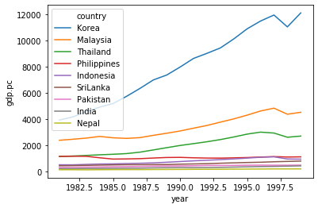
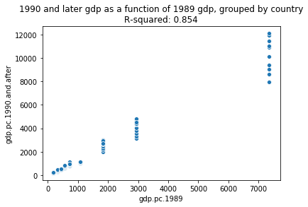
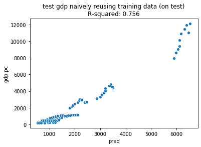
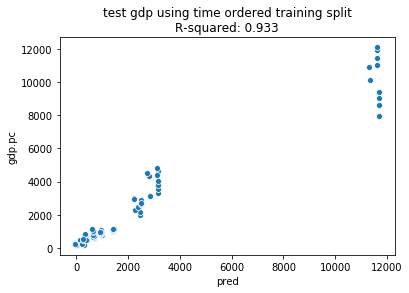

Translating the R sequences from https://arxiv.org/abs/1611.09477 into Python vtreat https://github.com/WinVector/pyvtreat


```python

```

R original
## ----LookFTData, echo=TRUE, warning=FALSE, message=FALSE-----------------
library("Amelia")
data("freetrade")
str(freetrade)
Python translation


```python
import pandas
import numpy
import numpy.random
import vtreat # https://github.com/WinVector/pyvtreat
import sklearn.linear_model

freetrade = pandas.read_csv('freetrade.csv')
freetrade.head()
```


<div>
<style scoped>
    .dataframe tbody tr th:only-of-type {
        vertical-align: middle;
    }

    .dataframe tbody tr th {
        vertical-align: top;
    }

    .dataframe thead th {
        text-align: right;
    }
</style>
<table border="1" class="dataframe">
  <thead>
    <tr style="text-align: right;">
      <th></th>
      <th>year</th>
      <th>country</th>
      <th>tariff</th>
      <th>polity</th>
      <th>pop</th>
      <th>gdp.pc</th>
      <th>intresmi</th>
      <th>signed</th>
      <th>fiveop</th>
      <th>usheg</th>
    </tr>
  </thead>
  <tbody>
    <tr>
      <th>0</th>
      <td>1981</td>
      <td>SriLanka</td>
      <td>NaN</td>
      <td>6.0</td>
      <td>14988000</td>
      <td>461.023590</td>
      <td>1.937347</td>
      <td>0.0</td>
      <td>12.4</td>
      <td>0.259311</td>
    </tr>
    <tr>
      <th>1</th>
      <td>1982</td>
      <td>SriLanka</td>
      <td>NaN</td>
      <td>5.0</td>
      <td>15189000</td>
      <td>473.763397</td>
      <td>1.964430</td>
      <td>0.0</td>
      <td>12.5</td>
      <td>0.255801</td>
    </tr>
    <tr>
      <th>2</th>
      <td>1983</td>
      <td>SriLanka</td>
      <td>41.299999</td>
      <td>5.0</td>
      <td>15417000</td>
      <td>489.226562</td>
      <td>1.663936</td>
      <td>1.0</td>
      <td>12.3</td>
      <td>0.265502</td>
    </tr>
    <tr>
      <th>3</th>
      <td>1984</td>
      <td>SriLanka</td>
      <td>NaN</td>
      <td>5.0</td>
      <td>15599000</td>
      <td>508.173920</td>
      <td>2.797462</td>
      <td>0.0</td>
      <td>12.3</td>
      <td>0.298801</td>
    </tr>
    <tr>
      <th>4</th>
      <td>1985</td>
      <td>SriLanka</td>
      <td>31.000000</td>
      <td>5.0</td>
      <td>15837000</td>
      <td>525.560852</td>
      <td>2.259116</td>
      <td>0.0</td>
      <td>12.3</td>
      <td>0.295243</td>
    </tr>
  </tbody>
</table>
</div>


```python
freetrade.dtypes
```


    year          int64
    country      object
    tariff      float64
    polity      float64
    pop           int64
    gdp.pc      float64
    intresmi    float64
    signed      float64
    fiveop      float64
    usheg       float64
    dtype: object


```python

```

R original
## ----LookFTData2, echo=FALSE, warning=FALSE, message=FALSE, fig.width=6, fig.height=3----
library("ggplot2")
compRsq <- function(d, x, y) {
  meany <- mean(d[[y]])
  rsq <- 1-sum((d[[y]]-d[[x]])^2)/sum((d[[y]]-meany)^2)
  rsq
}
plotFit <- function(d, x, y, title) {
  rsq <- compRsq(d, x, y)
  ggplot(data=d, aes_string(x=x, y=y)) +
    geom_abline(color='blue') +
    geom_point() +
    ggtitle(paste(title, '\n', 'R-squared:', 
                  format(rsq, scientific=FALSE, digits=3)))
}
plotFrame <- freetrade
sortFrame <- plotFrame[plotFrame$year==1989, c('country', 'gdp.pc')]
orderedLevels <- sortFrame$country[order(-sortFrame$gdp.pc)]
plotFrame$country <- factor(plotFrame$country, orderedLevels)
ggplot(data=plotFrame, aes(x=year, y=gdp.pc, color=country, linetype=country)) +
     geom_point() + geom_line()
Python version


```python
import seaborn

def compRsq(d, x, y):
    meany = numpy.mean(d[y])
    rsq = 1-numpy.sum((d[y]-d[x])**2)/numpy.sum((d[y]-meany)**2)
    return rsq


def plotFit(d, x, y, title):
    rsq = compRsq(d, x, y)
    title = title + "\nR-squared: " + '{:.3f}'.format(rsq)
    seaborn.scatterplot(x=x, y=y, data=d).set_title(title)
```


```python
plotFrame = freetrade
sortFrame = plotFrame.loc[plotFrame['year']==1989, ]
country_order = [c for c in sortFrame.groupby('country')[['gdp.pc']].mean().sort_values(by=['gdp.pc']).index]
country_order.reverse()
seaborn.lineplot(x='year', y='gdp.pc', data=plotFrame, hue='country',
                hue_order=country_order)
```


    <matplotlib.axes._subplots.AxesSubplot at 0x1a18bc51d0>





```python
plotFrame.groupby('country')[['gdp.pc']].mean().sort_values(by=['gdp.pc']).index
```


    Index(['Nepal', 'India', 'Pakistan', 'SriLanka', 'Indonesia', 'Philippines',
           'Thailand', 'Malaysia', 'Korea'],
          dtype='object', name='country')


```python

```

R origninal
## ----LookFTDefGoal1------------------------------------------------------
trainData <- freetrade[freetrade$year<1990, ]
testData <- freetrade[freetrade$year>=1990, ]
origVars <- c('tariff', 'polity', 'pop', 'year', 'country')


## ----ModelPast2, echo=FALSE, warning=FALSE, message=FALSE, fig.width=6, fig.height=3----
paired <- merge(freetrade[freetrade$year==1989, c('country', 'year', 'gdp.pc')], 
               freetrade[freetrade$year>=1990, c('country', 'year', 'gdp.pc')], 
               by='country', suffixes=c('.1989', '.1990.and.after'))
plotFit(paired, 'gdp.pc.1989', 'gdp.pc.1990.and.after', 
                     '1990 and later gdp as a function of 1989 gdp, grouped by country')
Python version


```python
## ----LookFTDefGoal1------------------------------------------------------
```


```python
trainData = freetrade.loc[freetrade['year']<1990, :].copy()
trainData.reset_index(inplace=True, drop=True)
testData = freetrade.loc[freetrade['year']>=1990, :].copy()
testData.reset_index(inplace=True, drop=True)
origVars = ['tariff', 'polity', 'pop', 'year', 'country']
```


```python
## ----ModelPast2, echo=FALSE, warning=FALSE, message=FALSE, fig.width=6, fig.height=3----
```


```python
paired = freetrade.loc[freetrade['year']==1989, ['country', 'year', 'gdp.pc']].merge(
               freetrade.loc[freetrade['year']>=1990, ['country', 'year', 'gdp.pc']], 
               on='country', 
               suffixes=['.1989', '.1990.and.after'])
plotFit(paired, 'gdp.pc.1989', 'gdp.pc.1990.and.after', 
                     '1990 and later gdp as a function of 1989 gdp, grouped by country')
```





```python

```

R original
## ----ModelFTTry1, warning=FALSE, message=FALSE, results='hide'-----------
library("vtreat")
treatments <- designTreatmentsN(trainData, origVars, 'gdp.pc')
scoreFrame <- treatments$scoreFrame


## ----ModelFTTry1p2, warning=FALSE, message=FALSE-------------------------
modelingVars <- unique(c('year', 
   scoreFrame$varName[(scoreFrame$sig < 1 / nrow(scoreFrame)) &
    !(scoreFrame$code %in% c('lev'))]))
print(modelingVars)
trainTreated <- prepare(treatments, trainData, 
                       pruneSig=NULL, varRestriction=modelingVars)
testTreated <- prepare(treatments, testData, 
                       pruneSig=NULL, varRestriction=modelingVars)
formula <- paste('gdp.pc', paste(modelingVars, collapse=' + '), sep=' ~ ')
print(strwrap(formula))
model <- lm(as.formula(formula), data=trainTreated)
testTreated$pred <- predict(model, newdata=testTreated)


## ----ModelFTTry1plot, echo=FALSE, warning=FALSE, message=FALSE, fig.width=6, fig.height=3----
plotFit(testTreated, 'pred', 'gdp.pc', 
        'test gdp naively reusing training data')
Python version


```python
## ----ModelFTTry1, warning=FALSE, message=FALSE, results='hide'-----------
```


```python
treatments = vtreat.NumericOutcomeTreatment(
    outcome_name='gdp.pc',
    params=vtreat.vtreat_parameters({'filter_to_recommended': False}))
trainTreated = treatments.fit_transform(trainData[origVars + ['gdp.pc']], trainData['gdp.pc'])
scoreFrame = treatments.score_frame_
scoreFrame
```


<div>
<style scoped>
    .dataframe tbody tr th:only-of-type {
        vertical-align: middle;
    }

    .dataframe tbody tr th {
        vertical-align: top;
    }

    .dataframe thead th {
        text-align: right;
    }
</style>
<table border="1" class="dataframe">
  <thead>
    <tr style="text-align: right;">
      <th></th>
      <th>variable</th>
      <th>orig_variable</th>
      <th>treatment</th>
      <th>y_aware</th>
      <th>has_range</th>
      <th>PearsonR</th>
      <th>significance</th>
      <th>vcount</th>
      <th>recommended</th>
    </tr>
  </thead>
  <tbody>
    <tr>
      <th>0</th>
      <td>tariff_is_bad</td>
      <td>tariff</td>
      <td>missing_indicator</td>
      <td>False</td>
      <td>True</td>
      <td>-0.121769</td>
      <td>2.788414e-01</td>
      <td>2.0</td>
      <td>True</td>
    </tr>
    <tr>
      <th>1</th>
      <td>polity_is_bad</td>
      <td>polity</td>
      <td>missing_indicator</td>
      <td>False</td>
      <td>True</td>
      <td>0.217462</td>
      <td>5.115870e-02</td>
      <td>2.0</td>
      <td>True</td>
    </tr>
    <tr>
      <th>2</th>
      <td>tariff</td>
      <td>tariff</td>
      <td>clean_copy</td>
      <td>False</td>
      <td>True</td>
      <td>-0.394763</td>
      <td>2.653752e-04</td>
      <td>4.0</td>
      <td>True</td>
    </tr>
    <tr>
      <th>3</th>
      <td>polity</td>
      <td>polity</td>
      <td>clean_copy</td>
      <td>False</td>
      <td>True</td>
      <td>-0.010388</td>
      <td>9.266652e-01</td>
      <td>4.0</td>
      <td>False</td>
    </tr>
    <tr>
      <th>4</th>
      <td>pop</td>
      <td>pop</td>
      <td>clean_copy</td>
      <td>False</td>
      <td>True</td>
      <td>-0.277180</td>
      <td>1.224046e-02</td>
      <td>4.0</td>
      <td>True</td>
    </tr>
    <tr>
      <th>5</th>
      <td>year</td>
      <td>year</td>
      <td>clean_copy</td>
      <td>False</td>
      <td>True</td>
      <td>0.105330</td>
      <td>3.493548e-01</td>
      <td>4.0</td>
      <td>False</td>
    </tr>
    <tr>
      <th>6</th>
      <td>country_impact_code</td>
      <td>country</td>
      <td>impact_code</td>
      <td>True</td>
      <td>True</td>
      <td>0.962853</td>
      <td>1.119532e-46</td>
      <td>1.0</td>
      <td>True</td>
    </tr>
    <tr>
      <th>7</th>
      <td>country_deviance_code</td>
      <td>country</td>
      <td>deviance_code</td>
      <td>True</td>
      <td>True</td>
      <td>0.903797</td>
      <td>7.507563e-31</td>
      <td>1.0</td>
      <td>True</td>
    </tr>
    <tr>
      <th>8</th>
      <td>country_prevalence_code</td>
      <td>country</td>
      <td>prevalence_code</td>
      <td>False</td>
      <td>False</td>
      <td>NaN</td>
      <td>1.000000e+00</td>
      <td>1.0</td>
      <td>False</td>
    </tr>
    <tr>
      <th>9</th>
      <td>country_lev_Philippines</td>
      <td>country</td>
      <td>indicator_code</td>
      <td>False</td>
      <td>True</td>
      <td>-0.066973</td>
      <td>5.524737e-01</td>
      <td>9.0</td>
      <td>False</td>
    </tr>
    <tr>
      <th>10</th>
      <td>country_lev_Malaysia</td>
      <td>country</td>
      <td>indicator_code</td>
      <td>False</td>
      <td>True</td>
      <td>0.261598</td>
      <td>1.832314e-02</td>
      <td>9.0</td>
      <td>True</td>
    </tr>
    <tr>
      <th>11</th>
      <td>country_lev_Pakistan</td>
      <td>country</td>
      <td>indicator_code</td>
      <td>False</td>
      <td>True</td>
      <td>-0.213975</td>
      <td>5.509552e-02</td>
      <td>9.0</td>
      <td>True</td>
    </tr>
    <tr>
      <th>12</th>
      <td>country_lev_SriLanka</td>
      <td>country</td>
      <td>indicator_code</td>
      <td>False</td>
      <td>True</td>
      <td>-0.186324</td>
      <td>9.581950e-02</td>
      <td>9.0</td>
      <td>True</td>
    </tr>
    <tr>
      <th>13</th>
      <td>country_lev_India</td>
      <td>country</td>
      <td>indicator_code</td>
      <td>False</td>
      <td>True</td>
      <td>-0.238962</td>
      <td>3.167718e-02</td>
      <td>9.0</td>
      <td>True</td>
    </tr>
    <tr>
      <th>14</th>
      <td>country_lev_Indonesia</td>
      <td>country</td>
      <td>indicator_code</td>
      <td>False</td>
      <td>True</td>
      <td>-0.165715</td>
      <td>1.392740e-01</td>
      <td>9.0</td>
      <td>False</td>
    </tr>
    <tr>
      <th>15</th>
      <td>country_lev_Nepal</td>
      <td>country</td>
      <td>indicator_code</td>
      <td>False</td>
      <td>True</td>
      <td>-0.261041</td>
      <td>1.858159e-02</td>
      <td>9.0</td>
      <td>True</td>
    </tr>
    <tr>
      <th>16</th>
      <td>country_lev_Korea</td>
      <td>country</td>
      <td>indicator_code</td>
      <td>False</td>
      <td>True</td>
      <td>0.869037</td>
      <td>7.365921e-26</td>
      <td>9.0</td>
      <td>True</td>
    </tr>
    <tr>
      <th>17</th>
      <td>country_lev_Thailand</td>
      <td>country</td>
      <td>indicator_code</td>
      <td>False</td>
      <td>True</td>
      <td>0.002355</td>
      <td>9.833534e-01</td>
      <td>9.0</td>
      <td>False</td>
    </tr>
  </tbody>
</table>
</div>


```python
trainTreated.head()
```


<div>
<style scoped>
    .dataframe tbody tr th:only-of-type {
        vertical-align: middle;
    }

    .dataframe tbody tr th {
        vertical-align: top;
    }

    .dataframe thead th {
        text-align: right;
    }
</style>
<table border="1" class="dataframe">
  <thead>
    <tr style="text-align: right;">
      <th></th>
      <th>gdp.pc</th>
      <th>tariff_is_bad</th>
      <th>polity_is_bad</th>
      <th>tariff</th>
      <th>polity</th>
      <th>pop</th>
      <th>year</th>
      <th>country_impact_code</th>
      <th>country_deviance_code</th>
      <th>country_lev_Philippines</th>
      <th>country_lev_Malaysia</th>
      <th>country_lev_Pakistan</th>
      <th>country_lev_SriLanka</th>
      <th>country_lev_India</th>
      <th>country_lev_Indonesia</th>
      <th>country_lev_Nepal</th>
      <th>country_lev_Korea</th>
      <th>country_lev_Thailand</th>
    </tr>
  </thead>
  <tbody>
    <tr>
      <th>0</th>
      <td>461.023590</td>
      <td>1.0</td>
      <td>0.0</td>
      <td>38.608889</td>
      <td>6.0</td>
      <td>14988000.0</td>
      <td>1981.0</td>
      <td>-949.446530</td>
      <td>11.032452</td>
      <td>0</td>
      <td>0</td>
      <td>0</td>
      <td>1</td>
      <td>0</td>
      <td>0</td>
      <td>0</td>
      <td>0</td>
      <td>0</td>
    </tr>
    <tr>
      <th>1</th>
      <td>473.763397</td>
      <td>1.0</td>
      <td>0.0</td>
      <td>38.608889</td>
      <td>5.0</td>
      <td>15189000.0</td>
      <td>1982.0</td>
      <td>-949.446530</td>
      <td>11.032452</td>
      <td>0</td>
      <td>0</td>
      <td>0</td>
      <td>1</td>
      <td>0</td>
      <td>0</td>
      <td>0</td>
      <td>0</td>
      <td>0</td>
    </tr>
    <tr>
      <th>2</th>
      <td>489.226562</td>
      <td>0.0</td>
      <td>0.0</td>
      <td>41.299999</td>
      <td>5.0</td>
      <td>15417000.0</td>
      <td>1983.0</td>
      <td>-949.446530</td>
      <td>11.032452</td>
      <td>0</td>
      <td>0</td>
      <td>0</td>
      <td>1</td>
      <td>0</td>
      <td>0</td>
      <td>0</td>
      <td>0</td>
      <td>0</td>
    </tr>
    <tr>
      <th>3</th>
      <td>508.173920</td>
      <td>1.0</td>
      <td>0.0</td>
      <td>38.608889</td>
      <td>5.0</td>
      <td>15599000.0</td>
      <td>1984.0</td>
      <td>-949.446530</td>
      <td>11.032452</td>
      <td>0</td>
      <td>0</td>
      <td>0</td>
      <td>1</td>
      <td>0</td>
      <td>0</td>
      <td>0</td>
      <td>0</td>
      <td>0</td>
    </tr>
    <tr>
      <th>4</th>
      <td>525.560852</td>
      <td>0.0</td>
      <td>0.0</td>
      <td>31.000000</td>
      <td>5.0</td>
      <td>15837000.0</td>
      <td>1985.0</td>
      <td>-707.960497</td>
      <td>35.385890</td>
      <td>0</td>
      <td>0</td>
      <td>0</td>
      <td>1</td>
      <td>0</td>
      <td>0</td>
      <td>0</td>
      <td>0</td>
      <td>0</td>
    </tr>
  </tbody>
</table>
</div>


```python
## ----ModelFTTry1p2, warning=FALSE, message=FALSE-------------------------
```


```python
modelingVars = [ scoreFrame['variable'][i] for i in range(scoreFrame.shape[0]) if 
                (scoreFrame['recommended'][i] and (not scoreFrame['treatment'][i]=='indicator_code'))]
if not 'year' in set(modelingVars):
    modelingVars = modelingVars + ['year']
print(modelingVars)
trainTreated = trainTreated[modelingVars + ['gdp.pc']].copy()
trainTreated.reset_index(inplace=True, drop=True)
testTreated = treatments.transform(testData)[modelingVars + ['gdp.pc']].copy()
model = sklearn.linear_model.LinearRegression()
testTreated.reset_index(inplace=True, drop=True)
model.fit(trainTreated[modelingVars], trainTreated['gdp.pc'])
testTreated['pred'] = model.predict(testTreated[modelingVars])
testTreated.head()
```

    ['tariff_is_bad', 'polity_is_bad', 'tariff', 'pop', 'country_impact_code', 'country_deviance_code', 'year']


<div>
<style scoped>
    .dataframe tbody tr th:only-of-type {
        vertical-align: middle;
    }

    .dataframe tbody tr th {
        vertical-align: top;
    }

    .dataframe thead th {
        text-align: right;
    }
</style>
<table border="1" class="dataframe">
  <thead>
    <tr style="text-align: right;">
      <th></th>
      <th>tariff_is_bad</th>
      <th>polity_is_bad</th>
      <th>tariff</th>
      <th>pop</th>
      <th>country_impact_code</th>
      <th>country_deviance_code</th>
      <th>year</th>
      <th>gdp.pc</th>
      <th>pred</th>
    </tr>
  </thead>
  <tbody>
    <tr>
      <th>0</th>
      <td>0.0</td>
      <td>0.0</td>
      <td>28.299999</td>
      <td>16993000.0</td>
      <td>-874.596804</td>
      <td>33.342945</td>
      <td>1990.0</td>
      <td>579.954834</td>
      <td>907.710837</td>
    </tr>
    <tr>
      <th>1</th>
      <td>0.0</td>
      <td>0.0</td>
      <td>26.900000</td>
      <td>17247000.0</td>
      <td>-874.596804</td>
      <td>33.342945</td>
      <td>1991.0</td>
      <td>597.698730</td>
      <td>979.710161</td>
    </tr>
    <tr>
      <th>2</th>
      <td>0.0</td>
      <td>0.0</td>
      <td>25.000000</td>
      <td>17405000.0</td>
      <td>-874.596804</td>
      <td>33.342945</td>
      <td>1992.0</td>
      <td>618.332947</td>
      <td>1052.865353</td>
    </tr>
    <tr>
      <th>3</th>
      <td>0.0</td>
      <td>0.0</td>
      <td>24.200001</td>
      <td>17628420.0</td>
      <td>-874.596804</td>
      <td>33.342945</td>
      <td>1993.0</td>
      <td>652.620483</td>
      <td>1123.478741</td>
    </tr>
    <tr>
      <th>4</th>
      <td>0.0</td>
      <td>0.0</td>
      <td>26.000000</td>
      <td>17865000.0</td>
      <td>-874.596804</td>
      <td>33.342945</td>
      <td>1994.0</td>
      <td>680.040833</td>
      <td>1188.085308</td>
    </tr>
  </tbody>
</table>
</div>


```python
## ----ModelFTTry1plot, echo=FALSE, warning=FALSE, message=FALSE, fig.width=6, fig.height=3----
```


```python
plotFit(testTreated, 'pred', 'gdp.pc', 
        'test gdp naively reusing training data (on test)')
```





```python

```

R original
## ----ModelFTTry3, warning=FALSE, message=FALSE---------------------------
timeOrderedSplitter <- function(nRows, nSplits, dframe, y) {
  years <- sort(unique(dframe$year))
  splits <- lapply(years, function(y) {
    list(train=which(dframe$year<y), 
         app=which(dframe$year>=y))
  })
  Filter(function(si) {
          (length(si$train)>0) && (length(si$app)>0)
         }, 
         splits)
}


## ----ModelFTTry3b, warning=FALSE, message=FALSE--------------------------
cfe <- mkCrossFrameNExperiment(trainData, origVars, 'gdp.pc', 
                               splitFunction=timeOrderedSplitter)
print(cfe$method)
treatments <- cfe$treatments
scoreFrame <- treatments$scoreFrame
modelingVars <- unique(c('year', 
   scoreFrame$varName[(scoreFrame$sig < 1 / nrow(scoreFrame)) &
    !(scoreFrame$code %in% c('lev'))]))
print(modelingVars)
trainTreated <- cfe$crossFrame
testTreated <- prepare(treatments, testData, 
                       pruneSig=NULL, varRestriction=modelingVars)
formula <- paste('gdp.pc', paste(modelingVars, collapse=' + '), sep=' ~ ')
print(strwrap(formula))
model <- lm(as.formula(formula), data=trainTreated)
testTreated$pred <- predict(model, newdata=testTreated)


## ----ModelFTTry3bplot, echo=FALSE, warning=FALSE, message=FALSE, fig.width=6, fig.height=3----
plotFit(testTreated, 'pred', 'gdp.pc', 
        'test gdp using time ordered training split')
Python version


```python
## ----ModelFTTry3, warning=FALSE, message=FALSE---------------------------
```


```python
class TimeOrderedSplitter(vtreat.CrossValidationPlan):
    """time oriented cross validation plan"""

    def __init__(self):
        vtreat.CrossValidationPlan.__init__(self)

    def split_plan(self, *, n_rows=None, k_folds=None, data=None, y=None):
       years = [y for y in set(data['year'])]
       years.sort()
       y0 = years[0]
       y1 = years[1]
       y_mid = years[int(len(years)/2)]
       splits = [{'train':[i for i in range(data.shape[0]) if (data['year'][i]<yr) and (data['year'][i]<y_mid)],
                  'app':[i for i in range(data.shape[0]) if data['year'][i]==yr]} for yr in years if yr>y0] +\
                [{'train':[i for i in range(data.shape[0]) if data['year'][i]==y1],
                  'app':[i for i in range(data.shape[0]) if data['year'][i]==y0]}]
       return splits
```


```python
## ----ModelFTTry3b, warning=FALSE, message=FALSE--------------------------
```


```python
treatments = vtreat.NumericOutcomeTreatment(
    outcome_name='gdp.pc',
    params=vtreat.vtreat_parameters({'filter_to_recommended': False,
                                     'cross_validation_plan': TimeOrderedSplitter()}))
trainTreated = treatments.fit_transform(trainData[origVars + ['gdp.pc']], trainData['gdp.pc'])
scoreFrame = treatments.score_frame_
modelingVars = [ scoreFrame['variable'][i] for i in range(scoreFrame.shape[0]) if 
                (scoreFrame['recommended'][i] and (not scoreFrame['treatment'][i]=='indicator_code'))]
if not 'year' in set(modelingVars):
    modelingVars = modelingVars + ['year']
print(modelingVars)
trainTreated = trainTreated[modelingVars + ['gdp.pc']].copy()
testTreated = treatments.transform(testData)[modelingVars + ['gdp.pc']].copy()
model = sklearn.linear_model.LinearRegression()
model.fit(trainTreated[modelingVars], trainTreated['gdp.pc'])
testTreated['pred'] = model.predict(testTreated[modelingVars])
testTreated.head()
```

    ['tariff_is_bad', 'polity_is_bad', 'tariff', 'pop', 'country_impact_code', 'country_deviance_code', 'year']


<div>
<style scoped>
    .dataframe tbody tr th:only-of-type {
        vertical-align: middle;
    }

    .dataframe tbody tr th {
        vertical-align: top;
    }

    .dataframe thead th {
        text-align: right;
    }
</style>
<table border="1" class="dataframe">
  <thead>
    <tr style="text-align: right;">
      <th></th>
      <th>tariff_is_bad</th>
      <th>polity_is_bad</th>
      <th>tariff</th>
      <th>pop</th>
      <th>country_impact_code</th>
      <th>country_deviance_code</th>
      <th>year</th>
      <th>gdp.pc</th>
      <th>pred</th>
    </tr>
  </thead>
  <tbody>
    <tr>
      <th>0</th>
      <td>0.0</td>
      <td>0.0</td>
      <td>28.299999</td>
      <td>16993000.0</td>
      <td>-874.596804</td>
      <td>33.342945</td>
      <td>1990.0</td>
      <td>579.954834</td>
      <td>675.362678</td>
    </tr>
    <tr>
      <th>1</th>
      <td>0.0</td>
      <td>0.0</td>
      <td>26.900000</td>
      <td>17247000.0</td>
      <td>-874.596804</td>
      <td>33.342945</td>
      <td>1991.0</td>
      <td>597.698730</td>
      <td>671.805287</td>
    </tr>
    <tr>
      <th>2</th>
      <td>0.0</td>
      <td>0.0</td>
      <td>25.000000</td>
      <td>17405000.0</td>
      <td>-874.596804</td>
      <td>33.342945</td>
      <td>1992.0</td>
      <td>618.332947</td>
      <td>671.654079</td>
    </tr>
    <tr>
      <th>3</th>
      <td>0.0</td>
      <td>0.0</td>
      <td>24.200001</td>
      <td>17628420.0</td>
      <td>-874.596804</td>
      <td>33.342945</td>
      <td>1993.0</td>
      <td>652.620483</td>
      <td>664.030849</td>
    </tr>
    <tr>
      <th>4</th>
      <td>0.0</td>
      <td>0.0</td>
      <td>26.000000</td>
      <td>17865000.0</td>
      <td>-874.596804</td>
      <td>33.342945</td>
      <td>1994.0</td>
      <td>680.040833</td>
      <td>638.767437</td>
    </tr>
  </tbody>
</table>
</div>


```python
## ----ModelFTTry3bplot, echo=FALSE, warning=FALSE, message=FALSE, fig.width=6, fig.height=3----
```


```python
plotFit(testTreated, 'pred', 'gdp.pc', 
        'test gdp using time ordered training split')
```





```python
scoreFrame
```


<div>
<style scoped>
    .dataframe tbody tr th:only-of-type {
        vertical-align: middle;
    }

    .dataframe tbody tr th {
        vertical-align: top;
    }

    .dataframe thead th {
        text-align: right;
    }
</style>
<table border="1" class="dataframe">
  <thead>
    <tr style="text-align: right;">
      <th></th>
      <th>variable</th>
      <th>orig_variable</th>
      <th>treatment</th>
      <th>y_aware</th>
      <th>has_range</th>
      <th>PearsonR</th>
      <th>significance</th>
      <th>vcount</th>
      <th>recommended</th>
    </tr>
  </thead>
  <tbody>
    <tr>
      <th>0</th>
      <td>tariff_is_bad</td>
      <td>tariff</td>
      <td>missing_indicator</td>
      <td>False</td>
      <td>True</td>
      <td>-0.121769</td>
      <td>2.788414e-01</td>
      <td>2.0</td>
      <td>True</td>
    </tr>
    <tr>
      <th>1</th>
      <td>polity_is_bad</td>
      <td>polity</td>
      <td>missing_indicator</td>
      <td>False</td>
      <td>True</td>
      <td>0.217462</td>
      <td>5.115870e-02</td>
      <td>2.0</td>
      <td>True</td>
    </tr>
    <tr>
      <th>2</th>
      <td>tariff</td>
      <td>tariff</td>
      <td>clean_copy</td>
      <td>False</td>
      <td>True</td>
      <td>-0.394763</td>
      <td>2.653752e-04</td>
      <td>4.0</td>
      <td>True</td>
    </tr>
    <tr>
      <th>3</th>
      <td>polity</td>
      <td>polity</td>
      <td>clean_copy</td>
      <td>False</td>
      <td>True</td>
      <td>-0.010388</td>
      <td>9.266652e-01</td>
      <td>4.0</td>
      <td>False</td>
    </tr>
    <tr>
      <th>4</th>
      <td>pop</td>
      <td>pop</td>
      <td>clean_copy</td>
      <td>False</td>
      <td>True</td>
      <td>-0.277180</td>
      <td>1.224046e-02</td>
      <td>4.0</td>
      <td>True</td>
    </tr>
    <tr>
      <th>5</th>
      <td>year</td>
      <td>year</td>
      <td>clean_copy</td>
      <td>False</td>
      <td>True</td>
      <td>0.105330</td>
      <td>3.493548e-01</td>
      <td>4.0</td>
      <td>False</td>
    </tr>
    <tr>
      <th>6</th>
      <td>country_impact_code</td>
      <td>country</td>
      <td>impact_code</td>
      <td>True</td>
      <td>True</td>
      <td>0.910616</td>
      <td>4.703553e-32</td>
      <td>1.0</td>
      <td>True</td>
    </tr>
    <tr>
      <th>7</th>
      <td>country_deviance_code</td>
      <td>country</td>
      <td>deviance_code</td>
      <td>True</td>
      <td>True</td>
      <td>0.882992</td>
      <td>1.135966e-27</td>
      <td>1.0</td>
      <td>True</td>
    </tr>
    <tr>
      <th>8</th>
      <td>country_prevalence_code</td>
      <td>country</td>
      <td>prevalence_code</td>
      <td>False</td>
      <td>False</td>
      <td>NaN</td>
      <td>1.000000e+00</td>
      <td>1.0</td>
      <td>False</td>
    </tr>
    <tr>
      <th>9</th>
      <td>country_lev_Philippines</td>
      <td>country</td>
      <td>indicator_code</td>
      <td>False</td>
      <td>True</td>
      <td>-0.066973</td>
      <td>5.524737e-01</td>
      <td>9.0</td>
      <td>False</td>
    </tr>
    <tr>
      <th>10</th>
      <td>country_lev_Malaysia</td>
      <td>country</td>
      <td>indicator_code</td>
      <td>False</td>
      <td>True</td>
      <td>0.261598</td>
      <td>1.832314e-02</td>
      <td>9.0</td>
      <td>True</td>
    </tr>
    <tr>
      <th>11</th>
      <td>country_lev_Pakistan</td>
      <td>country</td>
      <td>indicator_code</td>
      <td>False</td>
      <td>True</td>
      <td>-0.213975</td>
      <td>5.509552e-02</td>
      <td>9.0</td>
      <td>True</td>
    </tr>
    <tr>
      <th>12</th>
      <td>country_lev_SriLanka</td>
      <td>country</td>
      <td>indicator_code</td>
      <td>False</td>
      <td>True</td>
      <td>-0.186324</td>
      <td>9.581950e-02</td>
      <td>9.0</td>
      <td>True</td>
    </tr>
    <tr>
      <th>13</th>
      <td>country_lev_India</td>
      <td>country</td>
      <td>indicator_code</td>
      <td>False</td>
      <td>True</td>
      <td>-0.238962</td>
      <td>3.167718e-02</td>
      <td>9.0</td>
      <td>True</td>
    </tr>
    <tr>
      <th>14</th>
      <td>country_lev_Indonesia</td>
      <td>country</td>
      <td>indicator_code</td>
      <td>False</td>
      <td>True</td>
      <td>-0.165715</td>
      <td>1.392740e-01</td>
      <td>9.0</td>
      <td>False</td>
    </tr>
    <tr>
      <th>15</th>
      <td>country_lev_Nepal</td>
      <td>country</td>
      <td>indicator_code</td>
      <td>False</td>
      <td>True</td>
      <td>-0.261041</td>
      <td>1.858159e-02</td>
      <td>9.0</td>
      <td>True</td>
    </tr>
    <tr>
      <th>16</th>
      <td>country_lev_Korea</td>
      <td>country</td>
      <td>indicator_code</td>
      <td>False</td>
      <td>True</td>
      <td>0.869037</td>
      <td>7.365921e-26</td>
      <td>9.0</td>
      <td>True</td>
    </tr>
    <tr>
      <th>17</th>
      <td>country_lev_Thailand</td>
      <td>country</td>
      <td>indicator_code</td>
      <td>False</td>
      <td>True</td>
      <td>0.002355</td>
      <td>9.833534e-01</td>
      <td>9.0</td>
      <td>False</td>
    </tr>
  </tbody>
</table>
</div>


```python

```


```python

```
