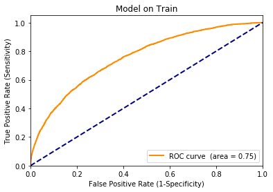
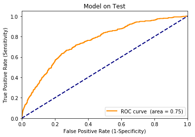
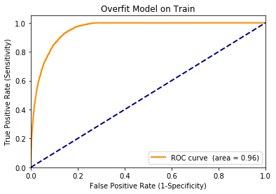

[This](https://github.com/WinVector/pyvtreat) is the Python version of the `vtreat` data preparation system
(also available as an [`R` package](http://winvector.github.io/vtreat/)).

In each case: `vtreat` is an data.frame processor/conditioner that
prepares real-world data for predictive modeling in a statistically
sound manner.

For more detail please see here: [arXiv:1611.09477
stat.AP](https://arxiv.org/abs/1611.09477) (the documentation describes the `R` version,
however all of the examples can be found worked in `Python` [here](https://github.com/WinVector/pyvtreat/tree/master/Examples/vtreat_paper1)).

‘vtreat’ is supplied by [Win-Vector LLC](http://www.win-vector.com)
under a [BSD 3-clause license](LICENSE), without warranty. We are also developing
a [Python version of ‘vtreat’]().


(logo: Julie Mount, source: “The Harvest” by Boris Kustodiev 1914)

Some operational examples can be found [here](https://github.com/WinVector/pyvtreat/tree/master/Examples).

We are working on new documentation. But for now understand `vtreat` is used by instantiating one of the classes
`vtreat.NumericOutcomeTreatment`, `vtreat.BinomialOutcomeTreatment`, `vtreat.MultinomialOutcomeTreatment`, or `vtreat.UnsupervisedTreatment`.
Each of these implements the [`sklearn.pipeline.Pipeline`](https://scikit-learn.org/stable/modules/generated/sklearn.pipeline.Pipeline.html) interfaces
expecting a [Pandas Data.Frame](https://pandas.pydata.org/pandas-docs/stable/reference/api/pandas.DataFrame.html) as input. The `vtreat` steps are intended to
be a "one step fix" that works well with [`sklearn.preprocessing`](https://scikit-learn.org/stable/modules/preprocessing.html) stages.

The `vtreat` `Pipeline.fit_transform()`
method implements the powerful [cross-frame](https://cran.r-project.org/web/packages/vtreat/vignettes/vtreatCrossFrames.html) ideas (allowing the same data to be used for `vtreat` fitting and for later model construction, while
mitigating nested model bias issues).

## Background

Even with modern machine learning techniques (random forests, support
vector machines, neural nets, gradient boosted trees, and so on) or
standard statistical methods (regression, generalized regression,
generalized additive models) there are *common* data issues that can
cause modeling to fail. vtreat deals with a number of these in a
principled and automated fashion.

In particular `vtreat` emphasizes a concept called “y-aware
pre-processing” and implements:

  - Treatment of missing values through safe replacement plus an indicator
    column (a simple but very powerful method when combined with
    downstream machine learning algorithms).
  - Treatment of novel levels (new values of categorical variable seen
    during test or application, but not seen during training) through
    sub-models (or impact/effects coding of pooled rare events).
  - Explicit coding of categorical variable levels as new indicator
    variables (with optional suppression of non-significant indicators).
  - Treatment of categorical variables with very large numbers of levels
    through sub-models (again [impact/effects
    coding](http://www.win-vector.com/blog/2012/07/modeling-trick-impact-coding-of-categorical-variables-with-many-levels/)).
  - Correct treatment of nested models or sub-models through data split / cross-frame methods
    (please see
    [here](https://winvector.github.io/vtreat/articles/vtreatOverfit.html))
    or through the generation of “cross validated” data frames (see
    [here](https://winvector.github.io/vtreat/articles/vtreatCrossFrames.html));
    these are issues similar to what is required to build statistically
    efficient stacked models or super-learners).

The idea is: even with a sophisticated machine learning algorithm there
are *many* ways messy real world data can defeat the modeling process,
and vtreat helps with at least ten of them. We emphasize: these problems
are already in your data, you simply build better and more reliable
models if you attempt to mitigate them. Automated processing is no
substitute for actually looking at the data, but vtreat supplies
efficient, reliable, documented, and tested implementations of many of
the commonly needed transforms.

To help explain the methods we have prepared some documentation:

  - The [vtreat package
    overall](https://winvector.github.io/vtreat/index.html).
  - [Preparing data for analysis using R
    white-paper](http://winvector.github.io/DataPrep/EN-CNTNT-Whitepaper-Data-Prep-Using-R.pdf)
  - The [types of new
    variables](https://winvector.github.io/vtreat/articles/vtreatVariableTypes.html)
    introduced by vtreat processing (including how to limit down to
    domain appropriate variable types).
  - Statistically sound treatment of the nested modeling issue
    introduced by any sort of pre-processing (such as vtreat itself):
    [nested over-fit
    issues](https://winvector.github.io/vtreat/articles/vtreatOverfit.html)
    and a general [cross-frame
    solution](https://winvector.github.io/vtreat/articles/vtreatCrossFrames.html).
  - [Principled ways to pick significance based pruning
    levels](https://winvector.github.io/vtreat/articles/vtreatSignificance.html).

## Example


This is an supervised classification example taken from the KDD 2009 cup.  A copy of the data and details can be found here: [https://github.com/WinVector/PDSwR2/tree/master/KDD2009](https://github.com/WinVector/PDSwR2/tree/master/KDD2009).  The problem was to predict account cancellation ("churn") from very messy data (column names not given, numeric and categorical variables, many missing values, some categorical variables with a large number of possible levels).  In this example we show how to quickly use `vtreat` to prepare the data for modeling.  `vtreat` takes in `Pandas` `DataFrame`s and returns both a treatment plan and a clean `Pandas` `DataFrame` ready for modeling.

```python
# To install:
!pip install https://github.com/WinVector/pyvtreat/raw/master/pkg/dist/vtreat-0.2.1.tar.gz
!pip install https://github.com/WinVector/wvpy/raw/master/pkg/dist/wvpy-0.2.1.tar.gz
```

Load our packages/modules.


```python
import pandas
import xgboost
import vtreat
import numpy
import numpy.random
import wvpy.util
```

Read in explanitory variables.


```python
# data from https://github.com/WinVector/PDSwR2/tree/master/KDD2009
dir = "../../../PracticalDataScienceWithR2nd/PDSwR2/KDD2009/"
d = pandas.read_csv(dir + 'orange_small_train.data.gz', sep='\t', header=0)
vars = [c for c in d.columns]
d.shape
```


    (50000, 230)


Read in dependent variable we are trying to predict.


```python
churn = pandas.read_csv(dir + 'orange_small_train_churn.labels.txt', header=None)
churn.columns = ["churn"]
churn.shape
```


    (50000, 1)


```python
churn["churn"].value_counts()
```


    -1    46328
     1     3672
    Name: churn, dtype: int64


Arrange test/train split.


```python


n = d.shape[0]
is_train = numpy.random.uniform(size=n)<=0.9
is_test = numpy.logical_not(is_train)
```


```python
d_train = d.loc[is_train, :].copy()
churn_train = numpy.asarray(churn.loc[is_train, :]["churn"]==1)
d_test = d.loc[is_test, :].copy()
churn_test = numpy.asarray(churn.loc[is_test, :]["churn"]==1)
```

Take a look at the dependent variables.  They are a mess, many missing values.  Categorical variables that can not be directly used without some re-encoding.


```python
d_train.head()
```


<div>
<table border="1" class="dataframe">
  <thead>
    <tr style="text-align: right;">
      <th></th>
      <th>Var1</th>
      <th>Var2</th>
      <th>Var3</th>
      <th>Var4</th>
      <th>Var5</th>
      <th>Var6</th>
      <th>Var7</th>
      <th>Var8</th>
      <th>Var9</th>
      <th>Var10</th>
      <th>...</th>
      <th>Var221</th>
      <th>Var222</th>
      <th>Var223</th>
      <th>Var224</th>
      <th>Var225</th>
      <th>Var226</th>
      <th>Var227</th>
      <th>Var228</th>
      <th>Var229</th>
      <th>Var230</th>
    </tr>
  </thead>
  <tbody>
    <tr>
      <th>1</th>
      <td>NaN</td>
      <td>NaN</td>
      <td>NaN</td>
      <td>NaN</td>
      <td>NaN</td>
      <td>525.0</td>
      <td>0.0</td>
      <td>NaN</td>
      <td>NaN</td>
      <td>NaN</td>
      <td>...</td>
      <td>oslk</td>
      <td>2Kb5FSF</td>
      <td>LM8l689qOp</td>
      <td>NaN</td>
      <td>NaN</td>
      <td>fKCe</td>
      <td>RAYp</td>
      <td>F2FyR07IdsN7I</td>
      <td>NaN</td>
      <td>NaN</td>
    </tr>
    <tr>
      <th>2</th>
      <td>NaN</td>
      <td>NaN</td>
      <td>NaN</td>
      <td>NaN</td>
      <td>NaN</td>
      <td>5236.0</td>
      <td>7.0</td>
      <td>NaN</td>
      <td>NaN</td>
      <td>NaN</td>
      <td>...</td>
      <td>Al6ZaUT</td>
      <td>NKv4yOc</td>
      <td>jySVZNlOJy</td>
      <td>NaN</td>
      <td>kG3k</td>
      <td>Qu4f</td>
      <td>02N6s8f</td>
      <td>ib5G6X1eUxUn6</td>
      <td>am7c</td>
      <td>NaN</td>
    </tr>
    <tr>
      <th>3</th>
      <td>NaN</td>
      <td>NaN</td>
      <td>NaN</td>
      <td>NaN</td>
      <td>NaN</td>
      <td>NaN</td>
      <td>0.0</td>
      <td>NaN</td>
      <td>NaN</td>
      <td>NaN</td>
      <td>...</td>
      <td>oslk</td>
      <td>CE7uk3u</td>
      <td>LM8l689qOp</td>
      <td>NaN</td>
      <td>NaN</td>
      <td>FSa2</td>
      <td>RAYp</td>
      <td>F2FyR07IdsN7I</td>
      <td>NaN</td>
      <td>NaN</td>
    </tr>
    <tr>
      <th>4</th>
      <td>NaN</td>
      <td>NaN</td>
      <td>NaN</td>
      <td>NaN</td>
      <td>NaN</td>
      <td>1029.0</td>
      <td>7.0</td>
      <td>NaN</td>
      <td>NaN</td>
      <td>NaN</td>
      <td>...</td>
      <td>oslk</td>
      <td>1J2cvxe</td>
      <td>LM8l689qOp</td>
      <td>NaN</td>
      <td>kG3k</td>
      <td>FSa2</td>
      <td>RAYp</td>
      <td>F2FyR07IdsN7I</td>
      <td>mj86</td>
      <td>NaN</td>
    </tr>
    <tr>
      <th>5</th>
      <td>NaN</td>
      <td>NaN</td>
      <td>NaN</td>
      <td>NaN</td>
      <td>NaN</td>
      <td>658.0</td>
      <td>7.0</td>
      <td>NaN</td>
      <td>NaN</td>
      <td>NaN</td>
      <td>...</td>
      <td>zCkv</td>
      <td>QqVuch3</td>
      <td>LM8l689qOp</td>
      <td>NaN</td>
      <td>NaN</td>
      <td>Qcbd</td>
      <td>02N6s8f</td>
      <td>Zy3gnGM</td>
      <td>am7c</td>
      <td>NaN</td>
    </tr>
  </tbody>
</table>
<p>5 rows × 230 columns</p>
</div>


```python
d_train.shape
```


    (44955, 230)


Try building a model directly off this data (this will fail).


```python
fitter = xgboost.XGBClassifier(n_estimators=10, max_depth=3, objective='binary:logistic')
try:
    fitter.fit(d_train, churn_train)
except Exception as ex:
    print(ex)
```

    DataFrame.dtypes for data must be int, float or bool.
                    Did not expect the data types in fields Var191, Var192, Var193, Var194, Var195, Var196, Var197, Var198, Var199, Var200, Var201, Var202, Var203, Var204, Var205, Var206, Var207, Var208, Var210, Var211, Var212, Var213, Var214, Var215, Var216, Var217, Var218, Var219, Var220, Var221, Var222, Var223, Var224, Var225, Var226, Var227, Var228, Var229


Let's quickly prepare a data frame with none of these issues.

We start by building our treatment plan, this has the `sklearn.pipeline.Pipeline` interfaces.


```python
plan = vtreat.BinomialOutcomeTreatment(outcome_target=True)
```

Use `.fit_transform()` to get a special copy of the treated training data that has cross-validated mitigations againsst nested model bias. We call this a "cross frame." `.fit_transform()` is deliberately a different `DataFrame` than what would be returned by `.fit().transform()` (the `.fit().transform()` would damage the modeling effort due nested model bias, the `.fit_transform()` "cross frame" uses cross-validation techniques similar to "stacking" to mitigate these issues).


```python
cross_frame = plan.fit_transform(d_train, churn_train)
```

Take a look at the new data.  This frame is guaranteed to be all numeric with no missing values.


```python
cross_frame.head()
```


<div>
<table border="1" class="dataframe">
  <thead>
    <tr style="text-align: right;">
      <th></th>
      <th>Var2_is_bad</th>
      <th>Var3_is_bad</th>
      <th>Var4_is_bad</th>
      <th>Var5_is_bad</th>
      <th>Var6_is_bad</th>
      <th>Var7_is_bad</th>
      <th>Var10_is_bad</th>
      <th>Var11_is_bad</th>
      <th>Var13_is_bad</th>
      <th>Var14_is_bad</th>
      <th>...</th>
      <th>Var226_lev_FSa2</th>
      <th>Var227_prevalence_code</th>
      <th>Var227_lev_RAYp</th>
      <th>Var227_lev_ZI9m</th>
      <th>Var228_prevalence_code</th>
      <th>Var228_lev_F2FyR07IdsN7I</th>
      <th>Var229_prevalence_code</th>
      <th>Var229_lev__NA_</th>
      <th>Var229_lev_am7c</th>
      <th>Var229_lev_mj86</th>
    </tr>
  </thead>
  <tbody>
    <tr>
      <th>0</th>
      <td>1.0</td>
      <td>1.0</td>
      <td>1.0</td>
      <td>1.0</td>
      <td>0.0</td>
      <td>0.0</td>
      <td>1.0</td>
      <td>1.0</td>
      <td>0.0</td>
      <td>1.0</td>
      <td>...</td>
      <td>0</td>
      <td>0.702369</td>
      <td>1</td>
      <td>0</td>
      <td>0.653453</td>
      <td>1</td>
      <td>0.569147</td>
      <td>1</td>
      <td>0</td>
      <td>0</td>
    </tr>
    <tr>
      <th>1</th>
      <td>1.0</td>
      <td>1.0</td>
      <td>1.0</td>
      <td>1.0</td>
      <td>0.0</td>
      <td>0.0</td>
      <td>1.0</td>
      <td>1.0</td>
      <td>0.0</td>
      <td>1.0</td>
      <td>...</td>
      <td>0</td>
      <td>0.047158</td>
      <td>0</td>
      <td>0</td>
      <td>0.053075</td>
      <td>0</td>
      <td>0.233211</td>
      <td>0</td>
      <td>1</td>
      <td>0</td>
    </tr>
    <tr>
      <th>2</th>
      <td>1.0</td>
      <td>1.0</td>
      <td>1.0</td>
      <td>1.0</td>
      <td>1.0</td>
      <td>0.0</td>
      <td>1.0</td>
      <td>1.0</td>
      <td>0.0</td>
      <td>1.0</td>
      <td>...</td>
      <td>1</td>
      <td>0.702369</td>
      <td>1</td>
      <td>0</td>
      <td>0.653453</td>
      <td>1</td>
      <td>0.569147</td>
      <td>1</td>
      <td>0</td>
      <td>0</td>
    </tr>
    <tr>
      <th>3</th>
      <td>1.0</td>
      <td>1.0</td>
      <td>1.0</td>
      <td>1.0</td>
      <td>0.0</td>
      <td>0.0</td>
      <td>1.0</td>
      <td>1.0</td>
      <td>0.0</td>
      <td>1.0</td>
      <td>...</td>
      <td>1</td>
      <td>0.702369</td>
      <td>1</td>
      <td>0</td>
      <td>0.653453</td>
      <td>1</td>
      <td>0.196063</td>
      <td>0</td>
      <td>0</td>
      <td>1</td>
    </tr>
    <tr>
      <th>4</th>
      <td>1.0</td>
      <td>1.0</td>
      <td>1.0</td>
      <td>1.0</td>
      <td>0.0</td>
      <td>0.0</td>
      <td>1.0</td>
      <td>1.0</td>
      <td>0.0</td>
      <td>1.0</td>
      <td>...</td>
      <td>0</td>
      <td>0.047158</td>
      <td>0</td>
      <td>0</td>
      <td>0.018841</td>
      <td>0</td>
      <td>0.233211</td>
      <td>0</td>
      <td>1</td>
      <td>0</td>
    </tr>
  </tbody>
</table>
<p>5 rows × 209 columns</p>
</div>


```python
cross_frame.shape
```


    (44955, 209)


Pick a recommended subset of the new derived variables.


```python
plan.score_frame_.head()
```


<div>
<table border="1" class="dataframe">
  <thead>
    <tr style="text-align: right;">
      <th></th>
      <th>variable</th>
      <th>orig_variable</th>
      <th>treatment</th>
      <th>y_aware</th>
      <th>has_range</th>
      <th>PearsonR</th>
      <th>significance</th>
      <th>vcount</th>
      <th>recommended</th>
    </tr>
  </thead>
  <tbody>
    <tr>
      <th>0</th>
      <td>Var1_is_bad</td>
      <td>Var1</td>
      <td>missing_indicator</td>
      <td>False</td>
      <td>True</td>
      <td>0.003308</td>
      <td>0.483072</td>
      <td>192.0</td>
      <td>False</td>
    </tr>
    <tr>
      <th>1</th>
      <td>Var2_is_bad</td>
      <td>Var2</td>
      <td>missing_indicator</td>
      <td>False</td>
      <td>True</td>
      <td>0.016913</td>
      <td>0.000336</td>
      <td>192.0</td>
      <td>True</td>
    </tr>
    <tr>
      <th>2</th>
      <td>Var3_is_bad</td>
      <td>Var3</td>
      <td>missing_indicator</td>
      <td>False</td>
      <td>True</td>
      <td>0.016913</td>
      <td>0.000336</td>
      <td>192.0</td>
      <td>True</td>
    </tr>
    <tr>
      <th>3</th>
      <td>Var4_is_bad</td>
      <td>Var4</td>
      <td>missing_indicator</td>
      <td>False</td>
      <td>True</td>
      <td>0.017624</td>
      <td>0.000186</td>
      <td>192.0</td>
      <td>True</td>
    </tr>
    <tr>
      <th>4</th>
      <td>Var5_is_bad</td>
      <td>Var5</td>
      <td>missing_indicator</td>
      <td>False</td>
      <td>True</td>
      <td>0.017745</td>
      <td>0.000168</td>
      <td>192.0</td>
      <td>True</td>
    </tr>
  </tbody>
</table>
</div>


```python
model_vars = numpy.asarray(plan.score_frame_["variable"][plan.score_frame_["recommended"]])
len(model_vars)
```


    209


Fit the model


```python
fd = xgboost.DMatrix(data=cross_frame.loc[:, model_vars], label=churn_train)
x_parameters = {"max_depth":3, "objective":'binary:logistic'}
cv = xgboost.cv(x_parameters, fd, num_boost_round=100, verbose_eval=False)
```


```python
cv.head()
```


<div>
<table border="1" class="dataframe">
  <thead>
    <tr style="text-align: right;">
      <th></th>
      <th>train-error-mean</th>
      <th>train-error-std</th>
      <th>test-error-mean</th>
      <th>test-error-std</th>
    </tr>
  </thead>
  <tbody>
    <tr>
      <th>0</th>
      <td>0.072873</td>
      <td>0.000623</td>
      <td>0.073496</td>
      <td>0.001215</td>
    </tr>
    <tr>
      <th>1</th>
      <td>0.073018</td>
      <td>0.000538</td>
      <td>0.073073</td>
      <td>0.001021</td>
    </tr>
    <tr>
      <th>2</th>
      <td>0.072995</td>
      <td>0.000557</td>
      <td>0.073051</td>
      <td>0.000999</td>
    </tr>
    <tr>
      <th>3</th>
      <td>0.073006</td>
      <td>0.000547</td>
      <td>0.073073</td>
      <td>0.001021</td>
    </tr>
    <tr>
      <th>4</th>
      <td>0.072784</td>
      <td>0.000697</td>
      <td>0.073006</td>
      <td>0.000851</td>
    </tr>
  </tbody>
</table>
</div>


```python
best = cv.loc[cv["test-error-mean"]<= min(cv["test-error-mean"] + 1.0e-9), :]
best


```


<div>
<table border="1" class="dataframe">
  <thead>
    <tr style="text-align: right;">
      <th></th>
      <th>train-error-mean</th>
      <th>train-error-std</th>
      <th>test-error-mean</th>
      <th>test-error-std</th>
    </tr>
  </thead>
  <tbody>
    <tr>
      <th>51</th>
      <td>0.070982</td>
      <td>0.00045</td>
      <td>0.07245</td>
      <td>0.00096</td>
    </tr>
  </tbody>
</table>
</div>


```python
ntree = best.index.values[0]
ntree
```


    51


```python
fitter = xgboost.XGBClassifier(n_estimators=ntree, max_depth=3, objective='binary:logistic')
fitter
```


    XGBClassifier(base_score=0.5, booster='gbtree', colsample_bylevel=1,
                  colsample_bytree=1, gamma=0, learning_rate=0.1, max_delta_step=0,
                  max_depth=3, min_child_weight=1, missing=None, n_estimators=51,
                  n_jobs=1, nthread=None, objective='binary:logistic',
                  random_state=0, reg_alpha=0, reg_lambda=1, scale_pos_weight=1,
                  seed=None, silent=True, subsample=1)


```python
model = fitter.fit(cross_frame.loc[:, model_vars], churn_train)
```

Apply the data transform to our held-out data.


```python
test_processed = plan.transform(d_test)
```

Plot the quality of the model on training data (a biased measure of performance).


```python
pf_train = pandas.DataFrame({"churn":churn_train})
pf_train["pred"] = model.predict_proba(cross_frame.loc[:, model_vars])[:, 1]
wvpy.util.plot_roc(pf_train["pred"], pf_train["churn"], title="Model on Train")
```





    0.7549132069434445


Plot the quality of the model score on the held-out data.  This AUC is not great, but in the ballpark of the original contest winners.


```python
pf = pandas.DataFrame({"churn":churn_test})
pf["pred"] = model.predict_proba(test_processed.loc[:, model_vars])[:, 1]
wvpy.util.plot_roc(pf["pred"], pf["churn"], title="Model on Test")
```





    0.7501286997003295


Notice we dealt with many problem columns at once, and in a statistically sound manner. More on the `vtreat` package for Python can be found here: [https://github.com/WinVector/pyvtreat](https://github.com/WinVector/pyvtreat).  Details on the `R` version can be found here: [https://github.com/WinVector/vtreat](https://github.com/WinVector/vtreat).

We can compare this to the [R solution](https://github.com/WinVector/PDSwR2/blob/master/KDD2009/KDD2009vtreat.md).


```python

```

We can compare the above cross-frame solution to a naive "design transform and model on the same data set" solution as we show below.  Note we turn off `filter_to_recommended` as this is computed using cross-frame techniques (and hence is a non-naive estimate).


```python
plan_naive = vtreat.BinomialOutcomeTreatment(
    outcome_target=True,              
    params=vtreat.vtreat_parameters({'filter_to_recommended':False}))
plan_naive.fit(d_train, churn_train)
naive_frame = plan_naive.transform(d_train)
```


```python
fd_naive = xgboost.DMatrix(data=naive_frame, label=churn_train)
x_parameters = {"max_depth":3, "objective":'binary:logistic'}
cvn = xgboost.cv(x_parameters, fd_naive, num_boost_round=100, verbose_eval=False)
```


```python
bestn = cvn.loc[cvn["test-error-mean"]<= min(cvn["test-error-mean"] + 1.0e-9), :]
bestn
```


<div>
<table border="1" class="dataframe">
  <thead>
    <tr style="text-align: right;">
      <th></th>
      <th>train-error-mean</th>
      <th>train-error-std</th>
      <th>test-error-mean</th>
      <th>test-error-std</th>
    </tr>
  </thead>
  <tbody>
    <tr>
      <th>88</th>
      <td>0.045301</td>
      <td>0.001092</td>
      <td>0.054232</td>
      <td>0.001402</td>
    </tr>
  </tbody>
</table>
</div>


```python
ntreen = bestn.index.values[0]
ntreen
```


    88


```python
fittern = xgboost.XGBClassifier(n_estimators=ntreen, max_depth=3, objective='binary:logistic')
fittern
```


    XGBClassifier(base_score=0.5, booster='gbtree', colsample_bylevel=1,
                  colsample_bytree=1, gamma=0, learning_rate=0.1, max_delta_step=0,
                  max_depth=3, min_child_weight=1, missing=None, n_estimators=88,
                  n_jobs=1, nthread=None, objective='binary:logistic',
                  random_state=0, reg_alpha=0, reg_lambda=1, scale_pos_weight=1,
                  seed=None, silent=True, subsample=1)


```python
modeln = fittern.fit(naive_frame, churn_train)
```


```python
test_processedn = plan_naive.transform(d_test)
```


```python
pfn_train = pandas.DataFrame({"churn":churn_train})
pfn_train["pred_naive"] = modeln.predict_proba(naive_frame)[:, 1]
wvpy.util.plot_roc(pfn_train["pred_naive"], pfn_train["churn"], title="Overfit Model on Train")
```





    0.955455267688174


```python
pfn = pandas.DataFrame({"churn":churn_test})
pfn["pred_naive"] = modeln.predict_proba(test_processedn)[:, 1]
wvpy.util.plot_roc(pfn["pred_naive"], pfn["churn"], title="Overfit Model on Test")
```


    0.5895797067200105


Note the naive test performance is worse, despite its far better training performance.  This is over-fit due to the nested model bias of using the same data to build the treatment plan and model without any cross-frame mitigations.


```python

```


## Solution Details

Some `vreat` data treatments are “y-aware” (use distribution relations between
independent variables and the dependent variable).

The purpose of ‘vtreat’ library is to reliably prepare data for
supervised machine learning. We try to leave as much as possible to the
machine learning algorithms themselves, but cover most of the truly
necessary typically ignored precautions. The library is designed to
produce a ‘data.frame’ that is entirely numeric and takes common
precautions to guard against the following real world data issues:

  - Categorical variables with very many levels.
    
    We re-encode such variables as a family of indicator or dummy
    variables for common levels plus an additional [impact
    code](http://www.win-vector.com/blog/2012/07/modeling-trick-impact-coding-of-categorical-variables-with-many-levels/)
    (also called “effects coded”). This allows principled use (including
    smoothing) of huge categorical variables (like zip-codes) when
    building models. This is critical for some libraries (such as
    ‘randomForest’, which has hard limits on the number of allowed
    levels).

  - Rare categorical levels.
    
    Levels that do not occur often during training tend not to have
    reliable effect estimates and contribute to over-fit.

  - Novel categorical levels.
    
    A common problem in deploying a classifier to production is: new
    levels (levels not seen during training) encountered during model
    application. We deal with this by encoding categorical variables in
    a possibly redundant manner: reserving a dummy variable for all
    levels (not the more common all but a reference level scheme). This
    is in fact the correct representation for regularized modeling
    techniques and lets us code novel levels as all dummies
    simultaneously zero (which is a reasonable thing to try). This
    encoding while limited is cheaper than the fully Bayesian solution
    of computing a weighted sum over previously seen levels during model
    application.

  - Missing/invalid values NA, NaN, +-Inf.
    
    Variables with these issues are re-coded as two columns. The first
    column is clean copy of the variable (with missing/invalid values
    replaced with either zero or the grand mean, depending on the user
    chose of the ‘scale’ parameter). The second column is a dummy or
    indicator that marks if the replacement has been performed. This is
    simpler than imputation of missing values, and allows the downstream
    model to attempt to use missingness as a useful signal (which it
    often is in industrial data).

The above are all awful things that often lurk in real world data.
Automating mitigation steps ensures they are easy enough that you actually
perform them and leaves the analyst time to look for additional data
issues. For example this allowed us to essentially automate a number of
the steps taught in chapters 4 and 6 of [*Practical Data Science with R*
(Zumel, Mount; Manning 2014)](http://practicaldatascience.com/) into a
[very short
worksheet](https://github.com/WinVector/pyvtreat/blob/master/Examples/KDD2009Example/KDD2009Example.md) (though we
think for understanding it is *essential* to work all the steps by hand
as we did in the book). The idea is: ‘data.frame’s prepared with the
’vtreat’ library are somewhat safe to train on as some precaution has
been taken against all of the above issues. Also of interest are the
‘vtreat’ variable significances (help in initial variable pruning, a
necessity when there are a large number of columns) and
‘vtreat::prepare(scale=TRUE)’ which re-encodes all variables into
effect units making them suitable for y-aware dimension reduction
(variable clustering, or principal component analysis) and for geometry
sensitive machine learning techniques (k-means, knn, linear SVM, and
more). You may want to do more than the ‘vtreat’ library does (such as
Bayesian imputation, variable clustering, and more) but you certainly do
not want to do less.

## References

Some of our related articles (which should make clear some of our
motivations, and design decisions):

  - [The `vtreat` technical paper](https://arxiv.org/abs/1611.09477).
  - [Modeling trick: impact coding of categorical variables with many
    levels](http://www.win-vector.com/blog/2012/07/modeling-trick-impact-coding-of-categorical-variables-with-many-levels/)
  - [A bit more on impact
    coding](http://www.win-vector.com/blog/2012/08/a-bit-more-on-impact-coding/)
  - [vtreat: designing a package for variable
    treatment](http://www.win-vector.com/blog/2014/08/vtreat-designing-a-package-for-variable-treatment/)
  - [A comment on preparing data for
    classifiers](http://www.win-vector.com/blog/2014/12/a-comment-on-preparing-data-for-classifiers/)
  - [Nina Zumel presenting on
    vtreat](http://www.slideshare.net/ChesterChen/vtreat)


A directory of worked examples can be found [here](https://github.com/WinVector/pyvtreat/tree/master/Examples).

We intend to add better Python documentation and a certification suite going forward.

## Installation

To install, from inside `R` please run:

```
!pip install https://github.com/WinVector/pyvtreat/raw/master/pkg/dist/vtreat-0.1.tar.gz
```
